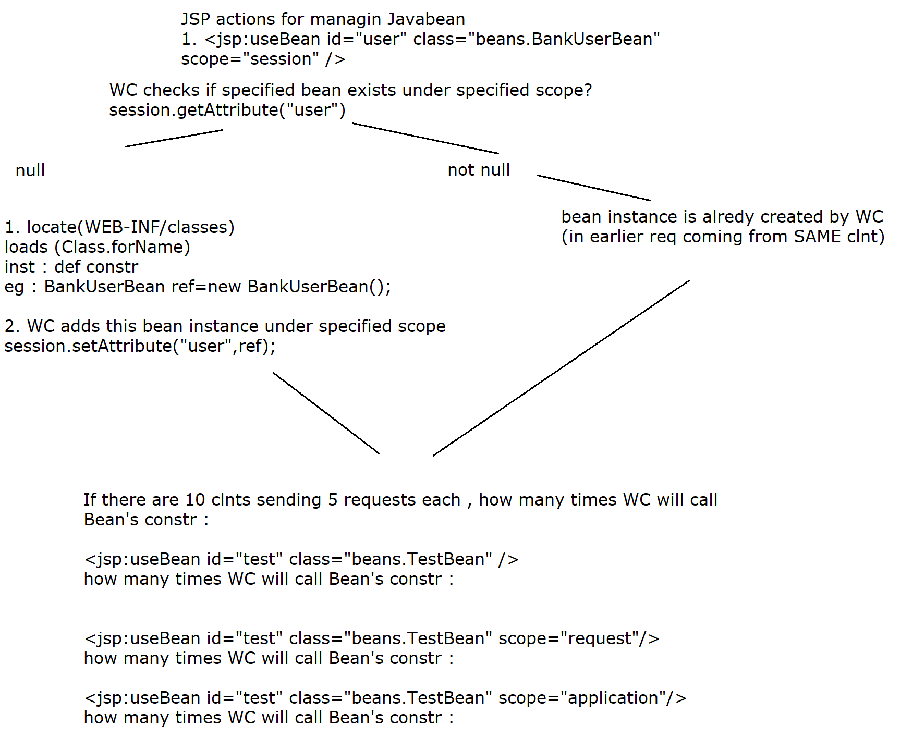
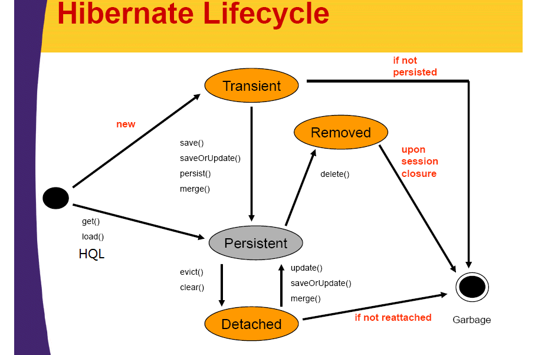
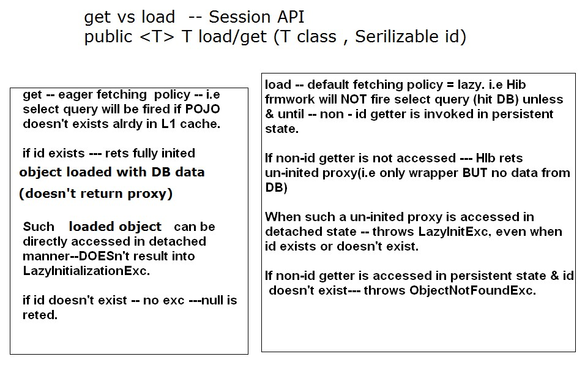

# j2EE syllabus 

1. Java Server Pages,
2.  JDBC, 
3.  JavaBeans,
4.   Java Security,
5.   Naming Services,
6.   Java Annotations,
7.    Java Mail,
8.     Java Messaging Services,
9.     Transactions, 
10.    Apache maven, 
11.    Introduction to hibernate,
12.     HQL,
13.      Hibernate, 
14.      Spring Framework, 
15.      Hands on Web services – JSON/XML/oData (data format conversation)

# Day 1 

## to read 

1. j2ee specification 
2. web server vs application server in case of j2ee? 
3. why j2ee ?
    
4. Why HttpServlet classs is declared as abstract class BUT with 100 % concrete functionality ?
-
1. It is abstract because the implementations of key servicing methods have to be provided by (e.g. overridden by) servlet developer. 
- Since it's abstract , it's instance can't be created.

2. A subclass of HttpServlet must override at least one method, usually one of these:
- 
1. doGet, if the servlet supports HTTP GET requests
2. doPost, for HTTP POST requests
3. doPut, for HTTP PUT requests
4. doDelete, for HTTP DELETE requests
- also compulsory to override init and destroy, to manage resources that are held for the life of the servlet

3. If you extend the class without overriding any methods, you will get a useless servlet; i.e. it will  give an error response for all requests.(HTTP 405 : Method not implemented) . 
-  So , if the class was not abstract, then any direct instance of HttpServlet would be useless.

4. So the reason for making the HttpServlet class abstract is to prevent a  programming error.
- As a servlet developer , you can choose to override the functionality of your requirement (eg : doPost) & ignore other methods. 

## notes 
### Version Java EE 8 (J2EE 1.8) maintained under Oracle  / Jakarta EE 8 (maintained by eclipse foundation)

1. What is J2EE ?
- Consists of specifications only .

2. Which specs ? (Rules or contract )
- Specifications of services required for any enterprise application.

3. What is enterprise application ?
- An enterprise application (EA) is a large software system platform designed to operate in a corporate environment .

- It includes online shopping and payment processing, interactive product catalogs, computerized billing systems, security, content management, IT service management,  business intelligence, human resource management, manufacturing, process automation, enterprise resource planning ....

- These specifications include ---
- Servlet API,JSP(Java server page) API,Security,Connection pooling ,EJB (Enterprise Java Bean), JNDI(Naming service -- Java naming & directory i/f),JPA(java persistence API),JMS(java messaging service),Java Mail, Java Server Faces , Java Transaction API, Webservices support(SOAP/REST) etc...

- Vendor of J2EE specs -- Oracle / Sun / Eclipse
---
- Implementation -- left to vendors (J2EE server vendors)
+ J2EE compliant web server --- Apache -- Tomcat (web container)
+ Services implemented --- servlet API,JSP API,Security,Connection pooling,JNDI(naming service)

+ J2EE complaint application server --- web container + EJB (enterprise java bean) container
+ ALL J2EE services implementation
---

### J2EE server Vendors & Products
1. Apache -- tomcat(web server) / Tomee (app server)
2. Oracle / Sun --- reference implementation --- Glassfish
3. Red Hat -- JBoss (wild fly)
4. Oracle / BEA -- weblogic
5. IBM -- Websphere
- 

4. WHY J2EE
- 1.  Can support different types of clnts ---
1. thin client(web clnt)
2. thick clnt --- application clnt(eg : TCP client)
3. smart clnts -- mobile clnts
- 
- 2. J2EE server independence -
-  Create & deploy server side appln on ANY J2ee compliant server
-   guaranteed to produce SAME results w/o touching or re-deploying on ANY other J2EE server

- 3. Ready made implementation of primary services
- eg security, conn,pooling,email...
-  so that J2EE developer DOESn't have to worry about primary services 
-  rather can concentrate on actual business logic.


5. Layers involved in HTTP request-response flow (refer to day1-data\day1_help\diags\request-response-flow.png)

- Web browser sends the request (URL)
 eg : http://www.abc.com:8080/day1.1 
/day1.1  --- root / context path /web app name

- Host --Web server--Web Container(server side JVM)--Web application---HTML/JSP/Servlet....


6. What is dyn web application
-  server side appln deployed on web server meant for servicing typically web clnts(thin)  using application layer protocol  HTTP /HTTPS
- (ref : diag request-resp flow)

### Read --HTTP basics including request & response structure from day1-data\day1_help\j2ee_prerequisites\HTTP Basics


1. Objective ?: Creating & deploying dyn web appln on Tomcat -- For HTML content


2. IDE automatically creates J2EE compliant web application folder structure .
Its details -- Refer to diag (J2EE compliant web app folder structure)


7. What is Web container --- (WC) & its jobs
- 1. Server side JVM residing within web server.
- Its run-time env for dyn web components(Servlet & JSP,Filter) . 
Jobs ---
- 2. Creating Http Request & Http response objects 
- 3. Controlling life-cycle of dyn web comps (manages life cycle of servlet,JSP,Filters)
- 4. Giving ready-made support for services --- Naming,security,Conn pooling .
- 5. Handling concurrent request from multiple clients .
- 6. Managing session tracking...

8. What is web.xml ?
-  Deployment descriptor one per web appln
1. created by -- dev
2. who reads it -- WC
3. when --- @ deployment 
4. what --- dep instrs --- welcome page, servlet deployment tags, sess config, sec config......

-
9. Why servlets? 
-  To add dynamic nature to the web application

10. What is a servlet ?
- Java class (with NO main method) -
-  represents dynamic web component 
     - whose life cycle will be managed by WC(web container : server side JVM)
- no main method
- contains of overriding form of life cycle methods
- life cycle methods --- init,service,destroy
- call back mechanism 
- Job list
1. Request processing
2. B.L 
3. Dynamic response generation
4. Data access logic(DAO class --managing DAO layer)
5. Page navigation

- Servlet API details --refer to diag servlet-api.png

### Objective 1: Test basic servlet life cycle  -- init , service ,destroy
-  Creating & deploying Hello Servlet. 

11. Deployment of the servlet
-
1. Via annotation
```java
eg : @WebServlet(value="/validate")
public class LoginServlet extends H.S {....}
Map : 
key -- /validate
value -- F.Q servlet cls name
URL : http://host:port/day1.1/validate?....
```
2. Using XML tags
- How to deploy a servlet w/o annotations --- via XML tags
web.xml
```xml
<servlet>
 <servlet-name>abc</servlet-name>
		<servlet-class>pages.SecondServlet</servlet-class>
</servlet>
<servlet-mapping>
		<servlet-name>abc</servlet-name>
		<url-pattern>/test2</url-pattern>
</servlet-mapping>
WC : map 
key : /test2
value  : pages.SecondServlet

eg URL --http://host:port/day1_web/hello

```
3.  At the time of web app deployment 
- WC tries to populate map of url patterns ,
-  from XML tags (from web.xml). Later it  will check for @WebServlet annotation


### Objective 2: Test basic servlet life cycle  -- init , service ,destroy (deployed via xml)

1. How to read request params sent from the clnt ?

- javax.servlet.ServletRequest i/f methods
1. public String getParameter(String paramName)

2. public String[] getParameterValues(String paramName)

### Objective 3 : Accept different type of i/ps from user , in HTML form.Write a servlet to display request parameters.


# Day2 

## Page Navigation Techniques
- Page Navigation=Taking user from 1 page to another page.

-  2 Ways
1. Client Pull
- Taking the client to the next page in the NEXT request
- 1. 1 User takes some action -
- eg : clicking on a button or link & then client browser generates new URL to take user to the next page.

1. 2 Redirect Scenario
- User doesn't take any action. Client browser automatically generates new URL to take user to the next page.(next page can be from same web appln , or diff web appln on same server or any web page on any srvr)

API of HttpServletResponse
public void sendRedirect(String redirectURL)
eg : For redirecting client from Servlet1 (/s1) to Servlet2 (/s2) , use
response.sendRedirect("s2");

If the response already has been committed(pw flushed or closed) , this method throws(WC) an IllegalStateException.(since WC can't redirect the client after response is alreadt committed)


2. Server Pull.
Taking the client to the next page in the same request.
Also known as resource chaining or request dispatching technique.
Client sends the request to the servlet / JSP. Same request can be chained to the next page for further servicing of the request.


Steps
1. Create Request Dispatcher object for wrapping the next page(resource --can be static or dynamic) 
API of ServletRequest
javax.servlet.RequestDispatcher getRequestDispatcher(String path)

2.Forward scenario
API of RequestDispatcher
public void forward(ServletRequest rq,ServletResponse rs)

This method allows one servlet to do initial processing of a request and another resource to generate the response. (i.e division of responsibility)

Uncommitted output in the response buffer is automatically cleared before the forward. 

If the response already has been committed(pw flushed or closed) , this method throws an IllegalStateException.

Limitation --only last page in the chain can generate dynamic response.

3. Include scenario
API of RequestDispatcher
public void include(ServletRequest rq,ServletResponse rs)

Includes the content of a resource @run time (servlet, JSP page, HTML file) in the response. --  server-side includes. 

Limitation -- The included servlet/JSP cannot change the response status code or set headers; any attempt to make a change is ignored. 


## What is a Session?

Session is a conversional state between client and server and it can consists of multiple request and response between client and server. Since HTTP and Web Server both are stateless, the only way to maintain a session is when some unique information about the session  is passed between server and client in every request and response.

HTTP protocol and Web Servers are stateless, what it means is that for web server every request is a new request to process and they cant identify if its coming from client that has been sending request previously.

But sometimes in web applications, we should know who the client is and process the request accordingly. For example, a shopping cart application should know who is sending the request to add an item and in which cart the item has to be added or who is sending checkout request so that it can charge the amount to correct client.

What is the need of session tracking?

1. To identify the clnt among multiple clnts
2. To remember the conversational state of the clnt(eg : list of the purchased books/ shopping cart/bank acct details/stocks) throughout current session

session = Represents duration or time interval 

Consists of all requests/resps coming from/ sent to SAME clnt from login to logout or till session expiration tmout.

There are several techniques for session tracking.
1. Plain Cookie based scenario
2. HttpSession interface 
3. HttpSession + URL rewriting
----------------------------------------------
Techniques

1. Plain Cookie based scenario

What is a cookie?
Cookie is small amount of text data.
Created by -- server (servlet or JSP prog or WC) & downloaded (sent) to clnt browser---within response header
 Cookie represents data shared across multiple dyn pages from the SAME web appln.(meant for the same client)

Steps :

1. Create cookie/s instance/s
javax.servlet.http.Cookie(String cName,String cVal)

2.Add the cookie/s to the resp hdr.
HttpServletResponse API :
void addCookie(Cookie c)

3. To retrieve the cookies :
HttpServletRequest :
Cookie[] getCookies()

4.Cookie class methods : 
String getName()
String getValue()
void setMaxAge(int ageInSeconds)
def age =-1 ---> browser stores cookie in cache
=0 ---> clnt browser should delete cookie
>0 --- persistent cookie --to be stored on clnt's hard disk.

int getMaxAge()

Disadvantages of pure cookie based scenario
0. Web developer (servlet prog) has to manage cookies.
1. Cookies can handle only text data : storing Java obj or bin data difficult.
2. As no of cookies inc., it will result into increased net traffic.
3. In cookie based approach : entire state of the clnt is saved on the clnt side. If the clnt browser rejects the cookies: state will be lost : session tracking fails.


How to redirect client automatically to next page ? (in the NEXT request)
API of HttpServletResponse
public void sendRedirect(String redirectLoc)
eg : resp.sendRedirect("s2");

IMPORTANT : 
WC -- throws 
java.lang.IllegalStateException: Cannot call sendRedirect() after the response has been committed(eg : pw.flush(),pw.close()...)
	


Technique # 2 : Session tracking based on HttpSession API
In this technique : 
Entire state of the client is not saved on client side , instead saved on the server side data structure (Http Sesion object) BUT the key to this Http Session object is STILL sent to client in form of a cookie.(cookie management is done by WC)


Servlet programmer  can store/restore java objects directly under the session scope(API : setAttribute/getAttribute)


Above mentioned , disadvantages ---0, 1 & 2 are reomved.
BUT entire session tracking again fails , if cookies are disabled.

Steps for javax.servlet.http.HttpSession i/f based session tracking.

1. Get Http Session object from WC

API of HttpServletRequest ---
HttpSession getSession()
Meaning --- Servlet requests WC to either create n return a NEW HttpSession object(for new clnt) or ret the existing one from WC's heap for existing client.


HttpSession --- i/f from javax.servlet.http
In case of new client : 
 HttpSession<String,Object> --empty map
String,Object ---- (entry)= attribute

OR
HttpSession getSession(boolean create)

2. : How to save data in HttpSession?(scope=entire session)
API of HttpSession i/f
public void setAttribute(String attrName,Object attrVal)
eg : hs.setAttribute("clnt_info",validatedCustomer);//no javac err
 attribute : server side object ---server side entry (key n value pair) --map


equivalent to map.put(k,v)
eg : hs.setAttribute("cart",l1);


3. For retrieving session data(getting attributes)
public Object getAttribute(String attrName) //key
eg : Customer cust=(Customer) hs.getAttribute("clnt_info");

4. To get session ID (value of the cookie whose name is jsessionid  -- unique per client by WC)
String getId()

4.5 How to remove attribute from the session scope?
public void removeAttribute(String attrName)
eg : hs.removeAttribute("clnt_info");

5. How to invalidate session?
HttpSession API
public void invalidate()
(WC marks HS object on the server side for GC ---BUT cookie  is NOT deleted from clnt browser)

6. HttpSession API
public boolean isNew()
Rets true for new client & false for existing client.

7.How to find all attr names from the session ?
public Enumeration<String> getAttributeNames()
--rets java.util.Enumeration of attr names.

8. Default session timeout value for Tomcat = 30 mins
How to change session tmout ?
HttpSession  i/f method
public void setMaxInactiveInterval(int secs)
eg : hs.setMaxInactiveInterval(300); --for 5 mins .

OR via xml tags in web.xml
<session-config>
  <session-timeout>5</session-timeout>
</session-config>


NOTE : 
What is an attribute ?
attribute = server side object(entry/mapping=key value pair)
who creates server side attrs ? -- web developer (servlet or JSP prog)
Each attribute has --- attr name(String) & attr value (java.lang.Object)
Attributes can exist in one of 3 scopes --- req. scope,session scope or application scope
1. Meaning of req scoped attr = attribute is visible for current req.
2. Meaning of session scoped attr = attribute is visible for current session.(shared across multiple reqs coming from SAME clnt)
3. Meaning of application scoped attr = attribute is visible for current web appln.(shared across multiple reqs from ANY clnt BUT for the SAME web application)


# Day3


# Day4 

## Today's topics
1. Complete Servlet Life cycle + ServletConfig
2. Executor Framework (used by WC to support concurrent handling of multiple client requests)
3. CGI Vs Servlets
4. Server pull
5. Scopes of attributes in web programming
6. ServletConfig vs ServletContext
7. Web application listeners
---
1.  day 4.1 : DB independent web app

- Complete Servlet Life cycle (including thread pool)
- Apply servlet config.
- How to Make web application DB independent (use ServletConfig)
(i.e if underlying DB changes ---no changes in java code BUT add DB specific details(JDBC drvr class, dbURL,userName , pwd) in xml based config files)


2. Scopes of attributes in web programming
refer to diag.

3. Refer to day4.3 
Replace client pull by server pull. (for LoginServlet--->CatalogServlet)  : forward
Request Dispatching technique
refer : readme n diagrams

4. Refer to day4.4 
Replace client pull by server pull. (for LoginServlet--->CatalogServlet) : include
Request Dispatching technique
refer : readme n diagrams

5. Refer to day4.5
How to Make web application DB independent (use ServletContext)
(i.e if underlying DB changes ---no changes in java code BUT add DB specific details(JDBC drvr class, dbURL,userName , pwd) in xml based config files)

6. Create web app listener (implementing ServletRequest, Session & ContextListener)
- Objective : Create a context listener , singleton instance of DB connection .
- 5.1 web.xml
- add ctx parameter : for DB config
- 5.2 Create a class imple ServletContextListener i/f 
     - contextInitialized
     - contextDestroyed
- 5.3 Edit DBUtils
- 5.4 Edit DAO layers.

---------------------------
Reading H.W ---
1.differentiate between getSession() vs getSesssion(create) of HttpServletRequest.

2.GenericServlet's overloaded init methods
3.Creating RequestDispatcher using ServletRequest or ServletContext
4. HttpSession internals
refer to --session internals & WC Heap pics.


## notes

### 1. Regarding SERVLET CONFIG	

- A servlet specific configuration object created by a servlet container to pass information to a servlet during initialization.

1. Represents Servlet specific configuration.
Defined in javax.servlet.ServletConfig -- interface.

2. Who creates its instance  ?
Web container(WC)
3. When ?
After WC creates servlet instance(via def constr), ServletConfig instance is created & then it invokes init() method of the servlet.
4. Usage
To store servlet specific init parameters.
(i.e the init-param is accessible to one servlet only or you can say that the init-param data is private for a particular servlet.)

5. Where to add servlet specific init parameters?
Can be added either in web.xml or @WebServlet annotation.

XML Tags
```xml
<servlet>
    <servlet-name>init</servlet-name>
    <servlet-class>ex.TestInitParam</servlet-class>
    <init-param>
      <param-name>name</param-name>
      <param-value>value</param-value>
    </init-param>
</servlet>
<servlet-mapping>
<servlet-name>init</servlet-name>
<url-pattern>/test_init</url-pattern>
</servlet-mapping>
```
6. How to access servlet specific init params from a servlet ?
6.1 Override init() method
6.2 Get ServletConfig
Method of Servlet i/f 
public ServletConfig getServletConfig()
6.3 Get the init params from ServletConfig
Method of ServletConfig i/f
String getInitparameter(String paramName) : rets the param value.


### 2. Executor Framework

- Introduced in Java 5.

1. **What's earlier support i.e in core java we used?**
- Extends Thread 
- Implements Runnable 

2. **Why Executor Framework?**
- 1. If you have thousands of task to be executed and if you create each thread for thousands of tasks, you will get performance overheads as creation and maintenance of each thread is  an overhead. 
- 2. Executor framework  solves this problem. 
- 3. In executor framework, you can create specified number of threads and reuse them to execute more tasks once it completes its current task.
- 4. It simplifies the design of creating multithreaded application and manages thread life cycles.
- 5. The programmer does not have to create or manage threads themselves, that’s the biggest advantage of executor framework.

3. **Important classes / interfaces for executor framework.**
- 
1. java.util.concurrent.Executor
- This interface is used to submit new task.
- It has a method called “execute”.

 ```java
public interface Executor {
 void execute(Runnable task);
}
```

2. ExecutorService
- It is sub-interface of Executor.
- Provides methods for 
     -     Submitting / executing Callable/Runnable tasks
     - Shutting down service
     - Executing multiple tasks etc.

3. ScheduledExecutorService
- It is sub-interface of executor service which provides methods for scheduling tasks at fixed intervals or with initial delay.

4. Executors
- This class provides factory methods for creating thread pool based executors.
- Important factory methods(=static method rets instance of ExecutorService) of Executors are:

- 4.1.  newFixedThreadPool:
     -  This method returns thread pool executor whose maximum size is fixed.
     -  If all n threads are busy performing the task and additional tasks are submitted, then they will have to wait  in the queue until thread is available.
- 4.2 newCachedThreadPool:
     -  this method returns an unbounded thread pool. It doesn’t have maximum size but if it has less number of tasks, then it will tear down unused thread.
     -   If a thread has been unused for keepAliveTime , then it will tear it down.
- 4.3 newSingleThreadedExecutor: 
     - this method returns an executor which is guaranteed to use the single thread. 
- 4.4 newScheduledThreadPool:
     -  this method returns a fixed size thread pool that can schedule commands to run after a given delay, or to execute periodically.

4. **Steps for Runnable** 
- 
1. Create a thread-pool executor , using suitable factory method of Executors.
- eg : For fixed no of threads
> ExecutorService executor = Executors.newFixedThreadPool(10);

2. Create Runnable task

3. Use inherited method
> public void execute(Runnable command)
- Executes this Runnable task , in a separate thread.

4. Shutdown the service
> public void shutdown()
- Initiates an orderly shutdown in which previously submitted tasks are executed, but no new tasks will be accepted. 

5. > boolean awaitTermination(long timeout,TimeUnit unit) throws InterruptedException
- Blocks until all tasks have completed execution after a shutdown request, or the timeout occurs.

6. > List<Runnable> shutdownNow()
- Attempts to stop all actively executing tasks, halts the processing of waiting tasks, and returns a list of the tasks that were awaiting execution.
---

7. BUT disadvantages with Runnable interface 
- 1. Can't return result from the running task
- 2. Doesn't include throws Exception .

5. **Better API**
> java.util.concurrent.Callable<V>
> V : result type of call method
- Represents a task that returns a result and may throw an exception. 
- Functional i/f
> SAM : public V call() throws Exception
- Computes a result, or throws an exception if unable to do so.

6. **Steps in using Callable i/f**
-
1. Create a thread-pool executor , using suitable factory method of Executors.
- eg : For fixed no of threads
> ExecutorService executor = Executors.newFixedThreadPool(10);

2. Create Callable task , which returns a result.

3. To submit a task to executor service , use method of ExecutorService i/f : 
> public  Future<T> submit(Callable<T> task)
- Submits a value-returning task for execution and returns a Future representing the pending results of the task. 
- It's a non blocking method (i.e rets immediately)
- The Future's get method will return the task's result upon successful completion.
- If you would like to immediately block waiting for a task, invoke get() on Future. 
- eg :  result = exec.submit(aCallable).get();

- OR 
- main thread can perform some other jobs in the mean time & then invoke get on Future , to actually get the results. 
- (get : blocking call ,waits  till the computation is completed n then rets result)

4. Other methods of ExecutorService i/f

> public  List<Future<T>> invokeAll(Collection<? extends Callable<T>> tasks) throws InterruptedException

- It's a blocking call.(waits till all tasks are complete)
- Executes the given tasks, returning a list of Futures holding their status and results when all complete.
-  Future.isDone() is true for each element of the returned list.

5. Shutdown the service
> public void shutdown()
- Initiates an orderly shutdown in which previously submitted tasks are executed, but no new tasks will be accepted. 

6. >  boolean awaitTermination(long timeout,TimeUnit unit) throws InterruptedException
- Blocks until all tasks have completed execution after a shutdown request, or the timeout occurs.

7.  > List<Runnable> shutdownNow()
- Attempts to stop all actively executing tasks, halts the processing of waiting tasks, and returns a list of the tasks that were awaiting execution.

### 3. Regarding javax.servlet.ServletContext (i/f)

1. Defined in  javax.servlet package.
2. Who creates its instance  -- WC
3. When -- @ Web application (=context) deployment time
####  NOTE : The ServletContext object is contained within the ServletConfig object, which the WC provides the servlet when the servlet is initialized.

4. How many instances ?
-  one per web application

5. Usages
- 5.1 Server side logging
      - API public void log(String mesg)
- 5.2 To create context scoped attributes
      - API public void setAttribute(String nm,Object val)
- NOTE : Access them always in thread safe manner

- 5.3 To access global(scope=entire web application) parameters
6.  How to add context scoped parameters ?

- In web.xml
```xml
<context-param>
  <param-name>name</param-name>
      <param-value>value</param-value>
</context-param>
```
7. How to access these params in a Servlet ?
- (can be accessed from init method onwards)
1. Get ServletContext  
- API of GenericServlet
> ServletContext getServletContext() --method inherited from GenericServlet

2. ServletContext API
> String getInitparameter(String paramName) : rets the param value.
- eg : ctx param name : user_name value : abc
> In the Servlet : getServletContext().getInitparameter("user_name") ---abc

- 5.4 Creating request dispatcher
H.W


### 4. Page Navigation Techniques
- Page Navigation=Taking user from 1 page to another page.
- 2 Ways
1. Client Pull
- Taking the client to the next page in the NEXT request
- 1.1 User takes some action -
      - eg : clicking on a button or link & then client browser generates new URL to take user to the next page.

- 1.2 Redirect Scenario 
      - User doesn't take any action.
      -  Client browser automatically generates new URL to take user to the next page.(next page can be from same web appln , or diff web appln on same server or any web page on any srvr)

- 2. API of HttpServletResponse
> public void sendRedirect(String redirectURL)
- eg : For redirecting client from Servlet1 (/s1) to Servlet2 (/s2) ,
      -  use response.sendRedirect("s2");

- If the response already has been committed(pw flushed or closed) , 
      - this method throws(WC) an IllegalStateException.
      - (since WC can't redirect the client after response is alreadt committed)


2. Server Pull.
- Taking the client to the next page in the same request.
- Also known as resource chaining or request dispatching technique.
- Client sends the request to the servlet / JSP.
-  Same request can be chained to the next page for further servicing of the request.


- 1. Steps
1. Create Request Dispatcher object for wrapping the next page(resource --can be static or dynamic) 
- API of ServletRequest
> javax.servlet.RequestDispatcher getRequestDispatcher(String path)

2. Forward scenario
- API of RequestDispatcher
> public void forward(ServletRequest rq,ServletResponse rs)

- This method allows one servlet to do initial processing of a request and another resource to generate the response. (i.e division of responsibility)
- Uncommitted output in the response buffer is automatically cleared before the forward. 
- If the response already has been committed(pw flushed or closed) , this method throws an IllegalStateException.

- Limitation --only last page in the chain can generate dynamic response.

3. Include scenario
- API of RequestDispatcher
> public void include(ServletRequest rq,ServletResponse rs)

- Includes the content of a resource @run time (servlet, JSP page, HTML file) in the response. --  server-side includes. 
- Limitation -- The included servlet/JSP cannot change the response status code or set headers; any attempt to make a change is ignored. 


### 5. What is a Servlet Listener(or web application listener)?
- 1. During the lifetime of a typical web application, a number of events take place.
- eg : requests are created or destroyed.
- sessions are created & destroyed
- Contexts(web apps) are created & destroyed.
- request or session or context attributes are added, removed, or modified etc.

- 2. The Servlet API provides a number of listener interfaces that one  can implement in order to react to these events.

- eg : Event Listener i/f
1. ServletRequestListener
2. HttpSessionListener
3. ServletContextListener

- Steps
1. Create a class , implementing from Listener i/f.
2. Register it with WC
- 2.1 @WebListener annotation(class level)
OR
2.2 XML tags in web.xml
```xml
<listener>
 <listener-class>F.Q cls name of listener</listener-class>
</listener>
```


# Day5 

## topic

### JSP
1. What is it ?
2. Why ?
3. JSP API
4. JSP Life cycle
5. JSP Syntax

6. Objective : Create dyn web app using layers :
- JSP --- JB --- DAO (DBUtils) ---POJO --- DB
- Create Java bean : for client validation.
1. public n pkged class (eg : beans)
2. properties : email,password (clnt sent request params) + results : validated user details : Customer validCustomer/Voter
3. Default arg-less constr : 
- 3.1 instantiate DAO (customer DAO)

4. Supply suitable setters/getters

5. B.L : public
```java
public String validateCustomer()
{
   validCustomer=dao.authenticateUser(email,password);
  if(validCustomer == null)
   return "login";//JB  is returning dyn navigational outcome to JSP
  return "category";
}
```

### 1. What is JSP? (Java server page)
- Dynamic Web page (having typically  HTML 5 markup) , that can embed Java code directly.
- Dynamic web component , whose life-cycle is managed by WC(JSP container/Servlet container/Servlet engine)

#### 2. WHY JSP?

1. JSP allows developer to separate presentation logic(dyn resp generation)  from Business logic or data manipulation logic.
- Typically JSPs -- used for P.L(presentation logic)
- Java Beans or Custom Tags(actions) --- will contain Business logic.

2. Ease of development --- JSP pages are auto. translated by W.C in to servlet & compiled & deployed.

3. Can use web design tools -- for faster development (RAD --rapid application development) tools.

4. JSP API : part of J2EE specification 
> jsp-api.jar --- <tomcat>/lib : specs
- Implementation : server vendors : Apache --jasper.jar
- Contains JSP API implementation classses.
```java
0. javax.servlet.Servlet -- super i/f
1. javax.servlet.jsp.JspPage -- extends Servlet i/f
 public void jspInit()
 public void jspDestroy()
```
- Can be overridden by JSP page author

2. Further extended by  javax.servlet.jsp.HttpJspPage
>  public void _jspService(HttpServletRequest rq,HttpServletResponse rs) throws ServletExc,IOExc.

- Never override _jspService ---JSP container auto translates JSP tags (body) into _jspService.

### 4.  JSP life-cycle

1. Clnt sends the 1st request to the JSP (test.jsp)
2. Web-container invokes the life cycle for JSP
3. Translation Phase : handled by the JSP container.
- I/p : test.jsp  O/p : test_jsp.java (name : specific to the Tomcat container)
- Meaning : .jsp is translated into corresponding  servlet page(.java)
- Translation time errs : syntactical  errs in using JSP syntax.
- In case of errs : life-cycle is aborted.
4. Compilation Phase : handled by the JSP container.
- I/p : Translated servlet page(.java)   O/p : Page Translation class(.class)
- Meaning : servlet page auto. compiled into .class file
- Compilation time errs: syntacticle  errs in generated Java  syntax.
5. Request processing phase / Run time phase. : typically handled by the Servlet Container.
6. S.C : will try to locate,load,instantiate the generated servlet class.
7. The 1st it calls : public void jspInit() : 
- one time inits can be performed.(jspInit availble from javax.servlet.jsp.JspPage)
8. Then it will call follwing method using thrd created per clnt request : 
>  public void _jspService(HttpServlet Rq,HttpServletResponse) throws ServletException,IOException(API
-  avlble from   javax.servlet.jsp.HttpJspPage)
- When _jspService rets , thread's run method is over & thrd rets to the pool, where it can be used for servicing some other or same clnt's req.

9. At the end ...(server shutting down or re-deployment of the context) : the S.C calls
public void jspDestroy()
- After this : translated servlet page class inst. will be GCEd....

10. For 2nd req onwards ...... : SC will invoke step 8 onwards.

- JSP 2.0/2.1/2.2/2.3 syntax
- 
### 5. JSP comments

1. server side comment
> syntax : <%-- comment text --%>
- significance : JSP translator & compiler ignores the commented text.

2. clnt side comment
> syntax : <!-- comment text -->
- significance : JSP translator & compiler does not ignore the commented text BUT clnt browser will ignore it.


### 6.  JSP's implicit objects (available only to _jspService) -- avlable to scriptlets,exprs
- 1. out
-   javax.servlet.jsp.JspWriter :
-  represents the buffered writer stream connected to the clnt via HttpServletResponse(similar to your PW in servlets)
Has the same API as PW(except printf)
- usage eg : out.print("some text sent to clnt");

- 2. request :
-  HttpServletRequest (same API)

- 3. response :
-  HttpServletResponse

- 4. config :
-  ServletConfig (used for passing init params)

- 5. session :
-  HttpSession (By def. all JSPs participate in session tracking i.e session obj is created) 

- 6. exception :
-  java.lang.Throwable (available only to err handling pages)

- 7. pageContext  :
-  current page environment : javax.servlet.jsp.PageContext
-  (this class stores references to page specific objects viz -- exception,out,config,session)
- It can be also used to store page scoped attributes (using setAttribute method)

- 8. application :
-  ServletContext
-  used for Request dispatching, server side logging, for creating context listeners,to avail context params, to add/get context scoped attrs
- 9. page 
-  current translated page class instance created for 'this' JSP 
- eg : If you create test.jsp , 
      - Tomcat will translate it into a public class test_jsp : 
      - page => instance of this class.


### 7. Scripting elements : To include the java content within JSP : to make it dynamic.

1. Scriptlets :
-  Can be used to add the java code directly . AVOID scriptlets .
-   (Use only till you learn Javabeans & custom tags or JSTL,). we will use use the scriptlets to add : Req. processing logic, B.L & P.L)
> syntax : <% java code...... %> : within <body> tag.
- location inside the translated page : within _jspService
- usage : till Java beans   or cust. tags are introduced : scriptlets used for control flow/B.L/req. proc. logic


2. JSP expressions : 
> syntax : <%= expr to evaluate %>
- Evaluates an expression --converts it to string --send it to clnt browser.
- eg : <%= new Date() %>

- 1. expr to evaluate : 
- java method invocation which rets a value OR
const expr or attributes(getAttribute) or variables(instance vars or method local)
- location inside the translated page : within _jspService
- significance : the expr gets evaluated---> to string -> automatically sent to clnt browser.
- examples
```java
<%= new Date() %>
<%= request.getAttribute("user_dtls") %> 
<%= 12*34*456 %>
<%= session.getAttribute("user_dtls") %>
<%= session.setAttribute("nm",1234) %> -- compiler error
<%= session.getId() %>
```


3. Expression Language
- 1. Better alternative to JSP Expressions : EL syntax (Expression Language : avlble from JSP 1.2 onwards)
> syntax : ${expr to evaluate} (to be added directly in body tag)
- EL syntax will evaluate the expr ---to String --sends it clnt browser.

- 2. JSP implicit object -
- request,response,session....---accessible from scriptlets & JSP exprs.

- 3. EL implicit objects 
 -   can be accessible only via EL syntax
- 1. param = name of the map containing request parameters
- 2. pageScope = name of the map containing page scoped attrs
- 3. requestScope = name of the map containing request scoped attrs
- 4. sessionScope = name of the map containing session scoped attrs
- 5. applicationScope = name of the map containing application(=context) scoped attrs
- 6. pageContext = instance of PageContext's sub class
- 7. cookie = name of the map containing cookies(cookie objects)
- 8. initParam = map of context params.

- avlable ONLY to EL syntax ${...}
- to be added directly within <body> ...</body>

- 9. eg : ${param.user_nm} 
-  param.get("user_nm") - value --to string ---> clnt 
- request.getParameter("user_nm") --value --to string ---> clnt 
- ${requestScope.abc} ---request.getAttribute("abc") ---to string --sent to clnt browser.

- 10. eg :
```java
 suppose ctx scoped attr --- loan_scheme
- ${applicationScope.loan_scheme}  --- getServletContext().getAttribute("loan_scheme") ---to string --sent to clnt
  
${abc} ---WC treats it as an attribute name.
pageContext.getAttribute("abc") ---not null -- to string -clnt
 null 
--request.getAttribute("abc") -- not null -- to string -clnt
null
session.getAttribute("abc") ---not null -- to string -clnt
null 
getServletContext().getAttirbute("abc") --not null -- to string -clnt
null ---BLANK to clnt browser.
```
- 11. eg :
```java
eg : Which will be faster for suppose : you have added a sesion scoped attribute
<%
 session.setAttribute("nm",new Date());
%>
1. ${sessionScope.nm}
2. ${nm}
Ans : 1

${pageContext.session.id}
--pageContext.getSession().getId() --- val of JessionId cookie w/o java code.

${pageContext.request.contextPath} ---
WC : pageContext.getRequest().getContextPath() --to string --sent to clnt
eg : /day5.1

${pageContext.session.maxInactiveInterval}
WC : pageContext.getSession().getMaxInactiveInterval() --- 1800
```
```java
${param}
{user_nm=asdf, user_pass=123456} 


eg : ${param.f1} ---> request.getParameter("f1").toString()---> sent to browser

param ----map of req parameters.


param : req. param map

${requestScope.abc} ----- out.print(request.getAttribute("abc").toString())

${abc}  -----pageCotext.getAttribute("abc")----null ---request ---session---application ---null ---EL prints blank.
```


4. JSP declarations
- 1. Represents  : private members of the translated servlet class
> syntax : <%! JSP declaration block %> (outside <body> tag within JSP)
- Usage : 
1. for creating page scoped java variables & methods (instance vars & methods/static members) : default scope => private
2. Also can be used for overriding life cycle methods (jspInit,jspDestroy)
- location inside the translated page : outside of _jspService (directly within JSP's translated class)
---


5. JSP Directives
-  commands/messages for JSP Engine(=JSP container=WC) -- to be used @Translation time. 

- Syntax 
> <%@ Directive name attrList %>
> 
1. **page directive**
- all commands applicable to current page only.
- Syntax 
> <%@ page import="comma separated list of pkgs" contentType="text/html" %>
- eg 
> <%@ page import="java.util.*,java.text.SimpleDateFormat" contentType="text/html"  %>
- Imp page directive attributes
- 1. import  --- comma separated list of pkgs
- 2. session --- boolean attribute. def=true.
   - To disable session tracking, spectify session="false"


- 3. errorPage="URI of err handling page" ---
   - tells WC to forward user to err handler page.
- 4. isErrorPage="true|false" def = false
   - If u enable this to true--- one can access 'exception' implicit object from this page.

   - This exception obj is stored under current page ---i.e under pageContext (type=javax.servlet.jsp.PageContext -- class which represents curnt JSP)
   - EL expresssion to display error mesg
    > ${pageContext.exception.message}
   - evals to pageContext.getException().getMessage()


6. Additional EL syntax

- EL syntax to be used in error handling pages 

 - 1. ERR causing URI :  ${pageContext.errorData.requestURI }<br/>
 - 2. ERR code :  ${pageContext.errorData.statusCode}<br/>
 - 3. ERR Mesg :  ${pageContext.exception.message} <br/>
 - 4. Throwable : ${pageContext.errorData.throwable}<br/>
 - 5. Throwable Root cause: ${pageContext.errorData.throwable.cause}


- 6. isThreadSafe="true|false" default=true. "true" is recommended
- true=>informing WC--- JSP is already written in thrd -safe manner ---- DONT apply thrd safety.
- false=>informing WC --- apply thrd safety.

- 7. (NOT recommended) ---WC typically marks entire service(servlet scenario) or _jspService in JSP scenarion --- synchronized. --
-  this removes concurrent handling of multiple client request --so not recommended.
- 8. What is reco? --
-  isThreadSafe=true(def.) --- identify critical code--wrap it in synchronized block.
- eg ---Context scoped attrs are inherently thrd -un safe. So access them always from within synched block.

- 7. Equivalent step in Servlet 
- Servlet class can imple. tag i/f -
-  javax.servlet.SingleThreadModel(DEPRECATED) --
-   WC ensures only 1thread (representing clnt request) can invoke service method. --NOT NOT recommended.


2. **include directive**
> <%@ include file="URI of the page to be included" %>
- Via include directive ---- 
- contents are included @ Translation time.--- indicates page scope(continuation of the same page).
- Typically used -- for including static content (can be used to include dyn conts)
- eg 
```java
---one.jsp
....<%@ include file="two.jsp" %>
two.jsp.....
```

---

6. JSP actions ----
- commands/mesgs meant for WC
- to be interpreted @ translation time & applied @ req. processing time.(run time)
- Syntax --
-standard actions --implementation classes are present in jsp-api.jar.
```jsp
<jsp:actionName attr list>Body of the tag/action
</jsp:actionName>
```


### 8. JSP Using Java beans
1. Why  Java Beans 
 - 1. allows prog to seperate  B.L in JBs.
 - (Req processing logic, Page navigation & resp generation will be still part of JSP)
- JBs can store conversational state of clnt(JB 's properties will reflect clnt state) + supplies Business logic methods.

- 2. simple sharing of JBS across multiple web pages---gives rise to re-usability.

- 3. Auto. translation between  req. params & JB props(string--->primitive data types auto. done by WC)

2. What is JB?
- 1. pkged public Java class 
- 2. Must have def constr.(MUST in JSP using JB scenario)
- 3. Properties of JBs ---
-  private, non-static , non-transient Data members  --
- equivalent to request params sent by clnt.(Prop names MUST match with req params for easy usage)
In proper words --
- Java bean props reflect the conversational state of the clnt.
- 4. per property  -- if RW
- naming conventions of JB
- supply getter & setter.
- Rules for setter (Java Bean Naming convention) : strict
> public void setPropertyName(Type val)
- Type -- prop type.
- eg -
```java
- private double regAmount;
public void setRegAmount(double val)
{...}
Rules for getter
public Type getPropertyName()
Type -- prop type.
eg -- public double getRegAmount(){...}
```
- 5. Business Logic --- methods
- public methods --- no other restrictions
----------------------------


3. Using Java Beans from JSP Via standard actions

1. >  <jsp:useBean id="BeanRef name" class="F.Q. Bean class name" scope="page|request|session|application/>
- def = page scope.
- pre-requisite --- JB class exists under <WEB-INF>/classes.
- JB = server side obj (attribute), attr name --- bean id,attr val -- bean inst.,can be added to any scope using scope atribute.


eg --
- beans.Userbean
- props --- email,pass
- setters/getters
- B.L mehod -- for validation

- Usage ---
> <jsp:useBean id="user" class="beans.UserBean" scope="session"/>


2. W.C invokes JB life-cycle
- 1. WC chks if specified Bean inst alrdy exists in specified scope
```java
java api --- request.getAttribute("user")
---null=>JB doesn't exist
---loc/load/inst JB class
UserBean u1=new UserBean();
--add JB inst to the specified scope
java api -- request.setAttribute("user",u1);
--- not-null  -- WC continues....
```
3. JSP using JB action
>  <jsp:setProperty name="Bean ref Name" property="propName" value="propVal---static/dyn" />
- Usage -
```java
<jsp:setProperty name="user" property="email"
value="a@b"/>
```
- WC invokes ---
```java
 session.getAttribute("user").setEmail("a@b");

<jsp:setProperty name="user" property="email"
value="<%= request.getParameter("f1") %>"/>

OR via EL
<jsp:setProperty name="user" property="email"
value="${param.f1}"/>
```
- WC invokes ---
> session.getAttribute("user").setEmail(request.getParameter("f1"));

4.  
```java
<jsp:setProperty name="Bean ref Name" property="propName" param="rq. param name"/>


Usage eg --
<jsp:setProperty name="user" property="email" param="f1"/>


WC invokes ---
((Userbean)request.getAttribute("user")).setEmail(request.getParameter("f1"));
```


5. 
```java
<jsp:setProperty name="Bean ref Name" property="*"/>
usage

<jsp:setProperty name="user" property="*"/>
```

- eg -
- If rq. param names are email & password(i.e matching with JB prop names) then ---matching setters(2) will get called 

```java
 <jsp:getProperty name="Bean ref name" property="propName"/>
Usage -- 
<jsp:getProperty name="user" property="email"/>
WC ---
session.getAttribute("user").getEmail()--- toString --- sent to clnt browser.
```

6. Better equivalent  -- EL syntax
```java 
${sessionScope.user.email} ---
session.getAttribute("user").getEmail()--- toString --- sent to clnt browser.

${requestScope.user.validUser.email}
request.getAttribute("user").getValidUser().getEmail()

${pageContext.exception.message}
```


### JSP std actions related to Request Dispatcher

1. RD's forward scenario
> <jsp:forward page="dispatcher URI" />
- eg : In one.jsp
> <jsp:forward page="two.jsp"/>
- WC invokes ---
```java
 RD rd=reuqest.getRD("two.jsp");
rd.forward(request,response);
```
2. RD's include scenario
> <jsp:include page="dispatcher URI" />


2. Why JSTL ?
-  JSP standard tag library
- When JSP std actions are in-sufficient to solve B.L
- 1. w/o writing scriptlets --
   - use additional std actions --
   -  supplied as JSTL actions
- 2. JSP standard Tag Library
      - has become std part of J2EE 1.5 onwards.
      - support exists in form JAR 
- 3. jstl-1.2.jar
- For using JSTL steps
1. Copy above JAR into ur run-time classpath(copy jars either in <tomcat_home>/lib OR <web-inf>/lib
2. Use taglib directive to include JSTL tag library into ur JSP pages.
```java
tag=action
tag library=collection of tags
supplier = JSTL vendor(spec vendor=Sun, JAR vendor=Sun/any J2EE compliant web/app server)
jstl.jar --- consist of Tag implementation classes
Tag libr-   TLD -- Tag library descriptor -- desc of tags -- how to use tags
<%@ taglib uri="URI of JSTL tag lib" prefix="tag prefix" %>

eg --- To import JSTL core lib
<%@ taglib uri="http://java.sun.com/jsp/jstl/core" prefix="c" %>

```


4. Invoke JSTL tag/action
- eg
```java 
<c:set var="abc" value="${param.f1}"  />
---WC 
pageContext.setAttribute("abc",request.getParameter("f1"))

WC invokes --- session.setAttribute("abc",request.getparameter("f1"));

menaing of <c:set> sets the specified attr to specified scope.

<c:set var="details" value="${sessionScope.abc}" />
WC 
pageContext.setAttribute("details",session.getAttribute("abc"));
```

1. <c:remove var="abc" scope="request"/>
- WC ---
> request.removeAttribute("abc") --
- removes the attr from req scope.

2. JB --- ShopBean -- property -- 
> private AL<Category> categories; --g & s

```java
<c:forEach var="cat" items="${sessionScope.shop.listCategories()}">
${cat}<br/>
</c:forEach>

WC invokes ---

for(Category cat : session.getAttribute("shop").listCategories())
  out.print(cat);

eg : 
<c:forEach var="acct" items="${sessionScope.my_bank.acctSummary}">
${acct.acctID} ${acct.type} ${acct.balance} <br/>
</c:forEach>
```

> http://localhost:8080/day6_web/close_acct.jsp?acId=101


```java
<input type="submit" name="btn" value="Withdraw"
					formaction="transactions.jsp" /></td>
				<td><input type="submit" name="btn" value="Deposit"
					formaction="transactions.jsp" /></td>

<% request.getPrameter("btn").equals("Deposit") %>
<c:if test="boolean val">

....
</c:if>

<c:if test="${param.btn eq 'Deposit'}">
  in deposit
</c:if>
<c:if test="${param.btn eq 'Withdraw'}">
  in withdraw
</c:if>
```
> http://localhost:8080/day6_web/transactions.jsp?acId=102&amount=500&btn=Deposit

```java
<c:redirect url="${sessionScope.my_bank.closeAccount()}"/>
WC --- response.sendRedirect(session.getAttribute("my_bank").closeAccount());
```
---

5. JSTL action --- for URL rewriting
```java

<c:url var="attr Name" value="URL to be encoded" scope="page|request|session|application"/>

eg : <c:url var="abc" value="next.jsp" />
WC invokes --- pageContext.setAttribute("abc",resp.encodeURL("next.jsp"));

<a href="${abc}">Next</a>

```
- var -- loop var
- items -- any JB 's prop --- array based,coll based (List or set) map based.

- Java syntax
```java
for(Category c : categories)
out.write(c.getName()
```
6. How to set session tm out ?
- 1. programmatically --- using Java API
- 2. From HttpSession --- setMaxInactiveInterval(int secs)
- 3.  declarativally -- either using Java annotations OR using XML config files (web.xml)

- Note : when u dont specify form action , its submitted to the same page.


### Expression Language implicit variables(case sensitive)

1. pageContext : 
- PageContext object (javax.servlet.jsp.PageContext) asso. 
    with current page. 
2. pageScope 
- a Map that contains  page-scoped attribute names and  their 
    values.
3. requestScope 
- a Map that contains request-scoped attribute names and  their
    values.
4. sessionScope 
- a Map that contains session-scoped attribute names and their 
    values.
5. applicationScope 
- a Map that contains application-scoped attribute names 
    and their values.
6. param -
-  a Map that contains rq. parameter names to a single String parameter
   value (obtained by calling ServletRequest.getParameter(String name)).
7. paramValues 
- a Map that contains rq. param name to a String[] of all values
   for that parameter (similar to calling ServletRequest.getParameterValues(name)
8.  initParam 
- a Map that contains context initialization parameter names and their 
String value (obtained by calling ServletContext.getInitParameter(String name)).
- eg : ${initParam.db_drvr}

9. cookie :
-  Map.Entry of cookies. (entrySet of cookies)
- eg :
```java
 ${cookie.cookiename.value} 
 key ---cookie name
value ---javax.servlet.http.Cookie


${cookie.JSESSIONID.value}
---cookie.get("JSESSIOIND").getValue()
```

10.  To retrieve err details from Error handling page.
 - ERR causing URI :  ${pageContext.errorData.requestURI }
 - ERR code :  ${pageContext.errorData.statusCode}
 - ERR Mesg :  ${pageContext.exception.message } 
 - Throwable : ${pageContext.errorData.throwable}
 - Throwable Root cause: ${pageContext.errorData.throwable.cause}


eg : 
```java
<c:set var="abc" scope="session" value="Hello User...."/>
${sessionScope.abc}
```

# Day6


### to read 

1. Post/Redirect/Get (PRG) 
- is a web development design pattern that lets the page shown after a form submission be reloaded, shared, or bookmarked without ill effects, such as submitting the form another time.


# Day 7 

## 1.  to read
1. threadSafe in read me  

## 2. todays Objectives
1. URL Rewriting
- API : HttpServletResponse : encodeURL OR encodeRedirectURL
OR
- JSTL Tags
> <c:url>
> <c:redirect>
2. page directive
3. include directive
4. Custom tags : pending....
5. Discuss admin part : to be solved as lab assignment
(including analysis + new voter registration)
6. Enter Hibernate
- Hibernate sequence 
- 1. Bootstrapping hibernate framework.
- 2. Auto table creating
- 3. Insertion of data.

## 3. Revision

- 1. Why JavaBean ?
1. clean separation between Business.Logic (java bean) n Presentation.Logic (JSP)
2. re usability
3. auto conversion from string based request parameter ---> primitive types(done by WC)


- 2. What is java bean ?
- it is a Java component ,
-  server side attribute , created by WC , added in specified scope.
- JB properties can store the conversational state of the client 
       - or can store application state
- they are Business.Logic(B.L) holder

- 3. mandetory Contents of java bean class
1. public n packaged class
2. properties  : 
- request parameters , 
- dao references,
-  pojos(holding the results of B.L)
3. JSP invokes these methods of bean class 
- 1. setter : 
   - if JSP need to pass client side information 
   - eg : email , password, user info , net banking related info...
       -  to JB (JSP ---> JB)
   - so use setter     
- 2. getter :
  -  if JSP needs to read the results from JB ---> JSP 
  -  eg : getting from java bean to supply to client :
       -   validated user details, bank acct info , shopping cart...
4. In JSP using JB scenario
-  i.e <jsp:useBean > 
       - WC invokes : default arg less constr 
       - MUST provide default arg less constr.
5. B.L methods

 
### 4. JSP Actions
1. **jsp:useBean** : 
-  to create a bean for req param i.e use bean action 
- Q. Clnt sent :  http://host:port/day7/one.jsp?stockQty=100&price=500&publishDate=2020-12-31
- answer : 
- 1.  In one.jsp : 
>  <jsp:useBean id="test" class="beans.TestBean" scope="application"/>
- 2.  What will WC invoke ?
- getServletContext().getAttribute("test")  -if it returns null
- => bean doesn't exist, so 
- getServletContext().setAttribute("test",new TestBean());
- now if use get attr , we get --> not null
- => bean alrdy exists
- tag simply rets.



2. **jsp:setProperty**
- <jsp:setProperty property="*" name="test"/>

- 1. What will WC try to invoke ?
-  ALL MATCHING setters 
- setStockQty,setPrice,setPublishDate

- 2. In TestBean : if no matching setters : what will happen ? :
- no error, JB property values will be kept default
- In order to succesfully transfer state ---> JB  (property="*")
- MUST match req param names with JB property setters

3. What will be Data types of 
- 1. stockQty : int
- 2. price : double
- 3. publishDate : String 
       - as only primitive type WC can parse, here programmer need to parse 

4. who parses
- 1. string(req params) --> prim types : WC
- 2. Can WC parse string ---> Date :
       - NO
- 3. emp info (name,adr,dept.....) 
- string(req params sent by client ---> to  server) ---> to  Emp POJO instance : 
- here JB programmer will perform conversion 
(two way form binding in spring : so no need for this)

5. Questions
- 1. <jsp:getProperty property="stockValue" name="test"/>
  - WC : getServletContext().getAttribute("test").getStockValue() -
  -  to string --> sent to clnt(html page on browser)

- 2. ${applicationScope.test.purchaseStocks()}
   - WC : getServletContext().getAttribute("test").purchaseStocks() --> to string -->sent to clnt(html page on browser)

- 3. ${applicationScope.test.stock.marketValue}
   - WC : getServletContext().getAttribute("test").getStock().getMarketValue() --> to string --> sent to clint(html page on browser)

### 5. JSTL : JSP standard tag library
- Standard part of J2EE specs : oracle/sun /Jakarta
- Implementation -->  left to server vendors.
1. Steps to use jstl tag
- 1. Copy jstl JAR into <WEB-INF>/lib or <tomcat>/lib
- 2. import JSTL supplied core tag lib
  
> <%@ taglib uri="http://java.sun.com/jsp/jstl/core" prefix="c" %>
- 3. Use the tags
- Examples : 
1. <c:set  *** >
>  <c:set var="abc" value="${param.name}" scope="session"/>
WC : session.setAttribute("abc",request.getParamter("name"));

2. <c:remove ***> 
> <c:remove var="abc"  scope="session"/>
- WC : session.removeAttribute("abc");

3. <c:set var="abc" value="${param.name}"/>
- WC : pageContext.setAttribute("abc",request.getParamter("name"));

4. <c:if> </c:if>
- eg : In HTML form : action="transactions.jsp"
```html
 <input type="submit" name="btn" value="Withdraw">
 <input type="submit" name="btn" value="Deposit">
```
- In transactions.jsp
```java
 <c:if test="${param.btn eq 'Withdraw'}">
  In withdraw 
> </c:if>
```
- WC : if(request.getParameter("btn").equals("Withdraw))
 out.print("In withdraw");

5. <c:choose>  </c:choose>
```xml
<c:choose>
 <c:when test="${param.btn eq 'Withdraw'}">
 In withdraw 
 </c:when>
 <c:when test="${param.btn eq 'Deposit'}">
In Deposit
 </c:when>
 <c:otherwise>
 some other btn ......
 </c:otherwise>
</c:choose>
```

6. Which tag will you use in JSP for server pull ?
> <jsp:forward> OR <jsp:include> : 
- std actions(implementation : japser.jar)

7. Any problems observed with server pull ?
- 1. YES : 
   - If user refreshes (sends additional reqs) to candidate list page : 
   - because of server pull, URL was still validate.jsp and 
   - so it was hitting validation query unnecessarily.
- its a Well known problem in many technology called as:
-  **double submit issue**

- 2. What's the solution ?
-  solution :  Double submit guard
- replace server pull ---> by client pull
> <c:redirect> :
- JSTL action 
- eg. only candidate list related DB query gets fired.
- Which tag will you use in JSP for clnt pull ?
-  (redirect scenario) - as there is no std. tag / action
- need to use JSTL action

- 3. Question for Url rewriting 
> URL :  http://host:port/one.jsp?name="Ranjana"

1. In one.jsp
```xml
<c:set var="abc" value="${param.name}" scope="session"/> 
<c:redirect url="two.jsp"/>
```
- its client pull 
- WC : response.sendRedirect(response.encodeRedirectURL("two.jsp"));

2. In two.jsp
- ${sessionScope.abc} : Ranjana   ---Even if cookies are enabled
- If cookies are disabled 
   -  ${sessionScope.abc} :  Ranjana
- i.e even when cookies are disabled we can still access session attribute due to JSTL tag
- it is done by URL ReWriting  
1. What will be the URL if cookies are disabled ? :
>  http://host:port/day7/two.jsp;jsessionid=fdgsdf5657
2. What will be the URL if cookies are enabled  ? :
>  http://host:port/day7/two.jsp


## notes


### 1. Session Tracking tchnique 3:  by URL  REWRITING:
>  HttpSession + URL rewriting

1. Why ????
- To develop a web app , independent of cookies , for session tracking.
- 1.  For tracking the clnt (clnt's session) :
       - the only information,  WC needs from the clnt browser is JSessionID value. 
       - If clnt browser is not sending it using cookie : 
       - Servlet/JSP prog can embed the JSessionID info in each outgoing URL .
       - (response: location / href /form action)

2. What is URL Rewriting : 
- Encoding the URL to contain the JSessionID info.
- W.C always 1st chks if JsessionID is coming from cookie,
-  if not ---> then it will chk in URL : 
-  if it finds JseesionID from the encoded URL :
-   extracts its value & proceeds in the same manner as earlier.

3. How to use it ?
-  API  for it are of two types:
- 1. clnt pull I
       - For URLs generated by clicking link/buttons(clnt pull I) use 
       -  HttpServletResponse method
      > public String encodeURL(String origURL)
      > Rets : origURL;JSESSIONID=12345
- 2. clnt pull II
       - For URLs generated by sendRedirect : clnt pull II : use
       - HttpServletResponse method
       > public String encodeRedirectURL(String redirectURL)
       > Rets : redirectURL;JSESSIONID=12345


### 2. What is Hibernate ?
0. Complete solution to the problem of managing persistence  in Java.
1. ORM tool.(Object Relational Mapping)  used mainly in data access layer or DAO layer.
2. Provides automatic & transperent persistence.
3. JPA(Java Persistence API) implementor
4. JPA vs Hibernate
- JPA ---standard part of J2EE specification --vendor --J2EE (sun)
- Implementation classes -- JAR (Hibernate)---hibernate core JARs(implementor of JPA)

5. Provides automatic & transparent persistence framework to store & retrieve data from database.
6. Open Source Java based framework founded by Gavin King in 2001, hosted on hibernate.org
- Currently hosted on sourceforge.net
- Java Persistence API (JPA) compliant
- Current version Hibernate 5.x
7. Other popular ORM Frameworks 
- EclipseLink,iBATIS,Kodo etc.


### 3. WHY Hibernate?

1. It mediates the applications interaction with a relational database, leaving the developer free to concentrate on the business problem at hand.
2. J2EE developer does not have to use JDBC API & manage data persistence at RDBMS level. 
3. No need to go to Table/Query/Column level.
4. One has to bootstrap Hibernate framework , create transient(=not yet persistent) POJOs & then rely entirely on Hibernate frmwork to manage persistence
- ref : why hibernate readme

5. Details
- There is huge mismatch between Object & Relational world.
- Formally referred as -
- Object-Relational Impedance Mismatch' (sometimes called the 'paradigm mismatch)

1. Important Mismatch Points
- 1. Granularity
- 2. Sub Types or inheritance n polymorphism
- 3. Identity
- 4. Associations
- 5. Data Navigation

2. Cost of Mismatch
- 1. SQL queries in Java code 
- 2. Iterating through ResultSet & mapping it to POJOs or entities.
- 3. SQL Exception handling.
- 4. Transaction management
- 5. Caching 
- 6. Connection pooling
- 7. Boiler plate code

### 4. There are many advantages of Hibernate Framework over JDBC
1. Opensource , Lightweight  
2. Fast performance: 
- The performance of hibernate framework is fast because cache is internally used in hibernate framework. There are two types of cache in hibernate framework first level cache and second level cache. First level cache is enabled by default.
Third type of cache is --query level cache.(not implicitely enabled)

3.  Database Independent query: 
 - HQL (Hibernate Query Language) / JPQL (Java persistence query language) is the object-oriented version of SQL. 
 - It generates the database independent queries. 

4. Automatic table creation: 
- Hibernate framework provides the facility to create the tables of the database automatically. So there is no need to create tables in the database manually.

5. Simplifies complex join:
-  To fetch data form multiple tables is easy in hibernate framework.
eg : To display the course names ordered by desc no of participants (many-to-many)
```sql
select c.name from dac_courses c inner join course_studs cs on c.id = cs.
c_id inner join dac_students s on cs.s_id = s.stud_id group by c.id order by count(*) desc;
 JPQL -- select c from Course c join fetch c.students group by c.id order by count(*) desc
```
6. Provides query statistics and database status: 
- Hibernate supports Query cache and provide statistics about query and database status.

7. Hibernate translates checked SQLException to unchecked org.hibernate HibernateException
- i.e (super cls of all hibernate related errs)
- so that prog doesn't have to handle excs.

### 5. Advantages of hibernates:

1. Hibernate supports Inheritance, Associations, Collections.
2. In hibernate if we save the derived class object,  then its base class object will also be stored into the database, it means hibernate supporting inheritance
3. Hibernate supports relationships like One-To-Many,One-To-One, Many-To-Many-to-Many, Many-To-One
4. This will also supports collections like List,Set,Map (Only new collections)
5. In jdbc all exceptions are checked exceptions, so we must write code in try, catch and throws, but in hibernate we only have Un-checked exceptions, so no need to write try, catch, or no need to write throws.  Actually in hibernate we have the translator which converts checked to Un-checked ;)
6. Hibernate has capability to generate primary keys automatically while we are storing the records into database
7. Hibernate has its own query language, i.e hibernate query language which is database independent
So if we change the database, then also our application will works as HQL is database independent
HQL contains database independent commands
8. While we are inserting any record, if we dont have any particular table in the database, JDBC will rises an error like View not exist, and throws exception, but in case of hibernate, if it not found any table in the database this will create the table for us ;)
9. Hibernate supports caching mechanism by this, the number of round trips between an application and the database will be reduced, by using this caching technique an application performance will be increased automatically.
Hibernate supports annotations, apart from XML
10. Hibernate provided Dialect classes, so we no need to write sql queries in hibernate, instead we use the methods provided by that API.
11. Getting pagination in hibernate is quite simple.
 

### 6. Hibernate Framework 
- popular ORM Tool 
- JPA (Java perssitence API) provider 
- Hibernate 4.x --- JPA compliant --- Java persistence API --- Its part of J2EE specifications.  ---Is fully JPA compliant 
- BUT it also has additional services / annotations --- specific to Hibernate.

1. Developer MUST add hibernate JARs ,while deploying appln on web server. 
- Need not add JPA provider JARs , while working on appln server.

2. Transparent persistence provider.
- As POJOs or Entities are not bound to any Persistence API 
- its written completely independent of Persistence Provider.

3. Fully supports OOP features 
- association,inheritance & polymorphism

4. can persist object graphs , consisting of associative objects

5. caches data which is fetched repeatedly (via L1 & L2 cache) --
-  thus reduces DB traffic
- L1 cache - at session level , itsbuilt in.
- L2 cache - pluggable (More on caching at end of document)

6. supports lazy loading -
- thus increases DB performance.
- Meaning --> Lazy fetching 
  - The associated object or collection is fetched lazily, when its first accessed.
  -  This results in a new request to the database (unless the associated object is cached).
-   Eager fetching : 
  - The associated object or collection is fetched together with the owning object, 
  -   using an SQL outer join, and no further database request is required.

7. supports Objectified version of SQL -
- HQL --works on objects & properties
- Hibernate usually obtains exactly the right lock level automatically .
-  so developer need not worry about applying Read/Write lock.

### 7. Some basics 

1. Hibernate uses runtime reflection to determine the persistent properties of a class. 

2. The objects to be persisted(called as POJO or Entity) are defined in a mapping document or marked with annotations.
- Either these HBM XML docs or annotations serves to describe the persistent fields and associations, as well as any subclasses or proxies of the persistent object. 

3. The mapping documents or annotations are compiled at application startup time and provide the framework with necessary information for a persistent class.

4. What is Hibernate config.?
- An instance of Hib Configuration allows the application to specify properties and mapping documents to be used at the frmwork start-up.
- The Configuration  : initialization-time object. 

5. SessionFactory is created from the compiled collection of mapping documents . 
- The SessionFactory provides the mechanism for managing persistent classes, the Session interface. 
 
6. A web application or Java SE application will create a single Configuration, build a single instance of SessionFactory and then instantiate multiple Sessions in threads servicing client requests. 

- SessionFactory :  
  - immutable and does not reflect  any changes done later  to the Configuration.

7. The Session class provides the interface between the persistent data store and the application. 
 - The Session interface wraps a JDBC connection, which can be user-managed or controlled by Hibernate.


# day8 

## to read 

1. oper session vs getCUrrent session ? in Hibernate 


## Revise

1. What is Hibernate?
- Complete solution to manage automatic persistence in DB in Java.
- ORM tool
- JPA implementor
- 1. JPA : J2EE specs (javax.persistence)
- 2. Hibernate : JPA implementor
- 3. Hibernate : persistence provider
- 4. Other persistence provider : iBatis,Kodo, EclipseLink...
- 5. Spring Boot frmwork : def persistence provider = Hibernate
- 6. Open source framework : founded by Gavin King
-  Intermediate layer between Java app n DB

- Which of the following layers are currently hibernate specific ?
   - DAO : org.hibernate.Session, SF , Transaction... : YES (native hibernate APIs)
   - POJO : javax.persistence : NO 

2. Why Hibernate ?
- 1. open source and light weight
- 2. supports cache (L1 , L2 , query cache) : for  faster performance
- 3. auto table creation.
- 4. simplifies join queries
- 5. 100 % DB independent (
   - HQL/JPQL ---Hibernate :
   -  DB dialect -- converts queries in DB specific syntax)
   - Hibernate 5.x onwards : no need to specifiy DB dialect property in config file
   -   (hibernate.cfg.xml : run time classpath)
   - REMOVE this property from config file.
- 6. Hibernate developer doesn't have to go to DB level 
    -  i.e  DB ,table ,cols , sql
    - to set up the db conn , prepare stmts (st/pst/cst)
    - exec queries : process ResultSeT : convert it into pojo / collection of POJOs
- All of above will be automated by Hibernate
- 7.  JDBC : 
-   fixed db conn.(new separate conn/ call to DriverManager.getConnection)
1.  Hibernate :
- 1.  connection pool : 
 - when : hib booting time
 - at the time of creation of SF
    - at the time confgure() -- hibernate.cfg.xml   is parsed : hibernate.connection pool_size= 20 (max size)
- 2.  In DAO layer :
 -  open session n begin tx : db conn is pooled out -- wrapped in Session instance n returned to caller.
 - for CRUD work 
 - where either commit/rollback
- 3.  finally :
 -  session .close ---pooled out cn simply rets to the pool : 
 -  so that the same conn can be REUSED for some other request.

- 8. Solve the important issue of  Impedance mismatch () 
- 1. Object world (java objs in heap , inheritace , association , polymorphism)
- 2.  RDBMS (table , row cols ,E-R,FKs,join tables...)
 -so Entity Relations , to connect object to RDBMS world 

- 9. Exception translation mechanism
- Hibernate translates checked SQL excs  to un checked hibernate excs
-  (org.hibernate.HibernateException) :
-   so that prog is not forced to handle the same. 


3. Hibernate architecture
- hibernate.cfg.xml
- hibernate.hbm2ddl.auto=update
 - Chks if table is not yet created for a POJO : create a new table.
 -  BUT if table alrdy exists : continues with the existing table.

```xml

<hibernate-configuration>

	<session-factory>
   <!--for  transaction : auto commit need t obe false  --> 
		<property name="hibernate.connection.autocommit">false</property> 
      <!--sb config  -->
		<property name="hibernate.connection.driver_class">com.mysql.cj.jdbc.Driver</property>
		<property name="hibernate.connection.password">password</property>
		<property name="hibernate.connection.url">jdbc:mysql://localhost:3306/day2?useSSL=false</property>
		<property name="hibernate.connection.username">dac</property>
		<property name="hibernate.current_session_context_class">thread</property>
		<property name="hibernate.connection.pool_size">2</property>
		<!-- <property name="hibernate.dialect">org.hibernate.dialect.MySQLDialect</property> -->
    <!-- for debugginh -->
		<property name="hibernate.show_sql">true</property>
		<property name="hibernate.format_sql">true</property>
    <!--hbm2ddl : hibernate mapping to data definition language : continue with same table once mapped -->
		<property name="hibernate.hbm2ddl.auto">update</property>
    <!--map pojo to table  -->
		<mapping class="pojos.Supplier"/>

	</session-factory>
</hibernate-configuration>
```


## notes 


 ### What is Session?
- Represents a wrapper around pooled out jdbc connection.
- Session object is persistance manager for the hibernate application
- Session object is the abstraction of hibernate engine for the Hibernate application
- Session object provides methods to perform CRUD operations
- Example

  1. save()                 -    Inserting the record
  2. get() / load()         -    Retrieveing the record
  3. update()               -    Updating the record
  4. delete()               -    Deleting the record

### What is SessionFactory?
- It is a factory(provider) of session objects.
- we use sessionfactory object to create session object
- It is a heavy weight object, 
  - therefore it has to be created only once for an application(typically @ appln start up time) -- typically one per DB per web application.
- Its immutable --
  - Once SF is created , changes made to hibernate.cfg.xml will  not be auto reflected in SF.


### What is Configuration Object ?
- Configuration object is used to create the SessionFactory object.
- Object Oriented Representation of  Hibernate configuration file  and 
mapping files(or annotations)  is nothing but Configuration object.
- When we call configure() method on configuration object ,
  - hibernate configuration file(hibernate.cfg.xml from run time classpath)  and mapping 
files (or resources) are loaded in the memory.

### Why connection pooling?
- Java applications should use connection pools because :
- 1. Acquiring a new connection is too expensive
- 2. Maintaining many idle connections is expensive
- 3. Creating prepared statements is expensive
- Hibernate provides basic or primitive connection pool -
  - useful only for classroom testing.
- Replace it by 3rd party vendor supplied connection pools
   - eg Apache or C3P0 or hikari in spring boot-- for production grade applications.
   - 

### Natural Key Vs Surrogate Key

If u have User reg system -- then u have a business rule that --- user email must be distinct. So if u want to make this as a prim key --then user will have to supply this during regsitration. 
This is called as natural key. Since its value will be user supplied , u cant tell hibernate to generate it for u---i.e cant use @GeneratedValue at all.

Where  as -- if u say I will reserve user id only for mapping purposes(similar to serial no ), it need not come from user at all & can definitely use hib. to auto generate it for u---this is ur surrogate key & can then use @GeneratedValue.


## todays 

### Persistent Object Life cycle


1. Transient State
- An object is said to be in transient state if it is not associated with the session,and has no matching record  in the database table.
- For example an Object of pojo class Account shown 
```java
Account account=new Account();
account.setAccno(101);
```

2. Persistent State
- An object is said to be in persistent state if 
  - it is associated with session object (L1 cache) and
  -  will result into a matching record in the databse table.(i.e upon commit)

> session.save(account);tx.commit();
- or
> Account account=session.get(Account.class,102);
- OR via HQL/JPQL


- 1.  Note
- When the POJO is in persistent state it
 - it will be in synchronization with the matching record in DB 
 - i.e  if we make any changes to the state of   persistent POJO it will be reflected in the database.(after commiting tx) 
 - i.e automatic dirty checking will be performed(resulting in insert/update/delete)


3. Detached state

- Object is not associated with session but has matching record in the database table.
-  If we make any changes to the state ofdetached object it will NOT  be reflected in the database.

- after these commands Object becomes Detached
```java
session.clear();
session.evict(Object);
session.close();
```
- 1. Note :
- By calling update method on session object it will go from detached state to persistent state.
- By calling delete method on session object it will go from persistenet state to transient  state.
 

4. Explain the following methods of Session API
- 1. > public void persist(Object ref) -
- Persists specified transient POJO on underlying DB , upon comitting the transaction.
- 2. > void clear() 
- When clear() is called on session object all  the objects associated with the session object become detached.
- But Databse Connection is not closed.
- (Completely clears the session. Evicts all loaded instances and cancel all pending saves, updates and deletions)

- 3. void close()
 
-  When close() is called on session object all the objects associated with the session object become detached and also closes the  Database Connection.

- 4. public void evict(Object ref)

- It detaches a particular persistent object detached or disassociates from the session.
- (Remove this instance from the session cache. Changes to the instance will not be synchronized with the database. )

- 5. void flush()

- When the object is in persistent state ,whatever changes we made to the object state will be reflected in the databse onlyat the end of transaction.

- If we want to reflect the changes before the end of transaction 
     - (i.e before commiting the transaction ) 
     -  call the flush method.
- (Flushing is the process of synchronizing the underlying DB state with persistable state of session cache )

 - 5. boolean contains(Object ref)
- The method indicates whether the object is associated with session or not.

- 6. void refresh(Object ref) -
-  ref --persistent or detached
- This method is used to get the latest  data from database and make  corresponding modifications to the persistent object state.
- (Re-read the state of the given instance from the underlying database)

- 6. public void update(Object ref)

- If object is in persistent state no need of calling the update method .
- As the object is in sync with the database whatever changes made to the object 
will be reflect to database at the end of transaction.
- eg ---
```java
 updateAccount(Account a,double amt)
{
    sess, tx
    sop(a);set amt
    sess.update(a);
    sop(a);
}
```


- 7. When the object is in detached state recordis present in the table
- but object is not in sync with database,
- therefore update() method can be called to update the record in the table

- 8. Which exceptions update method can raise?
1. StaleStateException -
- If u are trying to update a record (using session.update(ref)), whose id doesn't exist.
- i.e update can't transition from transient --->persistent
- It can only transition from detached --->persistent.
- eg -
- update_book.jsp -- supply updated details + id which doesn't exists on db.


2. NonUniqueObjectException -
- If there is already persistence instance with same id in session.
- eg -
- UpdateContactAddress.java


- 9. public Object merge(Object ref)
- Can Transition from transient -->persistent & detached --->persistent.
- Regarding Hibernate merge
1. The state of a transient or detached instance may also be made persistent as a new persistent instance by calling merge().
2. API of Session
 - Object merge(Object object)
 - Copies the state of the given object(can be passed as transient or detached) onto the persistent object with the same identifier. 
3. If there is no persistent instance currently associated with the session, it will be loaded. 
4. Return the persistent instance. If the given instance is unsaved, save a copy of and return it as a newly persistent instance. The given instance does not become associated with the session.
5. will not throw NonUniqueObjectException --Even If there is already persistence instance with same id in session.


- 10. public void saveOrUpdate(Object ref)
 - The method persists the object (insert) if matching record is not found (& id inited to default value) or fires update query
- If u supply Object , with non-existing ID -- Fires StaleStateException.

- lock()
 - when lock() method is called on the session object for a persistent object ,
 - untill the transaction is commited in the hibernate application , externally the matching record in the table cannot be modified.
 > session.lock(object,LockMode);

eg 
-  session.lock(account,LockMode.UPGRADE);  


# day 9

### revision 

1. Any problem noticed for change password in case of invalid credentials ?
Cause n solution
- dueto Hibernate Exception, i.e unchecked exception  
- so replace it with Runtime Exception 


2. POJO state transitions 
- Part of L1 cache (i.e POJO ref added in L1 cache)    ,
-  is it part of DB (is there a corresponding row in DB)
1. transient : NO(L1) NO(DB) (exists only in java Heap)

2. persistent : YES(L1), (DB) Depends upon : 
 - 1. transient ---> persistent 
    - (save/persist/saveOrUpdate/merge) : NOt part of DB but, will become upon commit
 - 2. get/load/JPQL/HQL :
    - they return  PERSISTENT pojo/s  as (select) query
    - for these YES(L1) YES(DB)

3. detached  : NO(L1) YES(DB)
- 1. When will persistent POJO/s become detached in case we obtain session object from folowing methods  ?  
+ 1.  for openSession() :
   -  session.close() via either try-with-resources or finally block
+ 2.  getCurrentSession() :
      -  upon Tx boundary(commit/rollback) 
+   Any Other Triggers for persistent----->Detached  : 
- Yes,  Session  APIs : 
+ 3. evict()
  - for single pojo instance  
+ 4. clear()
  - for all pojos associated with sesion
  - equivalent to  a evictAll method 
- become detached  




3. Important statements
- 1. If you modify the state(via setters)  of PERSISTENT entity/pojo :
   -  Hibernate performs auto dirty checking @ commit (resulting in insert/update/delete) 
   -  i.e it will auto sync up the state of DB with that of L1 cache.

- 2. If you modify the state(via setters of pojo )  of DETACHED entity/pojo :
   -  Hibernate DOES NOT perform auto dirty checking @ commit (resulting in insert/update/delete) 
   -  i.e it will NOT auto sync up the state of DB with that of L1 cache.

- 3. org.hibernate.Session API (Hibernate specific) : 
   - will have to be changed if hibernate is replaced by some other JPA implementor. 
   - DAO layer : hibernate specific BUT 
   - POJO : JPA  specific
   - Will be replaced by : JPA (javax.persistence) API : eg : EntityManager  

4. Recap of Session API
- 
1. public Serializable save (Object transientRef) throws HibernateException
2. <T> T get(Class<T> pojoCls,Serializable id) throws HibernateException
- 1. In case of invalid id  => null
- 2. In case of valid id  => returns to persistent POJO
- Use case : searching by PK

3. Query<T>  createQuery(String jpql,Class<T> cls) : 
- Use case : for search by non PK

- Solve   List all vendors , registered after specific reg date & reg amount < specified amt.
eg :
```java
 jpql ="select v from Vendor v where v.regDate > :dt and v.regAmount < :amount and v.userRole = :role";
List<Vendor> vendorList=session.createQuery(jpql,Vendor.class).setParameter("dt",date1)...getResultList();
-  IN Parameter --->  :variable 
```

- 1. **org.hibernate.query.Query Methods**
1. getResultList : rets list of persistent entities
2. getSingleResult : 
 - result single result object
 - in case of no result => 
    - throws Exc(javax.persistence.NoResultException)
    - so  catch  it in : RuntimeException
    - as it is not a Hibernate Exception 
- other.wise : connection leak will be detected.
- in case  of multiple results here in getsingleResult()  : givesa NonUniqueResultException
---
+  Question
```java
 Apply discount to reg amount , for all users , reged before a specific date.
i/p -- discount amt, reg date

jpql ="select u from User u where u.regDate < :dt";
getResultList() ; //1 select query
list.forEach(u -> u.setRegAmount(u.getRegAmount-discount));
tx.commit(); // if list size =10 : how many update queries will be fired  
 OR
Is it possible to replace it by single update query ? 
YES : BulkUpdate

```


5.  Session API
- 1. > public Query<T> createQuery(String jpql) throws HibernateException
- for jpql -- DML

- 2.  Query API
- public int executeUpdate() throws HibernateException
--use case --DML


6. BLOB Handling
- Save an image(any bin content) to  DB

- 1. NOTE :
- MySQL supports 4 types of BLOB data types, which only differ in the maximum length of data they can store. 
- 1. TINYBLOB: Only supports up to 255 bytes.
- 2. BLOB: Can handle up to 65,535 bytes of data.
- 3. MEDIUMBLOB: The maximum length supported is 16,777,215 bytes.
- 4. LONGBLOB: Stores up to 4,294,967,295 bytes of data.

- 2. User i/p : 
- image i/p file name along with path, user id
+ **Steps :**
- 1.  validate file (using java.io.File class API)
- 2. get byte[] from file
- Use FileUtils class API
> public static byte[] readFileToByteArray(File file throws IOException
- 3. session.get 
- get -- null chk : not null : persistent pojo ref : setImage --commit (update) 

- 4. restore image  from DB
- User i/p : userId , o/p file name to save bin contents
- API of FileUtils  class
> public static void writeByteArrayToFile(File file,byte[] data) throws IOException

+ **Steps**
- Session
- get : null chk : not null : persistent : getImage --- byte[]
- byte[] ---> write to the o/p file

---------------------


### Today 

1. Advanced Hibernate
2. Relationship between entities (ER)
3. Types of associations
- 1. one-to-one
- 2. one-to-many
- 3. many-to-one
- 4. many-to-many
4.  Objective --
 -Using  one-to-many & many-to-one assocition between entities
- eg : Course 1 <---->* Student
-  2 types of associations :
- 1. uni directional n
- 2.  bi -directional
  -  (Object world concept n NOT DB concept)

- 1.  case study
```java
Course 1 ---->* Student (uni directional) (navigation possible from Course---> Student)
eg : Course POJO
courseId,.......+ List<Student> students

Student POJO 
sid, name..... no course info

eg : Course 1 <---* Student (uni)
Course : .... no student info
Student : ...... + Course c;

eg :  Course 1<---->* Student (bi dir association)
Course : ..... +List<Student> students
Student : .... +Course c;

Tables : courses , stduents(....+ course_id : FK : references PK of courses table)

parent table : courses
child table  : students

owning side table : students (the table which actually contains physical association : FK ) : many side
non-owning (inverse side) table : courses.

one side -- Course
many side --student
parent side --course
child side --student
2 types of asso --uni -directional.
In  bi-dir association ,
owning side --FK col appearing side --Student
non-owning(inverse side) -- course
Course --- id,name(unique),capacity,strt_date,end_date,fees
+
List<Student> students;

Student --id ,name,email +
private Course selectedCourse;
``` 

- 2. If u don't add any mapping annotations, hibernate throws MappingException
   - Solution --add suitable annotaions
```java
@OneToMany
@ManyToOne
@OneToOne
@ManyToMany
```

- 3. Problems observed
  1.  FK column name --as per hibernate's naming convention
  2.   Additional table is created
- 1.  Why ?
   - In case of bi-dir association : 
   - Hibernate is unable to figure out --which is the owning side of the association.

-  2. Solution
- 1.  @JoinColumn -- owning side
- eg : In Student POJO 
```java
@ManyToOne
@JoinColumn(name="c_id")
public Course getSelectedCourse() {...}
```		
-  mappedBy attribute of one-to-many annotation.
- 2.  What is mappedBy & when it's mandatory?
  - Mandatory only in case of bi-dir associations
  - It's attribute of the @OneToMany / @ManyToMany / @OneToOne annotation.
- 3. What will happen if you don't add this attribute ?
- In case of one-to-many : Additional table (un necessary for the asso. mapping) gets created
- It MUST appear in the inverse side of the association.
- value of mappedBy=name of the association property as it appears in the owning side.
- eg : In Course POJO 
```java
@OneToMany(mappedBy="selectedCourse")
public List<Student> getStudents() {..}
```

- 4. DAO 
- ICourseDao
- String launchCourse(Course c);


- 1. Problem Observed
- When u tried to save Course object, with multiple students, insert query was fired only on courses table. 
 - Reason -- def cascade type = none
 - 2. Solution -
 - Add suitable cascade type & observe.
 - eg :
 ```java
  @OneToMany(mappedBy="selectedCourse",
cascade=CascadeType.ALL)
public List<Student> getStudents(){...}
```
- 3.  Suggestion from Gavin King , regarding bi-dir association
- Add helper methods (convenience methods) in POJOs, to set up bi-dir asso.
- 4 .How ?
  - Objective
  - Admit student
   - I/p -- student name, email, course name
   - o/p -- student details inserted + linked with FK

- DAO --IStudentDao
- String admitNewStudent(String courseName,Student s);

---

 - 5. Problem associated with one to many 
> org.hibernate.LazyInitializationException
- Trigger : GetCourseDetails : while accessing the Student details

- Hibernate follows def fetching policies for different types of asso.
1. one-to-one : EAGER
2. one-to-many : LAZY
3. many-to-one : EAGER
4. many-to-many : LAZY

- 1. one-to-many : LAZY
- Meaning : If you try to fetch details of one side(eg : Course) , will it fetch auto details of many side ?
   - NO (i.e select query will be fired only on courses table)
    -Why ? : for performance 

- 2. When will hibernate throw LazyInitializationException ?
   - Any time you are trying to access un-fetched data from DB , in a detached manner(outside the session scope)
   - cases : one-to-many, many-many, session's load

- un fetched data : in Course obj : represented by : proxy (substitution) : collection of proxies
proxy => un fetched data from DB

- 6. Solutions
1. Change the fetching policy of hibernate for one-to-many to : EAGER
eg : 
```java
@OneToMany(mappedBy = "selectedCourse",cascade = CascadeType.ALL,fetch=FetchType.EAGER)  
	private List<Student> students=new ArrayList<>();
```
- Is it recommneded soln :
-  NO (since even if you just want to access one side details , hib will fire query on many side) --will lead to worst performance. 

2. 
```java 
@OneToMany(mappedBy = "selectedCourse",cascade = CascadeType.ALL)  
	private List<Student> students=new ArrayList<>();
```
- Solution : Access the size of the collection within session scope : soln will be applied in DAO layer
- Dis Adv : Hibernate fires multiple queries to get the complete details

3. How to fetch the complete details , in a single join query ?
 - Using "join fetch" keyword in JPQL
 - String jpql = "select c from Course c join fetch c.students where c.title=:ti";


### 1. Hibernate Session 

1. A Hibernate Session  is a set of managed entity instances that exist in a particular data store. 

2. Managing an Entity Instances Life Cycle

You manage entity instances(or POJOs) by invoking operations on the entity/POJO  using EntityManager/Session instance. 

Entity instances are in one of four states  (2 imp aspects of it : its asso. with the hibernate session & sync of its state with the underlying DB)

States : new or transient , managed or persistent, detached, removed.

New entity instances have no persistent identity and are not yet associated with a hib. session (transient)

Managed entity instances have a persistent identity and are associated with a hib. session.(persistent : via save() or saveOrUpdate()) Changes to DB will be done when tx is commited.

Detached entity instances have a persistent identity and are not currently associated with a persistence context/Hib session.

Removed entity instances have a persistent identity, are associated with a persistent context and are scheduled for removal from the data store.(removed via  session.delete(obj))


### 2. Hibernate API

0. SessionFactory API
- getCurrentSession vs openSession
> public Session openSession() throws HibernateExc
  - opens new session from SF,which has to be explicitely closed by prog.

> public Session getCurrentSession() throws HibernateExc
 - Opens new session , if one doesn't exist ,
 -  otherwise continues with the exisitng one.
- Gets automatically closed upon Tx boundary or thread over
- (since current session is bound to current thread --mentioned in hibernate.cfg.xml property   -
     -  current_session_context_class ---thread)


#### Testing core api
1.  persist 
- public void persist(Object transientRef)
 - if u give some non-null id (existing or non-existing in DB) while calling persist(ref) -
 - gives exception 
 >  org.hibernate.PersistentObjectException:
   -  detached entity passed to persist: 
- why its taken as detached  ? --
- as non null id.

2. save 
> public Serializable save(Object ref)
- save, if user gives some non-null id(existing or non-existing in DB) while calling save(ref) 
- doesn't give any exc, 
- it Ignores your passed id &
   -  creates its own id as per strategy chosen in @GeneratedValue &
   -   inserts a row.

3. saveOrUpdate
> public void saveOrUpdate(Object ref)
- either inserts/updates or throws exc.
- 1. null id -->  fires insert (works as save)
- 2. non-null BUT existing id -->  fires update (works as update)
- 3. non-null BUT non existing id -- > throws StaleObjectStateException -
       - to indicate that  we are trying to delete or update a row that does not exist.
 - 4. merge
> public Object merge(Object ref)
- I/P -- either transient or detached POJO ref.
- O/P --Rets PERSISTENT POJO ref.

- 1. null id -- fires insert (works as save)
- 2. non-null BUT existing id -- fires update (select , update)
- 3. non-null BUT non existing id -- no exception thrown -
     -  Ignores your passed id & creates its own id & inserts a row.(select,insert)


4.  Difference in get & load
1. Both use common API (i.e load or get(Class c,Serializable id))
 - Ret type = T
- In get --- if id doesn't exist --- rets null
- In load --- if id doesn't exist & u are accessing it from within hib session --- throws ObjectNotFoundExc
2. In get --
- Hibernate uses eager fetching policy ---
- meaning will generate select query always & load the state from DB in persistent POJO ref. --- 
- so even if u access the same from within the session(persistent pojo)  or outside (detached) the hib session --
-  NO EXCEPTION(proxy + state)

3. In load --
- Hib uses lazy fetching policy ---
- meaning it will , by default NOT generate any select query --
   -  so what u have is ONLY PROXY(wrapper ---> with no state loaded from DB) --- on such a proxy 
-  if u access anything outside the hib session(detached) ---- 
- U WILL GET ---LazyInitializationExc 
- Fix -
1. Change fetch type --- to eager (NOT AT ALL reco.=> no caching , disabling L1 cache) 
2. If u want to access any POJO in detached manner(i.e outside hib session scope) -
fire non-id get method from within session & then hib has to load entire state from DB ---NO LazyInitializationExc 

5. update (Session API)
> public void update(Object object)
- Update the persistent instance with the identifier of the given detached instance.
- I/P --detached POJO containing updated state.
- Same POJO becomes persistent.
 
- 1. Exception associated : 
1. org.hibernate.TransientObjectException: 
- The given object has a null identifier:
- i.e while calling update if u give null id. (transient ----X ---persistent via update)

2. org.hibernate.StaleStateException -
- to indicate that  we are trying to delete or update a row that does not exist.
3. org.hibernate.NonUniqueObjectException:
 - a different object with the same identifier value was already associated with the session


6. merge 
> public Object merge(Object ref)
- Can Transition from transient -->persistent & detached --->persistent.
- Regarding Hibernate merge
+ 1. The state of a transient or detached instance may also be made persistent as a new persistent instance by calling merge().
+ 2. API of Session
> Object merge(Object object)
+ 3. Copies the state of the given object(can be passed as transient or detached) onto the persistent object with the same identifier. 
 + 4. If there is no persistent instance currently associated with the session, it will be loaded. 
 + 5. Return the persistent instance. 
  - If the given instance is unsaved, save a copy of and return it as a newly persistent instance. 
  - The given instance does not become associated with the session.
5. will not throw NonUniqueObjectException -
- Even If there is already persistence instance with same id in session.


7. evict 
> public void evict(Object persistentPojoRef)
- It detaches a particular persistent object from the session level cache(L1 cache)
- (Remove this instance from the session cache. Changes to the instance will not be synchronized with the database. )

8. clear 
> void clear() 
- When clear() is called on session object all  the objects associated with the session object(L1 cache) become detached.
-  But Databse Connection is not returned to connection pool.
- (Completely clears the session. Evicts all loaded instances and cancel all pending saves, updates and deletions)

9. close
>  void close()
- When close() is called on session object 
    - all  the persistent objects associated with the session object become detached(l1 cache is cleared) and also closes the  Database Connection.


10. flush 
> void flush()
- When the object is in persistent state , whatever changes we made to the object 
state will be reflected in the databse only at the end of transaction.
- BUT If we want to reflect the changes before the end of transaction 
- i.e before commiting the transaction,  call the flush method.
- (Flushing is the process of synchronizing the underlying DB state with persistable state of session cache )

11. contains
> boolean contains(Object ref)
- The method indicates whether the object is associated with session or not.(
   - i.e is it a part of l1 cache ?

12. refresh 
> void refresh(Object ref) -
- ref --persistent or detached
- This method is used to get the latest  data from database and make corresponding modifications to the persistent object state.
- (Re-reads the state of the given instance from the underlying database


### Introduction to Hibernate Caching

1. While working with Hibernate web applications we will face so many problems in its performance due to database traffic. 
- That too when the database traffic is very heavy .
-  Actually hibernate is well used just because of its high performance only. 
-  So some techniques are necessary to maintain its performance. 

2. Caching is the best technique to solve this problem. 
- The performance of Hibernate web applications is improved using caching by optimizing the database applications. 
- The cache actually stores the data already loaded from the database, so that the traffic between our application and the database will be reduced when the application want to access that data again. 
- At maximum the application will work with the data in the cache only.
-  Whenever some another data is needed, the database will be accessed.
-   Because the time needed to access the database is more when compared with the time needed to access the cache.
-    So obviously the access time and traffic will be reduced between the application and the database. 
- Here the cache stores only the data related to current running application. In order to do that, the cache must be cleared time to time whenever the applications are changing.


### Session API update Vs merge
Both methods transition detached object to persistent state.

 Update():- if you are sure that the session does not contain an already persistent instance with the same identifier then use update to save the data in hibernate.  If session has such object with same id , then it throws ---  org.hibernate.NonUniqueObjectException: a different object with the same identifier value was already associated with the session:


Merge():-if you want to save your modificatiions at any time with out knowing about the state of an session then use merge() in hibernate.

 

### Lazy fetching (becomes important in relationships or in Load Vs get)
- When a client requests an entity(eg - Course POJO) and its associated graph of objects(eg -Student POJO)  from the database, it isnt usually necessary to retrieve the whole graph of every (indirectly) associated
object. You wouldnt want to load the whole database into memory at once;
eg: loading a single Category shouldnt trigger the loading of all Items in that category(one-->many)
---


# day 10


## Revise 
1. Entity to Entity Associations 
2. Which are different types of Association ?
- 1. one-to-one
- 2. one-to-many
- 3. many-to-one
- 4. many-many

3. Case study for lab 
```java
eg : one to many bi-dir association
Vendor 1 <-----> * BankAccount
Regarding POJOs :
Vendor POJO --- 
Data members : vendorId ,name ,email ....+
@OneToMany(mappedBy="acctOwner",cascade=CascadeType.ALL)
private List<BankAccount> bankAccounts=new AL<>();
 

BankAccount POJO---acctNo(PK), acType(enum), balance +
@ManyToOne
private Vendor acctOwner;

Vendor : one , parent , inverse
BankAccount : many , child , owning

```
4.  What will happen if no mapping annotations are specified ?
- Hibernate throws
>  org.hibernate.MappingException


5.  What will happen if mappedBy is not specified ?
- 1.  Hibernate  creates additional 3rd table for mapping.
- 2. Why : Hibernate Can't figure out : which is owning side n which is inverse side.
- 3. How to tell hibernate ? : using annotation attribute :  mappedBy
- 4. where to add mappedBy : inverse side (Vendor : @OneToMany)
- 5. what should be value of mapppedBy : name of the mapping property  , appearing in owning side field name  


6.  What will happen in the below case (if no cascsade option supplied) in DB ? 
```java
Vendor v1=new Vendor(....);
v1.getBankAccounts().add(a1);...add(a2) ...add(a3);//parent ---> child
//i.e vendor has 3 accounts 
session.save(v1);
```
- 1. Ans : 1 record inserted in vendors table
- 2. If u want : cascading to happen from parent  --> child side :
  -  add cascade attribute in parent side

7. After adding cascade option , what will happen in the earlier case  ?
- 4 queries fired/recrdss will be inserted (1 : vendors table , 3 in accts table)
- but What will be value of FK here  ? --> null
- what will be output if 
    - sop(a1.getAcctOwner()) : ---->  null
    - as child to parent link remaining  
- Solution : establish reverse association from acct --> vendor (child ---> parent)


8. What are helper methods , where do you add them & how ?
- As per Gavin King's reco :
- 1. In case of bi-dir association  ,
   - add helper methods in POJO layer 
   1. to add the link from parent----> child as well as child--->parent  +
   3.  add method to remove the link between parent and child
- eg :
```java 
- In Vendor class
- to add account 
public void addAccount(BankAccount a)
{
 bankAccounts.add(a);//p--> c
   a.setAcctOwner(this);//c-->p
}
- How to removeAccount 
public void removeAccount(BankAccount a)
{
 bankAccounts.remove(a);//p--X--- c
   a.setAcctOwner(null);//c  ---X ----p
}
--- 
After adding these : 
eg :
Vendor v1=new Vendor(....);
v1.addAccount(a1);....a2 n a3
//vendor has 3 accounts 
session.save(v1);
//1 record will be inserted in vendors table. + 3 records in accts table + FK added/linking
``` 

9. What will be the name of FK column ? : as per Hibernate or prog ?
- Hibernate specified 
- 1. How do u modify ?
```java
@JoinColumn(name="vendor_id")
@ManyToOne
private Vendor acctOwner;
```

10. Given :
-  1 vendor ---has 3 child records.
- Input : vendor id
```java
Vendor v = session.get(Vendor.class, vendorId);
if(v != null) //v : PERSISTENT : in l1 cache , in DB
  session.delete(v);
```
- What will happen ? :
   -  4 delete queries will be fired
   -   (accts : 3 , vendors : 1)
   -   This happens thanks to cascadeType.ALL

11. What will happen in DB ?
- Suppose 1 vendors has 3 accts.
- I/P : vendor id , acct id
```java
Vendor v = session.get(Vendor.class, vendorId);
BankAccount a=session.get(BankAccount.class,acctId);
v.removeAccount(a);//delinking p --> c n c--> p
tx.commit();
```
- Ans : no deletion of record in accts table ,instead it will just set FK : null

- 1. Above will happen if orphanRemoval is not specified ?
- Final : In parent side
```java 
@OneToMany(mappedBy="acctOwner",cascade=CascadeType.ALL,orphanRemoval=true)
private List<BankAccount> bankAccounts=new AL<>();
```
- so, null for FK not allowed , so In child side : 
- Add NOT Null constraint on FK
```java
@ManyToOne
@JoinColumn(name="vendor_id",nullable=false)
private Vendor acctOwner;
```

Copy day9.3 into lab10.1
Fix build errors
Edit hibernate.cfh.xml as per your DB settings

12 . Objective
```java 
Get Course Details 
i/p : course name

Display course details
Display enrolled student details
```
- 1. Any problems observed ?
- Problem associated with one to many 
> org.hibernate.LazyInitializationException
- Trigger : by  GetCourseDetails : while accessing the Student details

#### - 2.  WHY ? 
- Hibernate follows default fetching policies for different types of asso.
1. one-to-one : EAGER
2. one-to-many : LAZY
3. many-to-one : EAGER
4. many-to-many : LAZY
- 
1. one-to-many :
  - LAZY (Course ---> Student)
  - Meaning : If you try to fetch details of one side(eg : Course) ,
  -  will it fetch auto details of many side ?
       - NO (i.e select query will be fired only on courses table)
  - Why ? : 
  - for performance 

 - 1. When will hibernate throw LazyInitializationException ?
   - Any time you are trying to access un-fetched data from DB , in a detached manner(outside the session scope)
   - cases / triggers for exception:
    1.  one-to-many
    2. many-many
    3. session load() method 

   - un fetched data : in Course obj : represented by : proxy (substitution/place holder) : 
   - collection of proxies
   - proxy => un fetched data from DB


 - 2. Solutions
   1. Change the fetching policy of hibernate for one-to-many to : EAGER
     - eg :
    ```java 
      @OneToMany(mappedBy = "selectedCourse",cascade = CascadeType.ALL,fetch=FetchType.EAGER)  
	   private List<Student> students=new ArrayList<>();
    ```
    - 1.  Is it recommended soln ? :
      -  NO (since even if you just want to access one side details , hib will fire query on many side) -
      -  will lead to worst performance. 
    - Use case : when size of many is very small.


   2.  Access the size of the collection within session scope : soln will be applied in DAO layer
     ```java   
      @OneToMany(mappedBy = "selectedCourse",cascade = CascadeType.ALL)  
      	private List<Student> students=new ArrayList<>();
    ```     
    -  Solution : Access the size of the collection within session scope : soln will be applied in DAO layer
    - Dis Adv : Hibernate fires multiple queries to get the complete details

   3. How to fetch the complete details , in a single join query ?
    - Using "join fetch" keyword in JPQL
    > String jpql = "select c from Course c left outer join fetch c.students where c.title=:ti";
    - most recommended this approach 
    - Q : How to fetch complete details of vendor + bank accounts
    - eg : jpql ="select v from Vendor v join fetch v.accounts where v.email=:em";


 - 2. Another trigger for lazy init exception 
 : Session's API 
 > load()
 - Understand get vs load.
 


2. One to one 
 - (can be uni directional as well as bi directional)
 - eg : Student 1<---->1 Address

 - Bi directional association between Student n Address
 - 1. Studnet pojo 
```java
Student POJO : inverse side (parent)
sid ,name , email, selectedCourse
Which annotations 
@OneToOne(mapedBy="stud",cascade=CascadeType.ALL)
+private Address adr;

Add helper method
addAddress , removeAddress
```
- 2. Address pojo (child)
```java
Address POJO  : adrId, city ,state,country , phone : owning side (child)
Which annotations ?
@OneToOne
@JoinColumn(name="sid",nullable=false)
+ private Student stud;
```

- 3. Objective :
    1. Assign address to a student
    I/P : student email, adr details
    2. Display student details
    I/P : student email
    Q : student n address + course : single join query
    
    3. Run Cancel admission later to confirm : cascade on delete

### Entity type  vs Value Type


- eg : Student HAS-A AdharCard
1. If you want to store : adhar card info(num,date...) not in a separate table BUT as additional cols in the student table   How ?
How many classes : 2 (Student , AdharCard)
 How many tables : 1

2. How to tell Hibernate , whatever follows is a Value type ?

> JPA : @Embeddable : mandatory (class level)
- Value types can't have : @Entity , @Id

3. How to tell Hibernate , to embed details of AdharCard in Student ?
- In Student class : add a property
```java
@Embedded //optional
private AdharCard  card;
```
4. Answer this

- 1. > String jpql="select s from Student s where s.email=:em"
Which details will it fetch (assume : Student has a Address, Student has a Adhar card , has a course : but lazy)
Ans : Student , adr , card 

- 2. String jpql="select a from AdharCard a where a.cardNumber=:num"
- Which details will it fetch : throw Exc : POJO not mapped.


5. How to tell hibernate about collection of embeddables ?
> @ElementCollection : mandatory
- In this case , who will decide name of collection table : Hibernate.
- How to specify name of the collection table ?
> @CollectionTable(.....) : optional BUT recommended
- e.g -> Student HAS-A EducationQualifications


## today 

1.  Entity Types :
- 1. If an object has its own database identity (primary key value) then it’s type is Entity Type.
- 2. An entity has its own lifecycle. It may exist independently of any other entity.
- 3. An object reference to an entity instance is persisted as a reference in the database (a foreign key value).
eg :  College is an Entity Type. It has it’s own database identity (It has primary key).
- 4. Manadatory annotations -- @Entity + @Id

2. Value Types :
- 1. If an object don’t have its own database identity (no primary key value) then it’s type is Value Type.
- 2. Value Type object belongs to an Entity Type Object.
- 3. It’s embedded in the owning entity and it represents the table column in the database.
- 4. The lifespan of a value type instance is bounded by the lifespan of the owning entity instance.
- 5. Annotation -- @Embeddable

3. Different types of Value Types

 - Basic, Composite, Collection Value Types :
 - 1. Basic Value Types :
   - Basic value types are :
   -  they map a single database value (column) to a single, non-aggregated Java type.
   - Hibernate provides a number of built-in basic types.
   - all primitive types ,String, Character, Boolean, Integer, Long, Byte, … etc.
   OPtional : @Basic

 - 2. Composite Value Types :
   - In JPA composite types also called Embedded Types.
   -  Hibernate traditionally called them Components.
   - 1.  Composite Value type looks like exactly an Entity,
     -  but does not have it's own lifecycle and identifier.
     - it Will never have : @Entity & @Id

4. Annotations Used

- 1. @Embeddable : Mandatory
   - Defines a class whose instances are stored as an intrinsic part of an owning entity and share the identity of the entity. 
   -   Each of the persistent properties or fields of the embedded object is mapped to the database table for the entity
   -    It   doesn't have own identifier. 
   - eg : 
   -  1.  Address is eg of Embeddable
      -  Student HAS-A Address(eg of Composition --i.e Address can't exist w/o its owning Entity i.e Student)
      -  College HAS-A Address (eg of Composition --i.e Address can't exist w/o its owning Entity i.e College)
  - BUT Student will have its own copy of Address & so will College(i.e Value Types don't support shared reference)


- 2. @Embedded : optional
   - Specifies a persistent field or property of an entity whose value is an instance of an embeddable class.
   -  The embeddable class must be annotated as Embeddable. 
   - eg : Address is embedded in College and User Objects.

- 3. @AttributesOverride :
- Used to override the mapping of a Basic (whether explicit or default) property or field or Id property or field.
- In Database tables observe the column names. 
  - Student table having STREET_ADDRESS column and
  -  College table having STREET column. 
  -  These two columns should map with same Address field streetAddress.
  >   @AttributeOverride gives solution for this.
- To override multiple column names for the same field use @AtributeOverrides annotation.
- eg : In Student class : 
```java
@Embedded
 @AttributeOverride(name="streetAddress", column=@Column(name="STREET_ADDRESS"))
private Address address;
where  , name --POJO property name in Address class 
```

- 3. Collection Value Types :
  - Hibernate allows to persist collections.
  - But Collection value Types can be either  collection of Basic value types, Composite types and custom types.
  - Collection mapping means mapping group of values to the single field or property. 
  - But we can’t store list of values in single table column in database.
  -  It has to be done in a separate table.
eg : Collection of embeddables
```java
@ElementCollection
	@CollectionTable(name="CONTACT_ADDRESS", joinColumns=@JoinColumn(name="USER_ID"))
	@AttributeOverride(name="streetAddress", column=@Column(name="STREET_ADDRESS"))
	private List<ContactAddress> address;
```

eg : collection of basic type
```java
	@ElementCollection
	@CollectionTable(name="Contacts", joinColumns=@JoinColumn(name="ID"))
	@Column(name="CONTACT_NO")
	private Collection<String> contacts;
```


# day 11 


## to read

### Why Spring 
It simplifies Java development. It's one-stop-shop.
Excellent for integration with existing frameworks.
Reduces boiler-plate code.
Allows to build applications using loose coupling achieved via IoC(Inversion of control) & AOP(aspect oriented programming)

What is it ?
It is a container + framework.

Why Container 
It manages the life cycle of spring beans (eg : controller,rest controller , dao,service)

Why Framework ?
It provides readymade implementation of patterns & helps in building enterprise applications.

It is the most popular application development framework for enterprise Java. It is used to create high performant, easily testable, and reusable code.

Spring framework is an open source Java platform. 
Founder is  Rod Johnson and was first released under the Apache  license in June 2003.
Currently hosted on Pivotal/VMware

Why Spring 

1. Spring is lightweight .The basic version of Spring framework is around 2MB.

2. It supports in developing any Java application, but there are extensions(web MVC)  for building web applications on top of the Java EE platform. 

3. It helps programmers  to make J2EE development easier to use and promotes good programming practices by enabling a POJO-based programming model.
4. Excellent n easy testing support.(Thanks to D.I)

5. Supports smooth integration with ORM

6. Easy integration with web MVC applications including web sockets 
(for async communication between server & client)
Spring's web framework is a  web MVC framework, which is a great alternative to web frameworks such as Struts 

7. It is organized in a modular fashion. Even though it's extensive , you have to worry only about the those modules that you need  and ignore the rest.

8. Spring does not re-invent the wheel, instead it makes use of already existing frameworks like Hibernate , making its integration easier.

9. It translates technology-specific exceptions (thrown by JDBC, Hibernate, or JDO, for example) into consistent, unchecked exceptions.

10. 
It provides a consistent transaction management interface that can support  a local transaction (using a single database) as well as  global transactions (using JTA over multiple databases).

Main winning feature of Spring is : loose coupling between the modules.

How does it achieve loose coupling ?
1. IoC -- IoC is achieved using Dependency Injection(D.I)
2. Aspect Oriented Programming(AOP)


### Enter Spring

Why Spring ?
Simplifies overall java development

What is it ?
container --manages life cycle of spring beans
(spring bean --- java obj whose life cycle completely managed by SC(spring container)
eg : rest controller, controller, service,DAO.
framework --rdy made implementation of std patterns(eg :MVC,Proxy,singleton,factory, ORM ...)


Spring is modular n extensive framework.


Why Spring : loosely coupled application
Via : D.I / AOP


What is dependency injection ?


In JSP---JB---DAO(Utils) -- POJO --DB layers
Dependent Objs -- JavaBean , Hibernate based DAO, JDBC Based DAO
Dependencies --- DAO,Utils(SessionFactory) , Utils(DB connection)

All of above are examples of tight coupling.
Why --Any time the nature of the dependency changes , dependent obj is affected(i.e u will have to make changes in dependent obj)


Tight coupling --strongly un desirable.
Why -- difficult to maintain or extend.

In above examples , Java bean creates the instance of DAO.
Hibernate based DAO , gets SF from HibUtils.
JDBC based DAO ,gets db connection from DBUtils.

i.e dependent objects are managing their dependencies. ---traditional/conventional programming model.

What is D.I ?(Dependency injection=wiring=collaboration between dependent & dependency)
Instead of dependent objs managing their dependencies , 3rd party containers(eg : Angular / Spring/ EJB) will auto create the dependecies & make it available to dependents, directly @ run time.

Since dependent are no longer managing dependencies --its called as IoC ---Inversion of control

Hollywood principle --You don't call us , we will call you....
SC --- > Dependent objs (i.e SC will create the dependencies for the dependent objs)

eg : UserController
@Autowired
private IUserService service;

In DAO layer
@AutoWired
private SessionFactory sf;


Pre requisite : Already added STS plug-in / STS
Steps for spring nature to Java SE (core java application)
Important :  Extract spring api-docs
0. Change perspective to Java
1. Create Java project
2. Create a new User lib --containing spring/hibernate/jdbc drvr/REST.... JARs.(from day11_help/spring-help/spring5-hibernate5-rest-jars)
DON'T use earlier created hibernate lib.


3. Add user lib in build path.(R click --build path --confgure build path)
3.5 Copy dependent & dependency beans from day11_help/spring-help/rdy code.
4. Create new src folder --<resources> & create spring bean config xml file.(Using STS support)
5. Add namespace <beans>


More details about <bean> tag 
Attributes
1. id --mandatory --bean unique id
2. class --- mandatory -- Fully qualified bean class name
3. scope --- In Java SE --- singleton | prototype
In web app singleton | prototype | request | session
Def scope = singleton
singleton --- SC will share single bean instance for multiple requests/demands
prototype -- SC creates NEW bean instance per  request/demand.

4. lazy-init --- def value=false.
Applicable only to singleton beans.
SC will auto create spring bean instance --- @ SC start up.

5. init-method --name of init style method(public void anyName() throws Exception{..})
called by SC after setter based D.I

6. destroy-method --name of destroy style method
(public void anyName() throws Exception{..})
called by SC before GC of spring bean (applicable only to singleton beans)


API 
How to get ready to use spring beans from SC ?
API of BeanFactory
public <T> T getBean(String beanId,Class<T> beanClass) throws BeansException

Spring bean life cycle
Types of wiring 


###


