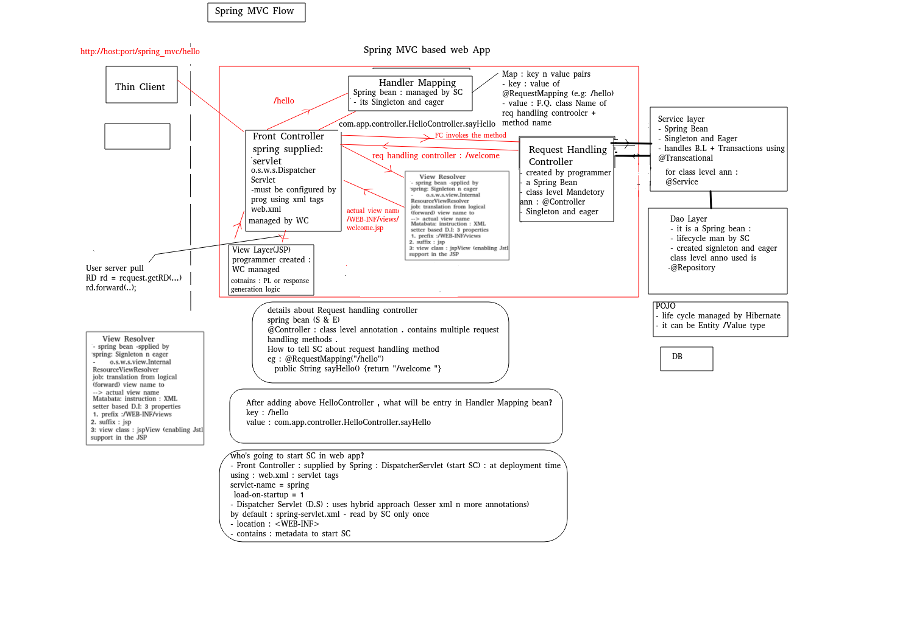

# j2EE syllabus 

1. Java Server Pages,
2.  JDBC, 
3.  JavaBeans,
4.   Java Security,
5.   Naming Services,
6.   Java Annotations,
7.    Java Mail,
8.   Java Messaging Services,
9.   Transactions, 
10.  Apache maven, 
11.  Introduction to hibernate,
12.  HQL,
13.   Hibernate, 
14.   Spring Framework, 
15.   Hands on Web services – JSON/XML/oData (data format conversation)

--- 

# Day 1 

## to read 

1. j2ee specification 
2. web server vs application server in case of j2ee? 
3. why j2ee ?
    
4. Why HttpServlet classs is declared as abstract class BUT with 100 % concrete functionality ?
-
1. It is abstract because the implementations of key servicing methods have to be provided by (e.g. overridden by) servlet developer. 
- Since it's abstract , it's instance can't be created.

2. A subclass of HttpServlet must override at least one method, usually one of these:
- 
1. doGet, if the servlet supports HTTP GET requests
2. doPost, for HTTP POST requests
3. doPut, for HTTP PUT requests
4. doDelete, for HTTP DELETE requests
- also compulsory to override init and destroy, to manage resources that are held for the life of the servlet

3. If you extend the class without overriding any methods, you will get a useless servlet; i.e. it will  give an error response for all requests.(HTTP 405 : Method not implemented) . 
-  So , if the class was not abstract, then any direct instance of HttpServlet would be useless.

4. So the reason for making the HttpServlet class abstract is to prevent a  programming error.
- As a servlet developer , you can choose to override the functionality of your requirement (eg : doPost) & ignore other methods. 

## Notes 

### Version Java EE 8 (J2EE 1.8) maintained under Oracle  / Jakarta EE 8 (maintained by eclipse foundation)

1. What is J2EE ?
- Consists of specifications only .

2. Which specs ? (Rules or contract )
- Specifications of services required for any enterprise application.

3. What is enterprise application ?
- An enterprise application (EA) is a large software system platform designed to operate in a corporate environment .

- It includes online shopping and payment processing, interactive product catalogs, computerized billing systems, security, content management, IT service management,  business intelligence, human resource management, manufacturing, process automation, enterprise resource planning ....

- These specifications include ---
- Servlet API,JSP(Java server page) API,Security,Connection pooling ,EJB (Enterprise Java Bean), JNDI(Naming service -- Java naming & directory i/f),JPA(java persistence API),JMS(java messaging service),Java Mail, Java Server Faces , Java Transaction API, Webservices support(SOAP/REST) etc...

- Vendor of J2EE specs -- Oracle / Sun / Eclipse
---
- Implementation -- left to vendors (J2EE server vendors)
+ J2EE compliant web server --- Apache -- Tomcat (web container)
+ Services implemented --- servlet API,JSP API,Security,Connection pooling,JNDI(naming service)

+ J2EE complaint application server --- web container + EJB (enterprise java bean) container
+ ALL J2EE services implementation
---

### J2EE server Vendors & Products
1. Apache -- tomcat(web server) / Tomee (app server)
2. Oracle / Sun --- reference implementation --- Glassfish
3. Red Hat -- JBoss (wild fly)
4. Oracle / BEA -- weblogic
5. IBM -- Websphere
- 

4. WHY J2EE
- 1.  Can support different types of clnts ---
1. thin client(web clnt)
2. thick clnt --- application clnt(eg : TCP client)
3. smart clnts -- mobile clnts
- 
- 2. J2EE server independence -
-  Create & deploy server side appln on ANY J2ee compliant server
-   guaranteed to produce SAME results w/o touching or re-deploying on ANY other J2EE server

- 3. Ready made implementation of primary services
- eg security, conn,pooling,email...
-  so that J2EE developer DOESn't have to worry about primary services 
-  rather can concentrate on actual business logic.


5. Layers involved in HTTP request-response flow (refer to day1-data\day1_help\diags\request-response-flow.png)

- Web browser sends the request (URL)
 eg : http://www.abc.com:8080/day1.1 
/day1.1  --- root / context path /web app name

- Host --Web server--Web Container(server side JVM)--Web application---HTML/JSP/Servlet....


6. What is dyn web application
-  server side appln deployed on web server meant for servicing typically web clnts(thin)  using application layer protocol  HTTP /HTTPS
- (ref : diag request-resp flow)

### Read --HTTP basics including request & response structure from day1-data\day1_help\j2ee_prerequisites\HTTP Basics


1. Objective ?: Creating & deploying dyn web appln on Tomcat -- For HTML content


2. IDE automatically creates J2EE compliant web application folder structure .
Its details -- Refer to diag (J2EE compliant web app folder structure)


7. What is Web container --- (WC) & its jobs
- 1. Server side JVM residing within web server.
- Its run-time env for dyn web components(Servlet & JSP,Filter) . 
Jobs ---
- 2. Creating Http Request & Http response objects 
- 3. Controlling life-cycle of dyn web comps (manages life cycle of servlet,JSP,Filters)
- 4. Giving ready-made support for services --- Naming,security,Conn pooling .
- 5. Handling concurrent request from multiple clients .
- 6. Managing session tracking...

8. What is web.xml ?
-  Deployment descriptor one per web appln
1. created by -- dev
2. who reads it -- WC
3. when --- @ deployment 
4. what --- dep instrs --- welcome page, servlet deployment tags, sess config, sec config......

-
9. Why servlets? 
-  To add dynamic nature to the web application

10. What is a servlet ?
- Java class (with NO main method) -
-  represents dynamic web component 
     - whose life cycle will be managed by WC(web container : server side JVM)
- no main method
- contains of overriding form of life cycle methods
- life cycle methods --- init,service,destroy
- call back mechanism 
- Job list
1. Request processing
2. B.L 
3. Dynamic response generation
4. Data access logic(DAO class --managing DAO layer)
5. Page navigation

- Servlet API details --refer to diag servlet-api.png

### Objective 1: Test basic servlet life cycle  -- init , service ,destroy
-  Creating & deploying Hello Servlet. 

11. Deployment of the servlet
-
1. Via annotation
```java
eg : @WebServlet(value="/validate")
public class LoginServlet extends H.S {....}
Map : 
key -- /validate
value -- F.Q servlet cls name
URL : http://host:port/day1.1/validate?....
```
2. Using XML tags
- How to deploy a servlet w/o annotations --- via XML tags
web.xml
```xml
<servlet>
 <servlet-name>abc</servlet-name>
		<servlet-class>pages.SecondServlet</servlet-class>
</servlet>
<servlet-mapping>
		<servlet-name>abc</servlet-name>
		<url-pattern>/test2</url-pattern>
</servlet-mapping>
WC : map 
key : /test2
value  : pages.SecondServlet

eg URL --http://host:port/day1_web/hello

```
3.  At the time of web app deployment 
- WC tries to populate map of url patterns ,
-  from XML tags (from web.xml). Later it  will check for @WebServlet annotation


### Objective 2: Test basic servlet life cycle  -- init , service ,destroy (deployed via xml)

1. How to read request params sent from the clnt ?

- javax.servlet.ServletRequest i/f methods
1. public String getParameter(String paramName)

2. public String[] getParameterValues(String paramName)

### Objective 3 : Accept different type of i/ps from user , in HTML form.Write a servlet to display request parameters.


# Day2 

## Today's topics
HttpSession based session tracking
Complete BookShop case study
Complete life cycle of servlet.
ServletConfig Vs ServletContext
Singleton instance of DB connection


## First Revise
Why session tracking ?
1. To remember the clnt's conversational state(eg :cart, bank account , reservation...)from succesful login ---logout
2. To identify client across multiple clients


Techniques ?
1. plain cookie based tech ---cookies are managed completely by servlet/JSP prog
Steps
1.1 create a cookie
Cookie c1=new Cookie(nm,val);//string,string
1.2 send the cookie to clnt , in resp hdr (set-cookie)
response.addCookie(c1);

1.3 clnt browser chks --
privacy settings
disabled --- session tracking fails
enabled -- chks age
-1 => def age --- transient cookie --cache
0 => delete cookie
> 0 => secs --- persistent --stored on clnt side h/d folders

Solve
eg : rem server IP address is  --ip1 
In web app(/day3.1) --- /s1(is a servlet) ---
Creates a  cookie  --- name --"clnt_info" , value --"details1234"

clnt IP adr--  ip2

1.4 Will Clnt browser of ip2  send the cookies in request header ?

1. clnt sends the URL --- http://ip3:8080/.....NOT sent (since different Host IP adr)
2. clnt sends the URL --- http://ip1:8080/day2/....  NOT sent (since different web app)
3. clnt sends the URL --- http://ip1:8080/day3.1/s2 : SENT (same host , same web app/web site)
4. clnt sends the URL --- http://ip1:8080/day3.1/s10 : SENT (same host , same web app/web site)

Default behaviour
Can be modified by Cookie class methods : setPath , setDomain

1.5 How to access clnt info from the  cookies ? (nm : clnt_info)
Cookie[]  cookies=request.getCookies();
if(cookies != null)
 for(Cookie c : cookies)
  if(c.getName().equals("clnt_info"))
   c.getValue() .....

1.5 limitations of cookie based approach
1. only text data.
2. inced no of cookies ---> inced net traffic
3. servlet prog has to manage cookies
4. Where is clnt's state stored : -- clnt side in form of a cookie
Cookies are deleted or rejected --entire session tracking fails

2. Session tracking based upon HttpSession i/f (from package : javax.servlet.http)
 
Major change -- WC manages cookie(creates, adds , retrieval)
1 cookie
(nm -- JSESSIONID , val --unique long string val generated per clnt by WC)

Clnt state is no longer saved on clnt side , instead saved on server side(within HttpSession obj)
One can store/restore java objs directly under the session scope(setAttribute/getAttribute/removeAttribute/getAttributeNames)

dis adv --- session tracking fails when cookies are disabled.(since key to HS object is still sent to the clnt as a cookie --
name -- JSESSIONID
value -- WC generated unique string(Pseudo random no generation protocol) / clnt.)

What is attribute?
server side object
entry = mapping =key n value pair
key = attribute name ---String
value = attr value -- java.lang.Object
who creates it ? servlet dev -- setAttribute(nm,val)
scope --request | session | application

eg : session.setAttribute("emp_salary",12345.78);//double ---> Double ---> Object

What is the scope of such attrs ?
eg :
HttpSession hs=request.getSession();
hs.setAttribute(nm,val); life time setAttr -------hs.invalidate() / session expiration tmout(30 mins for tomcat)

Session scoped attr will be shared between : multiple requests , coming from SAME client , for SAME web app

def session tmout value for Tomcat = 30 mins
How to change session tmout ?
HttpSession  i/f method
public void setMaxInactiveInterval(int secs)
eg : hs.setMaxInactiveInterval(300); --session tmout for 5 mins .
OR via xml tags

After either invalidate/tmout ,  What will happen ?
1. HS object is marked for GC from server side heap
2. jsesssionid cookie is deleted form clnt browser.
3. none
4. both 
Ans : 


Steps
1. HttpSession hs=request.getSession(); //new or exsisting 
2. Set Attribute  saving attrs under session scope
3. How to get attribute from HS scope ?
getAttribute(nm) -- val (Object)
4. logout page 
hs.invalidate(); --HS GCed.
----------------------------------
Complete case study
Completion till DAO
Table : dac_books
POJO : Book 
IBookDao
1. List<String> getAllCategories() ....
2. List<Book> getBooksByCategory(String catName) ...
3. Book getBookDetailsById(int bookId)...


Design servlets n test the same.

1. URL
http://localhost:8080/day3.1/category_details?cat_name=angular

http://localhost:8080/day3.1/add_to_cart?book_id=5&book_id=6


## Page Navigation Techniques
- Page Navigation=Taking user from 1 page to another page.

-  2 Ways
1. Client Pull
- Taking the client to the next page in the NEXT request
- 1. 1 User takes some action -
- eg : clicking on a button or link & then client browser generates new URL to take user to the next page.

1. 2 Redirect Scenario
- User doesn't take any action. Client browser automatically generates new URL to take user to the next page.(next page can be from same web appln , or diff web appln on same server or any web page on any srvr)

API of HttpServletResponse
public void sendRedirect(String redirectURL)
eg : For redirecting client from Servlet1 (/s1) to Servlet2 (/s2) , use
response.sendRedirect("s2");

If the response already has been committed(pw flushed or closed) , this method throws(WC) an IllegalStateException.(since WC can't redirect the client after response is alreadt committed)


2. Server Pull.
Taking the client to the next page in the same request.
Also known as resource chaining or request dispatching technique.
Client sends the request to the servlet / JSP. Same request can be chained to the next page for further servicing of the request.


Steps
1. Create Request Dispatcher object for wrapping the next page(resource --can be static or dynamic) 
API of ServletRequest
javax.servlet.RequestDispatcher getRequestDispatcher(String path)

2.Forward scenario
API of RequestDispatcher
public void forward(ServletRequest rq,ServletResponse rs)

This method allows one servlet to do initial processing of a request and another resource to generate the response. (i.e division of responsibility)

Uncommitted output in the response buffer is automatically cleared before the forward. 

If the response already has been committed(pw flushed or closed) , this method throws an IllegalStateException.

Limitation --only last page in the chain can generate dynamic response.

3. Include scenario
API of RequestDispatcher
public void include(ServletRequest rq,ServletResponse rs)

Includes the content of a resource @run time (servlet, JSP page, HTML file) in the response. --  server-side includes. 

Limitation -- The included servlet/JSP cannot change the response status code or set headers; any attempt to make a change is ignored. 


## What is a Session?

Session is a conversional state between client and server and it can consists of multiple request and response between client and server. Since HTTP and Web Server both are stateless, the only way to maintain a session is when some unique information about the session  is passed between server and client in every request and response.

HTTP protocol and Web Servers are stateless, what it means is that for web server every request is a new request to process and they cant identify if its coming from client that has been sending request previously.

But sometimes in web applications, we should know who the client is and process the request accordingly. For example, a shopping cart application should know who is sending the request to add an item and in which cart the item has to be added or who is sending checkout request so that it can charge the amount to correct client.

What is the need of session tracking?

1. To identify the clnt among multiple clnts
2. To remember the conversational state of the clnt(eg : list of the purchased books/ shopping cart/bank acct details/stocks) throughout current session

session = Represents duration or time interval 

Consists of all requests/resps coming from/ sent to SAME clnt from login to logout or till session expiration tmout.

There are several techniques for session tracking.
1. Plain Cookie based scenario
2. HttpSession interface 
3. HttpSession + URL rewriting
----------------------------------------------
Techniques

1. Plain Cookie based scenario

What is a cookie?
Cookie is small amount of text data.
Created by -- server (servlet or JSP prog or WC) & downloaded (sent) to clnt browser---within response header
 Cookie represents data shared across multiple dyn pages from the SAME web appln.(meant for the same client)

Steps :

1. Create cookie/s instance/s
javax.servlet.http.Cookie(String cName,String cVal)

2.Add the cookie/s to the resp hdr.
HttpServletResponse API :
void addCookie(Cookie c)

3. To retrieve the cookies :
HttpServletRequest :
Cookie[] getCookies()

4.Cookie class methods : 
String getName()
String getValue()
void setMaxAge(int ageInSeconds)
def age =-1 ---> browser stores cookie in cache
=0 ---> clnt browser should delete cookie
>0 --- persistent cookie --to be stored on clnt's hard disk.

int getMaxAge()

Disadvantages of pure cookie based scenario
0. Web developer (servlet prog) has to manage cookies.
1. Cookies can handle only text data : storing Java obj or bin data difficult.
2. As no of cookies inc., it will result into increased net traffic.
3. In cookie based approach : entire state of the clnt is saved on the clnt side. If the clnt browser rejects the cookies: state will be lost : session tracking fails.


How to redirect client automatically to next page ? (in the NEXT request)
API of HttpServletResponse
public void sendRedirect(String redirectLoc)
eg : resp.sendRedirect("s2");

IMPORTANT : 
WC -- throws 
java.lang.IllegalStateException: Cannot call sendRedirect() after the response has been committed(eg : pw.flush(),pw.close()...)
	


Technique # 2 : Session tracking based on HttpSession API
In this technique : 
Entire state of the client is not saved on client side , instead saved on the server side data structure (Http Sesion object) BUT the key to this Http Session object is STILL sent to client in form of a cookie.(cookie management is done by WC)


Servlet programmer  can store/restore java objects directly under the session scope(API : setAttribute/getAttribute)


Above mentioned , disadvantages ---0, 1 & 2 are reomved.
BUT entire session tracking again fails , if cookies are disabled.

Steps for javax.servlet.http.HttpSession i/f based session tracking.

1. Get Http Session object from WC

API of HttpServletRequest ---
HttpSession getSession()
Meaning --- Servlet requests WC to either create n return a NEW HttpSession object(for new clnt) or ret the existing one from WC's heap for existing client.


HttpSession --- i/f from javax.servlet.http
In case of new client : 
 HttpSession<String,Object> --empty map
String,Object ---- (entry)= attribute

OR
HttpSession getSession(boolean create)

2. : How to save data in HttpSession?(scope=entire session)
API of HttpSession i/f
public void setAttribute(String attrName,Object attrVal)
eg : hs.setAttribute("clnt_info",validatedCustomer);//no javac err
 attribute : server side object ---server side entry (key n value pair) --map


equivalent to map.put(k,v)
eg : hs.setAttribute("cart",l1);


3. For retrieving session data(getting attributes)
public Object getAttribute(String attrName) //key
eg : Customer cust=(Customer) hs.getAttribute("clnt_info");

4. To get session ID (value of the cookie whose name is jsessionid  -- unique per client by WC)
String getId()

4.5 How to remove attribute from the session scope?
public void removeAttribute(String attrName)
eg : hs.removeAttribute("clnt_info");

5. How to invalidate session?
HttpSession API
public void invalidate()
(WC marks HS object on the server side for GC ---BUT cookie  is NOT deleted from clnt browser)

6. HttpSession API
public boolean isNew()
Rets true for new client & false for existing client.

7.How to find all attr names from the session ?
public Enumeration<String> getAttributeNames()
--rets java.util.Enumeration of attr names.

8. Default session timeout value for Tomcat = 30 mins
How to change session tmout ?
HttpSession  i/f method
public void setMaxInactiveInterval(int secs)
eg : hs.setMaxInactiveInterval(300); --for 5 mins .

OR via xml tags in web.xml
<session-config>
  <session-timeout>5</session-timeout>
</session-config>


NOTE : 
What is an attribute ?
attribute = server side object(entry/mapping=key value pair)
who creates server side attrs ? -- web developer (servlet or JSP prog)
Each attribute has --- attr name(String) & attr value (java.lang.Object)
Attributes can exist in one of 3 scopes --- req. scope,session scope or application scope
1. Meaning of req scoped attr = attribute is visible for current req.
2. Meaning of session scoped attr = attribute is visible for current session.(shared across multiple reqs coming from SAME clnt)
3. Meaning of application scoped attr = attribute is visible for current web appln.(shared across multiple reqs from ANY clnt BUT for the SAME web application)


# Day3
- in day 2 notes


# Day4 

## Today's topics
1. Complete Servlet Life cycle + ServletConfig
2. Executor Framework (used by WC to support concurrent handling of multiple client requests)
3. CGI Vs Servlets
4. Server pull
5. Scopes of attributes in web programming
6. ServletConfig vs ServletContext
7. Web application listeners
---
1.  day 4.1 : DB independent web app

- Complete Servlet Life cycle (including thread pool)
- Apply servlet config.
- How to Make web application DB independent (use ServletConfig)
(i.e if underlying DB changes ---no changes in java code BUT add DB specific details(JDBC drvr class, dbURL,userName , pwd) in xml based config files)


2. Scopes of attributes in web programming
refer to diag.

3. Refer to day4.3 
Replace client pull by server pull. (for LoginServlet--->CatalogServlet)  : forward
Request Dispatching technique
refer : readme n diagrams

4. Refer to day4.4 
Replace client pull by server pull. (for LoginServlet--->CatalogServlet) : include
Request Dispatching technique
refer : readme n diagrams

5. Refer to day4.5
How to Make web application DB independent (use ServletContext)
(i.e if underlying DB changes ---no changes in java code BUT add DB specific details(JDBC drvr class, dbURL,userName , pwd) in xml based config files)

6. Create web app listener (implementing ServletRequest, Session & ContextListener)
- Objective : Create a context listener , singleton instance of DB connection .
- 5.1 web.xml
- add ctx parameter : for DB config
- 5.2 Create a class imple ServletContextListener i/f 
     - contextInitialized
     - contextDestroyed
- 5.3 Edit DBUtils
- 5.4 Edit DAO layers.

---------------------------
Reading H.W ---
1.differentiate between getSession() vs getSesssion(create) of HttpServletRequest.

2.GenericServlet's overloaded init methods
3.Creating RequestDispatcher using ServletRequest or ServletContext
4. HttpSession internals
refer to --session internals & WC Heap pics.


## notes

### 1. Regarding SERVLET CONFIG	

- A servlet specific configuration object created by a servlet container to pass information to a servlet during initialization.

1. Represents Servlet specific configuration.
Defined in javax.servlet.ServletConfig -- interface.

2. Who creates its instance  ?
Web container(WC)
3. When ?
After WC creates servlet instance(via def constr), ServletConfig instance is created & then it invokes init() method of the servlet.
4. Usage
To store servlet specific init parameters.
(i.e the init-param is accessible to one servlet only or you can say that the init-param data is private for a particular servlet.)

5. Where to add servlet specific init parameters?
Can be added either in web.xml or @WebServlet annotation.

XML Tags
```xml
<servlet>
    <servlet-name>init</servlet-name>
    <servlet-class>ex.TestInitParam</servlet-class>
    <init-param>
      <param-name>name</param-name>
      <param-value>value</param-value>
    </init-param>
</servlet>
<servlet-mapping>
<servlet-name>init</servlet-name>
<url-pattern>/test_init</url-pattern>
</servlet-mapping>
```
6. How to access servlet specific init params from a servlet ?
6.1 Override init() method
6.2 Get ServletConfig
Method of Servlet i/f 
public ServletConfig getServletConfig()
6.3 Get the init params from ServletConfig
Method of ServletConfig i/f
String getInitparameter(String paramName) : rets the param value.


### 2. Executor Framework

- Introduced in Java 5.

1. **What's earlier support i.e in core java we used?**
- Extends Thread 
- Implements Runnable 

2. **Why Executor Framework?**
- 1. If you have thousands of task to be executed and if you create each thread for thousands of tasks, you will get performance overheads as creation and maintenance of each thread is  an overhead. 
- 2. Executor framework  solves this problem. 
- 3. In executor framework, you can create specified number of threads and reuse them to execute more tasks once it completes its current task.
- 4. It simplifies the design of creating multithreaded application and manages thread life cycles.
- 5. The programmer does not have to create or manage threads themselves, that’s the biggest advantage of executor framework.

3. **Important classes / interfaces for executor framework.**
- 
1. java.util.concurrent.Executor
- This interface is used to submit new task.
- It has a method called “execute”.

 ```java
public interface Executor {
 void execute(Runnable task);
}
```

2. ExecutorService
- It is sub-interface of Executor.
- Provides methods for 
     -     Submitting / executing Callable/Runnable tasks
     - Shutting down service
     - Executing multiple tasks etc.

3. ScheduledExecutorService
- It is sub-interface of executor service which provides methods for scheduling tasks at fixed intervals or with initial delay.

4. Executors
- This class provides factory methods for creating thread pool based executors.
- Important factory methods(=static method rets instance of ExecutorService) of Executors are:

- 4.1.  newFixedThreadPool:
     -  This method returns thread pool executor whose maximum size is fixed.
     -  If all n threads are busy performing the task and additional tasks are submitted, then they will have to wait  in the queue until thread is available.
- 4.2 newCachedThreadPool:
     -  this method returns an unbounded thread pool. It doesn’t have maximum size but if it has less number of tasks, then it will tear down unused thread.
     -   If a thread has been unused for keepAliveTime , then it will tear it down.
- 4.3 newSingleThreadedExecutor: 
     - this method returns an executor which is guaranteed to use the single thread. 
- 4.4 newScheduledThreadPool:
     -  this method returns a fixed size thread pool that can schedule commands to run after a given delay, or to execute periodically.

4. **Steps for Runnable** 
- 
1. Create a thread-pool executor , using suitable factory method of Executors.
- eg : For fixed no of threads
> ExecutorService executor = Executors.newFixedThreadPool(10);

2. Create Runnable task

3. Use inherited method
> public void execute(Runnable command)
- Executes this Runnable task , in a separate thread.

4. Shutdown the service
> public void shutdown()
- Initiates an orderly shutdown in which previously submitted tasks are executed, but no new tasks will be accepted. 

5. > boolean awaitTermination(long timeout,TimeUnit unit) throws InterruptedException
- Blocks until all tasks have completed execution after a shutdown request, or the timeout occurs.

6. > List<Runnable> shutdownNow()
- Attempts to stop all actively executing tasks, halts the processing of waiting tasks, and returns a list of the tasks that were awaiting execution.
---

7. BUT disadvantages with Runnable interface 
- 1. Can't return result from the running task
- 2. Doesn't include throws Exception .

5. **Better API**
> java.util.concurrent.Callable<V>
> V : result type of call method
- Represents a task that returns a result and may throw an exception. 
- Functional i/f
> SAM : public V call() throws Exception
- Computes a result, or throws an exception if unable to do so.

6. **Steps in using Callable i/f**
-
1. Create a thread-pool executor , using suitable factory method of Executors.
- eg : For fixed no of threads
> ExecutorService executor = Executors.newFixedThreadPool(10);

2. Create Callable task , which returns a result.

3. To submit a task to executor service , use method of ExecutorService i/f : 
> public  Future<T> submit(Callable<T> task)
- Submits a value-returning task for execution and returns a Future representing the pending results of the task. 
- It's a non blocking method (i.e rets immediately)
- The Future's get method will return the task's result upon successful completion.
- If you would like to immediately block waiting for a task, invoke get() on Future. 
- eg :  result = exec.submit(aCallable).get();

- OR 
- main thread can perform some other jobs in the mean time & then invoke get on Future , to actually get the results. 
- (get : blocking call ,waits  till the computation is completed n then rets result)

4. Other methods of ExecutorService i/f

> public  List<Future<T>> invokeAll(Collection<? extends Callable<T>> tasks) throws InterruptedException

- It's a blocking call.(waits till all tasks are complete)
- Executes the given tasks, returning a list of Futures holding their status and results when all complete.
-  Future.isDone() is true for each element of the returned list.

5. Shutdown the service
> public void shutdown()
- Initiates an orderly shutdown in which previously submitted tasks are executed, but no new tasks will be accepted. 

6. >  boolean awaitTermination(long timeout,TimeUnit unit) throws InterruptedException
- Blocks until all tasks have completed execution after a shutdown request, or the timeout occurs.

7.  > List<Runnable> shutdownNow()
- Attempts to stop all actively executing tasks, halts the processing of waiting tasks, and returns a list of the tasks that were awaiting execution.

### 3. Regarding javax.servlet.ServletContext (i/f)

1. Defined in  javax.servlet package.
2. Who creates its instance  -- WC
3. When -- @ Web application (=context) deployment time
####  NOTE : The ServletContext object is contained within the ServletConfig object, which the WC provides the servlet when the servlet is initialized.

4. How many instances ?
-  one per web application

5. Usages
- 5.1 Server side logging
      - API public void log(String mesg)
- 5.2 To create context scoped attributes
      - API public void setAttribute(String nm,Object val)
- NOTE : Access them always in thread safe manner

- 5.3 To access global(scope=entire web application) parameters
6.  How to add context scoped parameters ?

- In web.xml
```xml
<context-param>
  <param-name>name</param-name>
      <param-value>value</param-value>
</context-param>
```
7. How to access these params in a Servlet ?
- (can be accessed from init method onwards)
1. Get ServletContext  
- API of GenericServlet
> ServletContext getServletContext() --method inherited from GenericServlet

2. ServletContext API
> String getInitparameter(String paramName) : rets the param value.
- eg : ctx param name : user_name value : abc
> In the Servlet : getServletContext().getInitparameter("user_name") ---abc

- 5.4 Creating request dispatcher
H.W


### 4. Page Navigation Techniques
- Page Navigation=Taking user from 1 page to another page.
- 2 Ways
1. Client Pull
- Taking the client to the next page in the NEXT request
- 1.1 User takes some action -
      - eg : clicking on a button or link & then client browser generates new URL to take user to the next page.

- 1.2 Redirect Scenario 
      - User doesn't take any action.
      -  Client browser automatically generates new URL to take user to the next page.(next page can be from same web appln , or diff web appln on same server or any web page on any srvr)

- 2. API of HttpServletResponse
> public void sendRedirect(String redirectURL)
- eg : For redirecting client from Servlet1 (/s1) to Servlet2 (/s2) ,
      -  use response.sendRedirect("s2");

- If the response already has been committed(pw flushed or closed) , 
      - this method throws(WC) an IllegalStateException.
      - (since WC can't redirect the client after response is alreadt committed)


2. Server Pull.
- Taking the client to the next page in the same request.
- Also known as resource chaining or request dispatching technique.
- Client sends the request to the servlet / JSP.
-  Same request can be chained to the next page for further servicing of the request.


- 1. Steps
1. Create Request Dispatcher object for wrapping the next page(resource --can be static or dynamic) 
- API of ServletRequest
> javax.servlet.RequestDispatcher getRequestDispatcher(String path)

2. Forward scenario
- API of RequestDispatcher
> public void forward(ServletRequest rq,ServletResponse rs)

- This method allows one servlet to do initial processing of a request and another resource to generate the response. (i.e division of responsibility)
- Uncommitted output in the response buffer is automatically cleared before the forward. 
- If the response already has been committed(pw flushed or closed) , this method throws an IllegalStateException.

- Limitation --only last page in the chain can generate dynamic response.

3. Include scenario
- API of RequestDispatcher
> public void include(ServletRequest rq,ServletResponse rs)

- Includes the content of a resource @run time (servlet, JSP page, HTML file) in the response. --  server-side includes. 
- Limitation -- The included servlet/JSP cannot change the response status code or set headers; any attempt to make a change is ignored. 


### 5. What is a Servlet Listener(or web application listener)?
- 1. During the lifetime of a typical web application, a number of events take place.
- eg : requests are created or destroyed.
- sessions are created & destroyed
- Contexts(web apps) are created & destroyed.
- request or session or context attributes are added, removed, or modified etc.

- 2. The Servlet API provides a number of listener interfaces that one  can implement in order to react to these events.

- eg : Event Listener i/f
1. ServletRequestListener
2. HttpSessionListener
3. ServletContextListener

- Steps
1. Create a class , implementing from Listener i/f.
2. Register it with WC
- 2.1 @WebListener annotation(class level)
OR
2.2 XML tags in web.xml
```xml
<listener>
 <listener-class>F.Q cls name of listener</listener-class>
</listener>
```


# Day5 

## topic

### JSP
1. What is it ?
2. Why ?
3. JSP API
4. JSP Life cycle
5. JSP Syntax

6. Objective : Create dyn web app using layers :
- JSP --- JB --- DAO (DBUtils) ---POJO --- DB
- Create Java bean : for client validation.
1. public n pkged class (eg : beans)
2. properties : email,password (clnt sent request params) + results : validated user details : Customer validCustomer/Voter
3. Default arg-less constr : 
- 3.1 instantiate DAO (customer DAO)

4. Supply suitable setters/getters

5. B.L : public
```java
public String validateCustomer()
{
   validCustomer=dao.authenticateUser(email,password);
  if(validCustomer == null)
   return "login";//JB  is returning dyn navigational outcome to JSP
  return "category";
}
```

### 1. What is JSP? (Java server page)
- Dynamic Web page (having typically  HTML 5 markup) , that can embed Java code directly.
- Dynamic web component , whose life-cycle is managed by WC(JSP container/Servlet container/Servlet engine)

#### 2. WHY JSP?

1. JSP allows developer to separate presentation logic(dyn resp generation)  from Business logic or data manipulation logic.
- Typically JSPs -- used for P.L(presentation logic)
- Java Beans or Custom Tags(actions) --- will contain Business logic.

2. Ease of development --- JSP pages are auto. translated by W.C in to servlet & compiled & deployed.

3. Can use web design tools -- for faster development (RAD --rapid application development) tools.

4. JSP API : part of J2EE specification 
> jsp-api.jar --- <tomcat>/lib : specs
- Implementation : server vendors : Apache --jasper.jar
- Contains JSP API implementation classses.
```java
0. javax.servlet.Servlet -- super i/f
1. javax.servlet.jsp.JspPage -- extends Servlet i/f
 public void jspInit()
 public void jspDestroy()
```
- Can be overridden by JSP page author

2. Further extended by  javax.servlet.jsp.HttpJspPage
>  public void _jspService(HttpServletRequest rq,HttpServletResponse rs) throws ServletExc,IOExc.

- Never override _jspService ---JSP container auto translates JSP tags (body) into _jspService.

### 4.  JSP life-cycle

1. Clnt sends the 1st request to the JSP (test.jsp)
2. Web-container invokes the life cycle for JSP
3. Translation Phase : handled by the JSP container.
- I/p : test.jsp  O/p : test_jsp.java (name : specific to the Tomcat container)
- Meaning : .jsp is translated into corresponding  servlet page(.java)
- Translation time errs : syntactical  errs in using JSP syntax.
- In case of errs : life-cycle is aborted.
4. Compilation Phase : handled by the JSP container.
- I/p : Translated servlet page(.java)   O/p : Page Translation class(.class)
- Meaning : servlet page auto. compiled into .class file
- Compilation time errs: syntacticle  errs in generated Java  syntax.
5. Request processing phase / Run time phase. : typically handled by the Servlet Container.
6. S.C : will try to locate,load,instantiate the generated servlet class.
7. The 1st it calls : public void jspInit() : 
- one time inits can be performed.(jspInit availble from javax.servlet.jsp.JspPage)
8. Then it will call follwing method using thrd created per clnt request : 
>  public void _jspService(HttpServlet Rq,HttpServletResponse) throws ServletException,IOException(API
-  avlble from   javax.servlet.jsp.HttpJspPage)
- When _jspService rets , thread's run method is over & thrd rets to the pool, where it can be used for servicing some other or same clnt's req.

9. At the end ...(server shutting down or re-deployment of the context) : the S.C calls
public void jspDestroy()
- After this : translated servlet page class inst. will be GCEd....

10. For 2nd req onwards ...... : SC will invoke step 8 onwards.

- JSP 2.0/2.1/2.2/2.3 syntax
- 
### 5. JSP comments

1. server side comment
> syntax : <%-- comment text --%>
- significance : JSP translator & compiler ignores the commented text.

2. clnt side comment
> syntax : <!-- comment text -->
- significance : JSP translator & compiler does not ignore the commented text BUT clnt browser will ignore it.


### 6.  JSP's implicit objects (available only to _jspService) -- avlable to scriptlets,exprs
- 1. out
-   javax.servlet.jsp.JspWriter :
-  represents the buffered writer stream connected to the clnt via HttpServletResponse(similar to your PW in servlets)
Has the same API as PW(except printf)
- usage eg : out.print("some text sent to clnt");

- 2. request :
-  HttpServletRequest (same API)

- 3. response :
-  HttpServletResponse

- 4. config :
-  ServletConfig (used for passing init params)

- 5. session :
-  HttpSession (By def. all JSPs participate in session tracking i.e session obj is created) 

- 6. exception :
-  java.lang.Throwable (available only to err handling pages)

- 7. pageContext  :
-  current page environment : javax.servlet.jsp.PageContext
-  (this class stores references to page specific objects viz -- exception,out,config,session)
- It can be also used to store page scoped attributes (using setAttribute method)

- 8. application :
-  ServletContext
-  used for Request dispatching, server side logging, for creating context listeners,to avail context params, to add/get context scoped attrs
- 9. page 
-  current translated page class instance created for 'this' JSP 
- eg : If you create test.jsp , 
      - Tomcat will translate it into a public class test_jsp : 
      - page => instance of this class.


### 7. Scripting elements : To include the java content within JSP : to make it dynamic.

1. Scriptlets :
-  Can be used to add the java code directly . AVOID scriptlets .
-   (Use only till you learn Javabeans & custom tags or JSTL,). we will use use the scriptlets to add : Req. processing logic, B.L & P.L)
> syntax : <% java code...... %> : within <body> tag.
- location inside the translated page : within _jspService
- usage : till Java beans   or cust. tags are introduced : scriptlets used for control flow/B.L/req. proc. logic


2. JSP expressions : 
> syntax : <%= expr to evaluate %>
- Evaluates an expression --converts it to string --send it to clnt browser.
- eg : <%= new Date() %>

- 1. expr to evaluate : 
- java method invocation which rets a value OR
const expr or attributes(getAttribute) or variables(instance vars or method local)
- location inside the translated page : within _jspService
- significance : the expr gets evaluated---> to string -> automatically sent to clnt browser.
- examples
```java
<%= new Date() %>
<%= request.getAttribute("user_dtls") %> 
<%= 12*34*456 %>
<%= session.getAttribute("user_dtls") %>
<%= session.setAttribute("nm",1234) %> -- compiler error
<%= session.getId() %>
```


3. Expression Language
- 1. Better alternative to JSP Expressions : EL syntax (Expression Language : avlble from JSP 1.2 onwards)
> syntax : ${expr to evaluate} (to be added directly in body tag)
- EL syntax will evaluate the expr ---to String --sends it clnt browser.

- 2. JSP implicit object -
- request,response,session....---accessible from scriptlets & JSP exprs.

- 3. EL implicit objects 
 -   can be accessible only via EL syntax
- 1. param = name of the map containing request parameters
- 2. pageScope = name of the map containing page scoped attrs
- 3. requestScope = name of the map containing request scoped attrs
- 4. sessionScope = name of the map containing session scoped attrs
- 5. applicationScope = name of the map containing application(=context) scoped attrs
- 6. pageContext = instance of PageContext's sub class
- 7. cookie = name of the map containing cookies(cookie objects)
- 8. initParam = map of context params.

- avlable ONLY to EL syntax ${...}
- to be added directly within <body> ...</body>

- 9. eg : ${param.user_nm} 
-  param.get("user_nm") - value --to string ---> clnt 
- request.getParameter("user_nm") --value --to string ---> clnt 
- ${requestScope.abc} ---request.getAttribute("abc") ---to string --sent to clnt browser.

- 10. eg :
```java
 suppose ctx scoped attr --- loan_scheme
- ${applicationScope.loan_scheme}  --- getServletContext().getAttribute("loan_scheme") ---to string --sent to clnt
  
${abc} ---WC treats it as an attribute name.
pageContext.getAttribute("abc") ---not null -- to string -clnt
 null 
--request.getAttribute("abc") -- not null -- to string -clnt
null
session.getAttribute("abc") ---not null -- to string -clnt
null 
getServletContext().getAttirbute("abc") --not null -- to string -clnt
null ---BLANK to clnt browser.
```
- 11. eg :
```java
eg : Which will be faster for suppose : you have added a sesion scoped attribute
<%
 session.setAttribute("nm",new Date());
%>
1. ${sessionScope.nm}
2. ${nm}
Ans : 1

${pageContext.session.id}
--pageContext.getSession().getId() --- val of JessionId cookie w/o java code.

${pageContext.request.contextPath} ---
WC : pageContext.getRequest().getContextPath() --to string --sent to clnt
eg : /day5.1

${pageContext.session.maxInactiveInterval}
WC : pageContext.getSession().getMaxInactiveInterval() --- 1800
```
```java
${param}
{user_nm=asdf, user_pass=123456} 


eg : ${param.f1} ---> request.getParameter("f1").toString()---> sent to browser

param ----map of req parameters.


param : req. param map

${requestScope.abc} ----- out.print(request.getAttribute("abc").toString())

${abc}  -----pageCotext.getAttribute("abc")----null ---request ---session---application ---null ---EL prints blank.
```


4. JSP declarations
- 1. Represents  : private members of the translated servlet class
> syntax : <%! JSP declaration block %> (outside <body> tag within JSP)
- Usage : 
1. for creating page scoped java variables & methods (instance vars & methods/static members) : default scope => private
2. Also can be used for overriding life cycle methods (jspInit,jspDestroy)
- location inside the translated page : outside of _jspService (directly within JSP's translated class)
---


5. JSP Directives
-  commands/messages for JSP Engine(=JSP container=WC) -- to be used @Translation time. 

- Syntax 
> <%@ Directive name attrList %>
> 
1. **page directive**
- all commands applicable to current page only.
- Syntax 
> <%@ page import="comma separated list of pkgs" contentType="text/html" %>
- eg 
> <%@ page import="java.util.*,java.text.SimpleDateFormat" contentType="text/html"  %>
- Imp page directive attributes
- 1. import  --- comma separated list of pkgs
- 2. session --- boolean attribute. def=true.
   - To disable session tracking, spectify session="false"


- 3. errorPage="URI of err handling page" ---
   - tells WC to forward user to err handler page.
- 4. isErrorPage="true|false" def = false
   - If u enable this to true--- one can access 'exception' implicit object from this page.

   - This exception obj is stored under current page ---i.e under pageContext (type=javax.servlet.jsp.PageContext -- class which represents curnt JSP)
   - EL expresssion to display error mesg
    > ${pageContext.exception.message}
   - evals to pageContext.getException().getMessage()


6. Additional EL syntax

- EL syntax to be used in error handling pages 

 - 1. ERR causing URI :  ${pageContext.errorData.requestURI }<br/>
 - 2. ERR code :  ${pageContext.errorData.statusCode}<br/>
 - 3. ERR Mesg :  ${pageContext.exception.message} <br/>
 - 4. Throwable : ${pageContext.errorData.throwable}<br/>
 - 5. Throwable Root cause: ${pageContext.errorData.throwable.cause}


- 6. isThreadSafe="true|false" default=true. "true" is recommended
- true=>informing WC--- JSP is already written in thrd -safe manner ---- DONT apply thrd safety.
- false=>informing WC --- apply thrd safety.

- 7. (NOT recommended) ---WC typically marks entire service(servlet scenario) or _jspService in JSP scenarion --- synchronized. --
-  this removes concurrent handling of multiple client request --so not recommended.
- 8. What is reco? --
-  isThreadSafe=true(def.) --- identify critical code--wrap it in synchronized block.
- eg ---Context scoped attrs are inherently thrd -un safe. So access them always from within synched block.

- 7. Equivalent step in Servlet 
- Servlet class can imple. tag i/f -
-  javax.servlet.SingleThreadModel(DEPRECATED) --
-   WC ensures only 1thread (representing clnt request) can invoke service method. --NOT NOT recommended.


2. **include directive**
> <%@ include file="URI of the page to be included" %>
- Via include directive ---- 
- contents are included @ Translation time.--- indicates page scope(continuation of the same page).
- Typically used -- for including static content (can be used to include dyn conts)
- eg 
```java
---one.jsp
....<%@ include file="two.jsp" %>
two.jsp.....
```

---

6. JSP actions ----
- commands/mesgs meant for WC
- to be interpreted @ translation time & applied @ req. processing time.(run time)
- Syntax --
-standard actions --implementation classes are present in jsp-api.jar.
```jsp
<jsp:actionName attr list>Body of the tag/action
</jsp:actionName>
```


### 8. JSP Using Java beans
1. Why  Java Beans 
 - 1. allows prog to seperate  B.L in JBs.
 - (Req processing logic, Page navigation & resp generation will be still part of JSP)
- JBs can store conversational state of clnt(JB 's properties will reflect clnt state) + supplies Business logic methods.

- 2. simple sharing of JBS across multiple web pages---gives rise to re-usability.

- 3. Auto. translation between  req. params & JB props(string--->primitive data types auto. done by WC)

2. What is JB?
- 1. pkged public Java class 
- 2. Must have def constr.(MUST in JSP using JB scenario)
- 3. Properties of JBs ---
-  private, non-static , non-transient Data members  --
- equivalent to request params sent by clnt.(Prop names MUST match with req params for easy usage)
In proper words --
- Java bean props reflect the conversational state of the clnt.
- 4. per property  -- if RW
- naming conventions of JB
- supply getter & setter.
- Rules for setter (Java Bean Naming convention) : strict
> public void setPropertyName(Type val)
- Type -- prop type.
- eg -
```java
- private double regAmount;
public void setRegAmount(double val)
{...}
Rules for getter
public Type getPropertyName()
Type -- prop type.
eg -- public double getRegAmount(){...}
```
- 5. Business Logic --- methods
- public methods --- no other restrictions
----------------------------


3. Using Java Beans from JSP Via standard actions

1. >  <jsp:useBean id="BeanRef name" class="F.Q. Bean class name" scope="page|request|session|application/>
- def = page scope.
- pre-requisite --- JB class exists under <WEB-INF>/classes.
- JB = server side obj (attribute), attr name --- bean id,attr val -- bean inst.,can be added to any scope using scope atribute.


eg --
- beans.Userbean
- props --- email,pass
- setters/getters
- B.L mehod -- for validation

- Usage ---
> <jsp:useBean id="user" class="beans.UserBean" scope="session"/>


2. W.C invokes JB life-cycle
- 1. WC chks if specified Bean inst alrdy exists in specified scope
```java
java api --- request.getAttribute("user")
---null=>JB doesn't exist
---loc/load/inst JB class
UserBean u1=new UserBean();
--add JB inst to the specified scope
java api -- request.setAttribute("user",u1);
--- not-null  -- WC continues....
```
3. JSP using JB action
>  <jsp:setProperty name="Bean ref Name" property="propName" value="propVal---static/dyn" />
- Usage -
```java
<jsp:setProperty name="user" property="email"
value="a@b"/>
```
- WC invokes ---
```java
 session.getAttribute("user").setEmail("a@b");

<jsp:setProperty name="user" property="email"
value="<%= request.getParameter("f1") %>"/>

OR via EL
<jsp:setProperty name="user" property="email"
value="${param.f1}"/>
```
- WC invokes ---
> session.getAttribute("user").setEmail(request.getParameter("f1"));

4.  
```java
<jsp:setProperty name="Bean ref Name" property="propName" param="rq. param name"/>


Usage eg --
<jsp:setProperty name="user" property="email" param="f1"/>


WC invokes ---
((Userbean)request.getAttribute("user")).setEmail(request.getParameter("f1"));
```


5. 
```java
<jsp:setProperty name="Bean ref Name" property="*"/>
usage

<jsp:setProperty name="user" property="*"/>
```

- eg -
- If rq. param names are email & password(i.e matching with JB prop names) then ---matching setters(2) will get called 

```java
 <jsp:getProperty name="Bean ref name" property="propName"/>
Usage -- 
<jsp:getProperty name="user" property="email"/>
WC ---
session.getAttribute("user").getEmail()--- toString --- sent to clnt browser.
```

6. Better equivalent  -- EL syntax
```java 
${sessionScope.user.email} ---
session.getAttribute("user").getEmail()--- toString --- sent to clnt browser.

${requestScope.user.validUser.email}
request.getAttribute("user").getValidUser().getEmail()

${pageContext.exception.message}
```


### JSP std actions related to Request Dispatcher

1. RD's forward scenario
> <jsp:forward page="dispatcher URI" />
- eg : In one.jsp
> <jsp:forward page="two.jsp"/>
- WC invokes ---
```java
 RD rd=reuqest.getRD("two.jsp");
rd.forward(request,response);
```
2. RD's include scenario
> <jsp:include page="dispatcher URI" />


2. Why JSTL ?
-  JSP standard tag library
- When JSP std actions are in-sufficient to solve B.L
- 1. w/o writing scriptlets --
   - use additional std actions --
   -  supplied as JSTL actions
- 2. JSP standard Tag Library
      - has become std part of J2EE 1.5 onwards.
      - support exists in form JAR 
- 3. jstl-1.2.jar
- For using JSTL steps
1. Copy above JAR into ur run-time classpath(copy jars either in <tomcat_home>/lib OR <web-inf>/lib
2. Use taglib directive to include JSTL tag library into ur JSP pages.
```java
tag=action
tag library=collection of tags
supplier = JSTL vendor(spec vendor=Sun, JAR vendor=Sun/any J2EE compliant web/app server)
jstl.jar --- consist of Tag implementation classes
Tag libr-   TLD -- Tag library descriptor -- desc of tags -- how to use tags
<%@ taglib uri="URI of JSTL tag lib" prefix="tag prefix" %>

eg --- To import JSTL core lib
<%@ taglib uri="http://java.sun.com/jsp/jstl/core" prefix="c" %>

```


4. Invoke JSTL tag/action
- eg
```java 
<c:set var="abc" value="${param.f1}"  />
---WC 
pageContext.setAttribute("abc",request.getParameter("f1"))

WC invokes --- session.setAttribute("abc",request.getparameter("f1"));

menaing of <c:set> sets the specified attr to specified scope.

<c:set var="details" value="${sessionScope.abc}" />
WC 
pageContext.setAttribute("details",session.getAttribute("abc"));
```

1. <c:remove var="abc" scope="request"/>
- WC ---
> request.removeAttribute("abc") --
- removes the attr from req scope.

2. JB --- ShopBean -- property -- 
> private AL<Category> categories; --g & s

```java
<c:forEach var="cat" items="${sessionScope.shop.listCategories()}">
${cat}<br/>
</c:forEach>

WC invokes ---

for(Category cat : session.getAttribute("shop").listCategories())
  out.print(cat);

eg : 
<c:forEach var="acct" items="${sessionScope.my_bank.acctSummary}">
${acct.acctID} ${acct.type} ${acct.balance} <br/>
</c:forEach>
```

> http://localhost:8080/day6_web/close_acct.jsp?acId=101


```java
<input type="submit" name="btn" value="Withdraw"
					formaction="transactions.jsp" /></td>
				<td><input type="submit" name="btn" value="Deposit"
					formaction="transactions.jsp" /></td>

<% request.getPrameter("btn").equals("Deposit") %>
<c:if test="boolean val">

....
</c:if>

<c:if test="${param.btn eq 'Deposit'}">
  in deposit
</c:if>
<c:if test="${param.btn eq 'Withdraw'}">
  in withdraw
</c:if>
```
> http://localhost:8080/day6_web/transactions.jsp?acId=102&amount=500&btn=Deposit

```java
<c:redirect url="${sessionScope.my_bank.closeAccount()}"/>
WC --- response.sendRedirect(session.getAttribute("my_bank").closeAccount());
```
---

5. JSTL action --- for URL rewriting
```java

<c:url var="attr Name" value="URL to be encoded" scope="page|request|session|application"/>

eg : <c:url var="abc" value="next.jsp" />
WC invokes --- pageContext.setAttribute("abc",resp.encodeURL("next.jsp"));

<a href="${abc}">Next</a>

```
- var -- loop var
- items -- any JB 's prop --- array based,coll based (List or set) map based.

- Java syntax
```java
for(Category c : categories)
out.write(c.getName()
```
6. How to set session tm out ?
- 1. programmatically --- using Java API
- 2. From HttpSession --- setMaxInactiveInterval(int secs)
- 3.  declarativally -- either using Java annotations OR using XML config files (web.xml)

- Note : when u dont specify form action , its submitted to the same page.


### Expression Language implicit variables(case sensitive)

1. pageContext : 
- PageContext object (javax.servlet.jsp.PageContext) asso. 
    with current page. 
2. pageScope 
- a Map that contains  page-scoped attribute names and  their 
    values.
3. requestScope 
- a Map that contains request-scoped attribute names and  their
    values.
4. sessionScope 
- a Map that contains session-scoped attribute names and their 
    values.
5. applicationScope 
- a Map that contains application-scoped attribute names 
    and their values.
6. param -
-  a Map that contains rq. parameter names to a single String parameter
   value (obtained by calling ServletRequest.getParameter(String name)).
7. paramValues 
- a Map that contains rq. param name to a String[] of all values
   for that parameter (similar to calling ServletRequest.getParameterValues(name)
8.  initParam 
- a Map that contains context initialization parameter names and their 
String value (obtained by calling ServletContext.getInitParameter(String name)).
- eg : ${initParam.db_drvr}

9. cookie :
-  Map.Entry of cookies. (entrySet of cookies)
- eg :
```java
 ${cookie.cookiename.value} 
 key ---cookie name
value ---javax.servlet.http.Cookie


${cookie.JSESSIONID.value}
---cookie.get("JSESSIOIND").getValue()
```

10.  To retrieve err details from Error handling page.
 - ERR causing URI :  ${pageContext.errorData.requestURI }
 - ERR code :  ${pageContext.errorData.statusCode}
 - ERR Mesg :  ${pageContext.exception.message } 
 - Throwable : ${pageContext.errorData.throwable}
 - Throwable Root cause: ${pageContext.errorData.throwable.cause}


eg : 
```java
<c:set var="abc" scope="session" value="Hello User...."/>
${sessionScope.abc}
```

# Day6


### to read 

1. Post/Redirect/Get (PRG) 
- is a web development design pattern that lets the page shown after a form submission be reloaded, shared, or bookmarked without ill effects, such as submitting the form another time.


# Day 7 

## 1.  to read
1. threadSafe in read me  

## 2. todays Objectives
1. URL Rewriting
- API : HttpServletResponse : encodeURL OR encodeRedirectURL
OR
- JSTL Tags
> <c:url>
> <c:redirect>
2. page directive
3. include directive
4. Custom tags : pending....
5. Discuss admin part : to be solved as lab assignment
(including analysis + new voter registration)
6. Enter Hibernate
- Hibernate sequence 
- 1. Bootstrapping hibernate framework.
- 2. Auto table creating
- 3. Insertion of data.

## 3. Revision

- 1. Why JavaBean ?
1. clean separation between Business.Logic (java bean) n Presentation.Logic (JSP)
2. re usability
3. auto conversion from string based request parameter ---> primitive types(done by WC)


- 2. What is java bean ?
- it is a Java component ,
-  server side attribute , created by WC , added in specified scope.
- JB properties can store the conversational state of the client 
       - or can store application state
- they are Business.Logic(B.L) holder

- 3. mandetory Contents of java bean class
1. public n packaged class
2. properties  : 
- request parameters , 
- dao references,
-  pojos(holding the results of B.L)
3. JSP invokes these methods of bean class 
- 1. setter : 
   - if JSP need to pass client side information 
   - eg : email , password, user info , net banking related info...
       -  to JB (JSP ---> JB)
   - so use setter     
- 2. getter :
  -  if JSP needs to read the results from JB ---> JSP 
  -  eg : getting from java bean to supply to client :
       -   validated user details, bank acct info , shopping cart...
4. In JSP using JB scenario
-  i.e <jsp:useBean > 
       - WC invokes : default arg less constr 
       - MUST provide default arg less constr.
5. B.L methods

 
### 4. JSP Actions
1. **jsp:useBean** : 
-  to create a bean for req param i.e use bean action 
- Q. Clnt sent :  http://host:port/day7/one.jsp?stockQty=100&price=500&publishDate=2020-12-31
- answer : 
- 1.  In one.jsp : 
>  <jsp:useBean id="test" class="beans.TestBean" scope="application"/>
- 2.  What will WC invoke ?
- getServletContext().getAttribute("test")  -if it returns null
- => bean doesn't exist, so 
- getServletContext().setAttribute("test",new TestBean());
- now if use get attr , we get --> not null
- => bean alrdy exists
- tag simply rets.


2. **jsp:setProperty**
- <jsp:setProperty property="*" name="test"/>

- 1. What will WC try to invoke ?
-  ALL MATCHING setters 
- setStockQty,setPrice,setPublishDate

- 2. In TestBean : if no matching setters : what will happen ? :
- no error, JB property values will be kept default
- In order to succesfully transfer state ---> JB  (property="*")
- MUST match req param names with JB property setters

3. What will be Data types of 
- 1. stockQty : int
- 2. price : double
- 3. publishDate : String 
       - as only primitive type WC can parse, here programmer need to parse 

4. who parses
- 1. string(req params) --> prim types : WC
- 2. Can WC parse string ---> Date :
       - NO
- 3. emp info (name,adr,dept.....) 
- string(req params sent by client ---> to  server) ---> to  Emp POJO instance : 
- here JB programmer will perform conversion 
(two way form binding in spring : so no need for this)

5. Questions
- 1. <jsp:getProperty property="stockValue" name="test"/>
  - WC : getServletContext().getAttribute("test").getStockValue() -
  -  to string --> sent to clnt(html page on browser)

- 2. ${applicationScope.test.purchaseStocks()}
   - WC : getServletContext().getAttribute("test").purchaseStocks() --> to string -->sent to clnt(html page on browser)

- 3. ${applicationScope.test.stock.marketValue}
   - WC : getServletContext().getAttribute("test").getStock().getMarketValue() --> to string --> sent to clint(html page on browser)

### 5. JSTL : JSP standard tag library
- Standard part of J2EE specs : oracle/sun /Jakarta
- Implementation -->  left to server vendors.
1. Steps to use jstl tag
- 1. Copy jstl JAR into <WEB-INF>/lib or <tomcat>/lib
- 2. import JSTL supplied core tag lib
  
> <%@ taglib uri="http://java.sun.com/jsp/jstl/core" prefix="c" %>
- 3. Use the tags
- Examples : 
1. <c:set  *** >
>  <c:set var="abc" value="${param.name}" scope="session"/>
WC : session.setAttribute("abc",request.getParamter("name"));

2. <c:remove ***> 
> <c:remove var="abc"  scope="session"/>
- WC : session.removeAttribute("abc");

3. <c:set var="abc" value="${param.name}"/>
- WC : pageContext.setAttribute("abc",request.getParamter("name"));

4. <c:if> </c:if>
- eg : In HTML form : action="transactions.jsp"
```html
 <input type="submit" name="btn" value="Withdraw">
 <input type="submit" name="btn" value="Deposit">
```
- In transactions.jsp
```java
 <c:if test="${param.btn eq 'Withdraw'}">
  In withdraw 
> </c:if>
```
- WC : if(request.getParameter("btn").equals("Withdraw))
 out.print("In withdraw");

5. <c:choose>  </c:choose>
```xml
<c:choose>
 <c:when test="${param.btn eq 'Withdraw'}">
 In withdraw 
 </c:when>
 <c:when test="${param.btn eq 'Deposit'}">
In Deposit
 </c:when>
 <c:otherwise>
 some other btn ......
 </c:otherwise>
</c:choose>
```

6. Which tag will you use in JSP for server pull ?
> <jsp:forward> OR <jsp:include> : 
- std actions(implementation : japser.jar)

7. Any problems observed with server pull ?
- 1. YES : 
   - If user refreshes (sends additional reqs) to candidate list page : 
   - because of server pull, URL was still validate.jsp and 
   - so it was hitting validation query unnecessarily.
- its a Well known problem in many technology called as:
-  **double submit issue**

- 2. What's the solution ?
-  solution :  Double submit guard
- replace server pull ---> by client pull
> <c:redirect> :
- JSTL action 
- eg. only candidate list related DB query gets fired.
- Which tag will you use in JSP for clnt pull ?
-  (redirect scenario) - as there is no std. tag / action
- need to use JSTL action

- 3. Question for Url rewriting 
> URL :  http://host:port/one.jsp?name="Ranjana"

1. In one.jsp
```xml
<c:set var="abc" value="${param.name}" scope="session"/> 
<c:redirect url="two.jsp"/>
```
- its client pull 
- WC : response.sendRedirect(response.encodeRedirectURL("two.jsp"));

2. In two.jsp
- ${sessionScope.abc} : Ranjana   ---Even if cookies are enabled
- If cookies are disabled 
   -  ${sessionScope.abc} :  Ranjana
- i.e even when cookies are disabled we can still access session attribute due to JSTL tag
- it is done by URL ReWriting  
1. What will be the URL if cookies are disabled ? :
>  http://host:port/day7/two.jsp;jsessionid=fdgsdf5657
2. What will be the URL if cookies are enabled  ? :
>  http://host:port/day7/two.jsp


## notes


### 1. Session Tracking tchnique 3:  by URL  REWRITING:
>  HttpSession + URL rewriting

1. Why ????
- To develop a web app , independent of cookies , for session tracking.
- 1.  For tracking the clnt (clnt's session) :
       - the only information,  WC needs from the clnt browser is JSessionID value. 
       - If clnt browser is not sending it using cookie : 
       - Servlet/JSP prog can embed the JSessionID info in each outgoing URL .
       - (response: location / href /form action)

2. What is URL Rewriting : 
- Encoding the URL to contain the JSessionID info.
- W.C always 1st chks if JsessionID is coming from cookie,
-  if not ---> then it will chk in URL : 
-  if it finds JseesionID from the encoded URL :
-   extracts its value & proceeds in the same manner as earlier.

3. How to use it ?
-  API  for it are of two types:
- 1. clnt pull I
       - For URLs generated by clicking link/buttons(clnt pull I) use 
       -  HttpServletResponse method
      > public String encodeURL(String origURL)
      > Rets : origURL;JSESSIONID=12345
- 2. clnt pull II
       - For URLs generated by sendRedirect : clnt pull II : use
       - HttpServletResponse method
       > public String encodeRedirectURL(String redirectURL)
       > Rets : redirectURL;JSESSIONID=12345


### 2. What is Hibernate ?
0. Complete solution to the problem of managing persistence  in Java.
1. ORM tool.(Object Relational Mapping)  used mainly in data access layer or DAO layer.
2. Provides automatic & transperent persistence.
3. JPA(Java Persistence API) implementor
4. JPA vs Hibernate
- JPA ---standard part of J2EE specification --vendor --J2EE (sun)
- Implementation classes -- JAR (Hibernate)---hibernate core JARs(implementor of JPA)

5. Provides automatic & transparent persistence framework to store & retrieve data from database.
6. Open Source Java based framework founded by Gavin King in 2001, hosted on hibernate.org
- Currently hosted on sourceforge.net
- Java Persistence API (JPA) compliant
- Current version Hibernate 5.x
7. Other popular ORM Frameworks 
- EclipseLink,iBATIS,Kodo etc.


### 3. WHY Hibernate?

1. It mediates the applications interaction with a relational database, leaving the developer free to concentrate on the business problem at hand.
2. J2EE developer does not have to use JDBC API & manage data persistence at RDBMS level. 
3. No need to go to Table/Query/Column level.
4. One has to bootstrap Hibernate framework , create transient(=not yet persistent) POJOs & then rely entirely on Hibernate frmwork to manage persistence
- ref : why hibernate readme

5. Details
- There is huge mismatch between Object & Relational world.
- Formally referred as -
- Object-Relational Impedance Mismatch' (sometimes called the 'paradigm mismatch)

1. Important Mismatch Points
- 1. Granularity
- 2. Sub Types or inheritance n polymorphism
- 3. Identity
- 4. Associations
- 5. Data Navigation

2. Cost of Mismatch
- 1. SQL queries in Java code 
- 2. Iterating through ResultSet & mapping it to POJOs or entities.
- 3. SQL Exception handling.
- 4. Transaction management
- 5. Caching 
- 6. Connection pooling
- 7. Boiler plate code

### 4. There are many advantages of Hibernate Framework over JDBC
1. Opensource , Lightweight  
2. Fast performance: 
- The performance of hibernate framework is fast because cache is internally used in hibernate framework. There are two types of cache in hibernate framework first level cache and second level cache. First level cache is enabled by default.
Third type of cache is --query level cache.(not implicitely enabled)

3.  Database Independent query: 
 - HQL (Hibernate Query Language) / JPQL (Java persistence query language) is the object-oriented version of SQL. 
 - It generates the database independent queries. 

4. Automatic table creation: 
- Hibernate framework provides the facility to create the tables of the database automatically. So there is no need to create tables in the database manually.

5. Simplifies complex join:
-  To fetch data form multiple tables is easy in hibernate framework.
eg : To display the course names ordered by desc no of participants (many-to-many)
```sql
select c.name from dac_courses c inner join course_studs cs on c.id = cs.
c_id inner join dac_students s on cs.s_id = s.stud_id group by c.id order by count(*) desc;
 JPQL -- select c from Course c join fetch c.students group by c.id order by count(*) desc
```
6. Provides query statistics and database status: 
- Hibernate supports Query cache and provide statistics about query and database status.

7. Hibernate translates checked SQLException to unchecked org.hibernate HibernateException
- i.e (super cls of all hibernate related errs)
- so that prog doesn't have to handle excs.

### 5. Advantages of hibernates:

1. Hibernate supports Inheritance, Associations, Collections.
2. In hibernate if we save the derived class object,  then its base class object will also be stored into the database, it means hibernate supporting inheritance
3. Hibernate supports relationships like One-To-Many,One-To-One, Many-To-Many-to-Many, Many-To-One
4. This will also supports collections like List,Set,Map (Only new collections)
5. In jdbc all exceptions are checked exceptions, so we must write code in try, catch and throws, but in hibernate we only have Un-checked exceptions, so no need to write try, catch, or no need to write throws.  Actually in hibernate we have the translator which converts checked to Un-checked ;)
6. Hibernate has capability to generate primary keys automatically while we are storing the records into database
7. Hibernate has its own query language, i.e hibernate query language which is database independent
So if we change the database, then also our application will works as HQL is database independent
HQL contains database independent commands
8. While we are inserting any record, if we dont have any particular table in the database, JDBC will rises an error like View not exist, and throws exception, but in case of hibernate, if it not found any table in the database this will create the table for us ;)
9. Hibernate supports caching mechanism by this, the number of round trips between an application and the database will be reduced, by using this caching technique an application performance will be increased automatically.
Hibernate supports annotations, apart from XML
10. Hibernate provided Dialect classes, so we no need to write sql queries in hibernate, instead we use the methods provided by that API.
11. Getting pagination in hibernate is quite simple.
 

### 6. Hibernate Framework 
- popular ORM Tool 
- JPA (Java perssitence API) provider 
- Hibernate 4.x --- JPA compliant --- Java persistence API --- Its part of J2EE specifications.  ---Is fully JPA compliant 
- BUT it also has additional services / annotations --- specific to Hibernate.

1. Developer MUST add hibernate JARs ,while deploying appln on web server. 
- Need not add JPA provider JARs , while working on appln server.

2. Transparent persistence provider.
- As POJOs or Entities are not bound to any Persistence API 
- its written completely independent of Persistence Provider.

3. Fully supports OOP features 
- association,inheritance & polymorphism

4. can persist object graphs , consisting of associative objects

5. caches data which is fetched repeatedly (via L1 & L2 cache) --
-  thus reduces DB traffic
- L1 cache - at session level , itsbuilt in.
- L2 cache - pluggable (More on caching at end of document)

6. supports lazy loading -
- thus increases DB performance.
- Meaning --> Lazy fetching 
  - The associated object or collection is fetched lazily, when its first accessed.
  -  This results in a new request to the database (unless the associated object is cached).
-   Eager fetching : 
  - The associated object or collection is fetched together with the owning object, 
  -   using an SQL outer join, and no further database request is required.

7. supports Objectified version of SQL -
- HQL --works on objects & properties
- Hibernate usually obtains exactly the right lock level automatically .
-  so developer need not worry about applying Read/Write lock.

### 7. Some basics 

1. Hibernate uses runtime reflection to determine the persistent properties of a class. 

2. The objects to be persisted(called as POJO or Entity) are defined in a mapping document or marked with annotations.
- Either these HBM XML docs or annotations serves to describe the persistent fields and associations, as well as any subclasses or proxies of the persistent object. 

3. The mapping documents or annotations are compiled at application startup time and provide the framework with necessary information for a persistent class.

4. What is Hibernate config.?
- An instance of Hib Configuration allows the application to specify properties and mapping documents to be used at the frmwork start-up.
- The Configuration  : initialization-time object. 

5. SessionFactory is created from the compiled collection of mapping documents . 
- The SessionFactory provides the mechanism for managing persistent classes, the Session interface. 
 
6. A web application or Java SE application will create a single Configuration, build a single instance of SessionFactory and then instantiate multiple Sessions in threads servicing client requests. 

- SessionFactory :  
  - immutable and does not reflect  any changes done later  to the Configuration.

7. The Session class provides the interface between the persistent data store and the application. 
 - The Session interface wraps a JDBC connection, which can be user-managed or controlled by Hibernate.


# day8 

## to read 

1. oper session vs getCUrrent session ? in Hibernate 


## Revise

1. What is Hibernate?
- Complete solution to manage automatic persistence in DB in Java.
- ORM tool
- JPA implementor
- 1. JPA : J2EE specs (javax.persistence)
- 2. Hibernate : JPA implementor
- 3. Hibernate : persistence provider
- 4. Other persistence provider : iBatis,Kodo, EclipseLink...
- 5. Spring Boot frmwork : def persistence provider = Hibernate
- 6. Open source framework : founded by Gavin King
-  Intermediate layer between Java app n DB

- Which of the following layers are currently hibernate specific ?
   - DAO : org.hibernate.Session, SF , Transaction... : YES (native hibernate APIs)
   - POJO : javax.persistence : NO 

2. Why Hibernate ?
- 1. open source and light weight
- 2. supports cache (L1 , L2 , query cache) : for  faster performance
- 3. auto table creation.
- 4. simplifies join queries
- 5. 100 % DB independent (
   - HQL/JPQL ---Hibernate :
   -  DB dialect -- converts queries in DB specific syntax)
   - Hibernate 5.x onwards : no need to specifiy DB dialect property in config file
   -   (hibernate.cfg.xml : run time classpath)
   - REMOVE this property from config file.
- 6. Hibernate developer doesn't have to go to DB level 
    -  i.e  DB ,table ,cols , sql
    - to set up the db conn , prepare stmts (st/pst/cst)
    - exec queries : process ResultSeT : convert it into pojo / collection of POJOs
- All of above will be automated by Hibernate
- 7.  JDBC : 
-   fixed db conn.(new separate conn/ call to DriverManager.getConnection)
1.  Hibernate :
- 1.  connection pool : 
 - when : hib booting time
 - at the time of creation of SF
    - at the time confgure() -- hibernate.cfg.xml   is parsed : hibernate.connection pool_size= 20 (max size)
- 2.  In DAO layer :
 -  open session n begin tx : db conn is pooled out -- wrapped in Session instance n returned to caller.
 - for CRUD work 
 - where either commit/rollback
- 3.  finally :
 -  session .close ---pooled out cn simply rets to the pool : 
 -  so that the same conn can be REUSED for some other request.

- 8. Solve the important issue of  Impedance mismatch () 
- 1. Object world (java objs in heap , inheritace , association , polymorphism)
- 2.  RDBMS (table , row cols ,E-R,FKs,join tables...)
 -so Entity Relations , to connect object to RDBMS world 

- 9. Exception translation mechanism
- Hibernate translates checked SQL excs  to un checked hibernate excs
-  (org.hibernate.HibernateException) :
-   so that prog is not forced to handle the same. 


3. Hibernate architecture
- hibernate.cfg.xml
- hibernate.hbm2ddl.auto=update
 - Chks if table is not yet created for a POJO : create a new table.
 -  BUT if table alrdy exists : continues with the existing table.

```xml

<hibernate-configuration>

	<session-factory>
   <!--for  transaction : auto commit need t obe false  --> 
		<property name="hibernate.connection.autocommit">false</property> 
      <!--sb config  -->
		<property name="hibernate.connection.driver_class">com.mysql.cj.jdbc.Driver</property>
		<property name="hibernate.connection.password">password</property>
		<property name="hibernate.connection.url">jdbc:mysql://localhost:3306/day2?useSSL=false</property>
		<property name="hibernate.connection.username">dac</property>
		<property name="hibernate.current_session_context_class">thread</property>
		<property name="hibernate.connection.pool_size">2</property>
		<!-- <property name="hibernate.dialect">org.hibernate.dialect.MySQLDialect</property> -->
    <!-- for debugginh -->
		<property name="hibernate.show_sql">true</property>
		<property name="hibernate.format_sql">true</property>
    <!--hbm2ddl : hibernate mapping to data definition language : continue with same table once mapped -->
		<property name="hibernate.hbm2ddl.auto">update</property>
    <!--map pojo to table  -->
		<mapping class="pojos.Supplier"/>

	</session-factory>
</hibernate-configuration>
```


## notes 


 ### What is Session?
- Represents a wrapper around pooled out jdbc connection.
- Session object is persistance manager for the hibernate application
- Session object is the abstraction of hibernate engine for the Hibernate application
- Session object provides methods to perform CRUD operations
- Example

  1. save()                 -    Inserting the record
  2. get() / load()         -    Retrieveing the record
  3. update()               -    Updating the record
  4. delete()               -    Deleting the record

### What is SessionFactory?
- It is a factory(provider) of session objects.
- we use sessionfactory object to create session object
- It is a heavy weight object, 
  - therefore it has to be created only once for an application(typically @ appln start up time) -- typically one per DB per web application.
- Its immutable --
  - Once SF is created , changes made to hibernate.cfg.xml will  not be auto reflected in SF.


### What is Configuration Object ?
- Configuration object is used to create the SessionFactory object.
- Object Oriented Representation of  Hibernate configuration file  and 
mapping files(or annotations)  is nothing but Configuration object.
- When we call configure() method on configuration object ,
  - hibernate configuration file(hibernate.cfg.xml from run time classpath)  and mapping 
files (or resources) are loaded in the memory.

### Why connection pooling?
- Java applications should use connection pools because :
- 1. Acquiring a new connection is too expensive
- 2. Maintaining many idle connections is expensive
- 3. Creating prepared statements is expensive
- Hibernate provides basic or primitive connection pool -
  - useful only for classroom testing.
- Replace it by 3rd party vendor supplied connection pools
   - eg Apache or C3P0 or hikari in spring boot-- for production grade applications.
   - 

### Natural Key Vs Surrogate Key

If u have User reg system -- then u have a business rule that --- user email must be distinct. So if u want to make this as a prim key --then user will have to supply this during regsitration. 
This is called as natural key. Since its value will be user supplied , u cant tell hibernate to generate it for u---i.e cant use @GeneratedValue at all.

Where  as -- if u say I will reserve user id only for mapping purposes(similar to serial no ), it need not come from user at all & can definitely use hib. to auto generate it for u---this is ur surrogate key & can then use @GeneratedValue.


## todays 

### Persistent Object Life cycle


1. Transient State
- An object is said to be in transient state if it is not associated with the session,and has no matching record  in the database table.
- For example an Object of pojo class Account shown 
```java
Account account=new Account();
account.setAccno(101);
```

2. Persistent State
- An object is said to be in persistent state if 
  - it is associated with session object (L1 cache) and
  -  will result into a matching record in the databse table.(i.e upon commit)

> session.save(account);tx.commit();
- or
> Account account=session.get(Account.class,102);
- OR via HQL/JPQL


- 1.  Note
- When the POJO is in persistent state it
 - it will be in synchronization with the matching record in DB 
 - i.e  if we make any changes to the state of   persistent POJO it will be reflected in the database.(after commiting tx) 
 - i.e automatic dirty checking will be performed(resulting in insert/update/delete)


3. Detached state

- Object is not associated with session but has matching record in the database table.
-  If we make any changes to the state ofdetached object it will NOT  be reflected in the database.

- after these commands Object becomes Detached
```java
session.clear();
session.evict(Object);
session.close();
```
- 1. Note :
- By calling update method on session object it will go from detached state to persistent state.
- By calling delete method on session object it will go from persistenet state to transient  state.
 

4. Explain the following methods of Session API
- 1. > public void persist(Object ref) -
- Persists specified transient POJO on underlying DB , upon comitting the transaction.
- 2. > void clear() 
- When clear() is called on session object all  the objects associated with the session object become detached.
- But Databse Connection is not closed.
- (Completely clears the session. Evicts all loaded instances and cancel all pending saves, updates and deletions)

- 3. void close()
 
-  When close() is called on session object all the objects associated with the session object become detached and also closes the  Database Connection.

- 4. public void evict(Object ref)

- It detaches a particular persistent object detached or disassociates from the session.
- (Remove this instance from the session cache. Changes to the instance will not be synchronized with the database. )

- 5. void flush()

- When the object is in persistent state ,whatever changes we made to the object state will be reflected in the databse onlyat the end of transaction.

- If we want to reflect the changes before the end of transaction 
     - (i.e before commiting the transaction ) 
     -  call the flush method.
- (Flushing is the process of synchronizing the underlying DB state with persistable state of session cache )

 - 5. boolean contains(Object ref)
- The method indicates whether the object is associated with session or not.

- 6. void refresh(Object ref) -
-  ref --persistent or detached
- This method is used to get the latest  data from database and make  corresponding modifications to the persistent object state.
- (Re-read the state of the given instance from the underlying database)

- 6. public void update(Object ref)

- If object is in persistent state no need of calling the update method .
- As the object is in sync with the database whatever changes made to the object 
will be reflect to database at the end of transaction.
- eg ---
```java
 updateAccount(Account a,double amt)
{
    sess, tx
    sop(a);set amt
    sess.update(a);
    sop(a);
}
```


- 7. When the object is in detached state recordis present in the table
- but object is not in sync with database,
- therefore update() method can be called to update the record in the table

- 8. Which exceptions update method can raise?
1. StaleStateException -
- If u are trying to update a record (using session.update(ref)), whose id doesn't exist.
- i.e update can't transition from transient --->persistent
- It can only transition from detached --->persistent.
- eg -
- update_book.jsp -- supply updated details + id which doesn't exists on db.


2. NonUniqueObjectException -
- If there is already persistence instance with same id in session.
- eg -
- UpdateContactAddress.java


- 9. public Object merge(Object ref)
- Can Transition from transient -->persistent & detached --->persistent.
- Regarding Hibernate merge
1. The state of a transient or detached instance may also be made persistent as a new persistent instance by calling merge().
2. API of Session
 - Object merge(Object object)
 - Copies the state of the given object(can be passed as transient or detached) onto the persistent object with the same identifier. 
3. If there is no persistent instance currently associated with the session, it will be loaded. 
4. Return the persistent instance. If the given instance is unsaved, save a copy of and return it as a newly persistent instance. The given instance does not become associated with the session.
5. will not throw NonUniqueObjectException --Even If there is already persistence instance with same id in session.


- 10. public void saveOrUpdate(Object ref)
 - The method persists the object (insert) if matching record is not found (& id inited to default value) or fires update query
- If u supply Object , with non-existing ID -- Fires StaleStateException.

- lock()
 - when lock() method is called on the session object for a persistent object ,
 - untill the transaction is commited in the hibernate application , externally the matching record in the table cannot be modified.
 > session.lock(object,LockMode);

eg 
-  session.lock(account,LockMode.UPGRADE);  


# day 9

### revision 

1. Any problem noticed for change password in case of invalid credentials ?
Cause n solution
- dueto Hibernate Exception, i.e unchecked exception  
- so replace it with Runtime Exception 


2. POJO state transitions 
- Part of L1 cache (i.e POJO ref added in L1 cache)    ,
-  is it part of DB (is there a corresponding row in DB)
1. transient : NO(L1) NO(DB) (exists only in java Heap)

2. persistent : YES(L1), (DB) Depends upon : 
 - 1. transient ---> persistent 
    - (save/persist/saveOrUpdate/merge) : NOt part of DB but, will become upon commit
 - 2. get/load/JPQL/HQL :
    - they return  PERSISTENT pojo/s  as (select) query
    - for these YES(L1) YES(DB)

3. detached  : NO(L1) YES(DB)
- 1. When will persistent POJO/s become detached in case we obtain session object from folowing methods  ?  
+ 1.  for openSession() :
   -  session.close() via either try-with-resources or finally block
+ 2.  getCurrentSession() :
      -  upon Tx boundary(commit/rollback) 
+   Any Other Triggers for persistent----->Detached  : 
- Yes,  Session  APIs : 
+ 3. evict()
  - for single pojo instance  
+ 4. clear()
  - for all pojos associated with sesion
  - equivalent to  a evictAll method 
- become detached  


3. Important statements
- 1. If you modify the state(via setters)  of PERSISTENT entity/pojo :
   -  Hibernate performs auto dirty checking @ commit (resulting in insert/update/delete) 
   -  i.e it will auto sync up the state of DB with that of L1 cache.

- 2. If you modify the state(via setters of pojo )  of DETACHED entity/pojo :
   -  Hibernate DOES NOT perform auto dirty checking @ commit (resulting in insert/update/delete) 
   -  i.e it will NOT auto sync up the state of DB with that of L1 cache.

- 3. org.hibernate.Session API (Hibernate specific) : 
   - will have to be changed if hibernate is replaced by some other JPA implementor. 
   - DAO layer : hibernate specific BUT 
   - POJO : JPA  specific
   - Will be replaced by : JPA (javax.persistence) API : eg : EntityManager  

4. Recap of Session API
- 
1. public Serializable save (Object transientRef) throws HibernateException
2. <T> T get(Class<T> pojoCls,Serializable id) throws HibernateException
- 1. In case of invalid id  => null
- 2. In case of valid id  => returns to persistent POJO
- Use case : searching by PK

3. Query<T>  createQuery(String jpql,Class<T> cls) : 
- Use case : for search by non PK

- Solve   List all vendors , registered after specific reg date & reg amount < specified amt.
eg :
```java
 jpql ="select v from Vendor v where v.regDate > :dt and v.regAmount < :amount and v.userRole = :role";
List<Vendor> vendorList=session.createQuery(jpql,Vendor.class).setParameter("dt",date1)...getResultList();
-  IN Parameter --->  :variable 
```

- 1. **org.hibernate.query.Query Methods**
1. getResultList : rets list of persistent entities
2. getSingleResult : 
 - result single result object
 - in case of no result => 
    - throws Exc(javax.persistence.NoResultException)
    - so  catch  it in : RuntimeException
    - as it is not a Hibernate Exception 
- other.wise : connection leak will be detected.
- in case  of multiple results here in getsingleResult()  : givesa NonUniqueResultException
---
+  Question
```java
 Apply discount to reg amount , for all users , reged before a specific date.
i/p -- discount amt, reg date

jpql ="select u from User u where u.regDate < :dt";
getResultList() ; //1 select query
list.forEach(u -> u.setRegAmount(u.getRegAmount-discount));
tx.commit(); // if list size =10 : how many update queries will be fired  
 OR
Is it possible to replace it by single update query ? 
YES : BulkUpdate

```


5.  Session API
- 1. > public Query<T> createQuery(String jpql) throws HibernateException
- for jpql -- DML

- 2.  Query API
- public int executeUpdate() throws HibernateException
--use case --DML


6. BLOB Handling
- Save an image(any bin content) to  DB

- 1. NOTE :
- MySQL supports 4 types of BLOB data types, which only differ in the maximum length of data they can store. 
- 1. TINYBLOB: Only supports up to 255 bytes.
- 2. BLOB: Can handle up to 65,535 bytes of data.
- 3. MEDIUMBLOB: The maximum length supported is 16,777,215 bytes.
- 4. LONGBLOB: Stores up to 4,294,967,295 bytes of data.

- 2. User i/p : 
- image i/p file name along with path, user id
+ **Steps :**
- 1.  validate file (using java.io.File class API)
- 2. get byte[] from file
- Use FileUtils class API
> public static byte[] readFileToByteArray(File file throws IOException
- 3. session.get 
- get -- null chk : not null : persistent pojo ref : setImage --commit (update) 

- 4. restore image  from DB
- User i/p : userId , o/p file name to save bin contents
- API of FileUtils  class
> public static void writeByteArrayToFile(File file,byte[] data) throws IOException

+ **Steps**
- Session
- get : null chk : not null : persistent : getImage --- byte[]
- byte[] ---> write to the o/p file

---------------------


### Today 

1. Advanced Hibernate
2. Relationship between entities (ER)
3. Types of associations
- 1. one-to-one
- 2. one-to-many
- 3. many-to-one
- 4. many-to-many
4.  Objective --
 -Using  one-to-many & many-to-one assocition between entities
- eg : Course 1 <---->* Student
-  2 types of associations :
- 1. uni directional n
- 2.  bi -directional
  -  (Object world concept n NOT DB concept)

- 1.  case study
```java
Course 1 ---->* Student (uni directional) (navigation possible from Course---> Student)
eg : Course POJO
courseId,.......+ List<Student> students

Student POJO 
sid, name..... no course info

eg : Course 1 <---* Student (uni)
Course : .... no student info
Student : ...... + Course c;

eg :  Course 1<---->* Student (bi dir association)
Course : ..... +List<Student> students
Student : .... +Course c;

Tables : courses , stduents(....+ course_id : FK : references PK of courses table)

parent table : courses
child table  : students

owning side table : students (the table which actually contains physical association : FK ) : many side
non-owning (inverse side) table : courses.

one side -- Course
many side --student
parent side --course
child side --student
2 types of asso --uni -directional.
In  bi-dir association ,
owning side --FK col appearing side --Student
non-owning(inverse side) -- course
Course --- id,name(unique),capacity,strt_date,end_date,fees
+
List<Student> students;

Student --id ,name,email +
private Course selectedCourse;
``` 

- 2. If u don't add any mapping annotations, hibernate throws MappingException
   - Solution --add suitable annotaions
```java
@OneToMany
@ManyToOne
@OneToOne
@ManyToMany
```

- 3. Problems observed
  1.  FK column name --as per hibernate's naming convention
  2.   Additional table is created
- 1.  Why ?
   - In case of bi-dir association : 
   - Hibernate is unable to figure out --which is the owning side of the association.

-  2. Solution
- 1.  @JoinColumn -- owning side
- eg : In Student POJO 
```java
@ManyToOne
@JoinColumn(name="c_id")
public Course getSelectedCourse() {...}
```		
-  mappedBy attribute of one-to-many annotation.
- 2.  What is mappedBy & when it's mandatory?
  - Mandatory only in case of bi-dir associations
  - It's attribute of the @OneToMany / @ManyToMany / @OneToOne annotation.
- 3. What will happen if you don't add this attribute ?
- In case of one-to-many : Additional table (un necessary for the asso. mapping) gets created
- It MUST appear in the inverse side of the association.
- value of mappedBy=name of the association property as it appears in the owning side.
- eg : In Course POJO 
```java
@OneToMany(mappedBy="selectedCourse")
public List<Student> getStudents() {..}
```

- 4. DAO 
- ICourseDao
- String launchCourse(Course c);


- 1. Problem Observed
- When u tried to save Course object, with multiple students, insert query was fired only on courses table. 
 - Reason -- def cascade type = none
 - 2. Solution -
 - Add suitable cascade type & observe.
 - eg :
 ```java
  @OneToMany(mappedBy="selectedCourse",
cascade=CascadeType.ALL)
public List<Student> getStudents(){...}
```
- 3.  Suggestion from Gavin King , regarding bi-dir association
- Add helper methods (convenience methods) in POJOs, to set up bi-dir asso.
- 4 .How ?
  - Objective
  - Admit student
   - I/p -- student name, email, course name
   - o/p -- student details inserted + linked with FK

- DAO --IStudentDao
- String admitNewStudent(String courseName,Student s);

---

 - 5. Problem associated with one to many 
> org.hibernate.LazyInitializationException
- Trigger : GetCourseDetails : while accessing the Student details

- Hibernate follows def fetching policies for different types of asso.
1. one-to-one : EAGER
2. one-to-many : LAZY
3. many-to-one : EAGER
4. many-to-many : LAZY

- 1. one-to-many : LAZY
- Meaning : If you try to fetch details of one side(eg : Course) , will it fetch auto details of many side ?
   - NO (i.e select query will be fired only on courses table)
    -Why ? : for performance 

- 2. When will hibernate throw LazyInitializationException ?
   - Any time you are trying to access un-fetched data from DB , in a detached manner(outside the session scope)
   - cases : one-to-many, many-many, session's load

- un fetched data : in Course obj : represented by : proxy (substitution) : collection of proxies
proxy => un fetched data from DB

- 6. Solutions
1. Change the fetching policy of hibernate for one-to-many to : EAGER
eg : 
```java
@OneToMany(mappedBy = "selectedCourse",cascade = CascadeType.ALL,fetch=FetchType.EAGER)  
	private List<Student> students=new ArrayList<>();
```
- Is it recommneded soln :
-  NO (since even if you just want to access one side details , hib will fire query on many side) --will lead to worst performance. 

2. 
```java 
@OneToMany(mappedBy = "selectedCourse",cascade = CascadeType.ALL)  
	private List<Student> students=new ArrayList<>();
```
- Solution : Access the size of the collection within session scope : soln will be applied in DAO layer
- Dis Adv : Hibernate fires multiple queries to get the complete details

3. How to fetch the complete details , in a single join query ?
 - Using "join fetch" keyword in JPQL
 - String jpql = "select c from Course c join fetch c.students where c.title=:ti";


### 1. Hibernate Session 

1. A Hibernate Session  is a set of managed entity instances that exist in a particular data store. 

2. Managing an Entity Instances Life Cycle

You manage entity instances(or POJOs) by invoking operations on the entity/POJO  using EntityManager/Session instance. 

Entity instances are in one of four states  (2 imp aspects of it : its asso. with the hibernate session & sync of its state with the underlying DB)

States : new or transient , managed or persistent, detached, removed.

New entity instances have no persistent identity and are not yet associated with a hib. session (transient)

Managed entity instances have a persistent identity and are associated with a hib. session.(persistent : via save() or saveOrUpdate()) Changes to DB will be done when tx is commited.

Detached entity instances have a persistent identity and are not currently associated with a persistence context/Hib session.

Removed entity instances have a persistent identity, are associated with a persistent context and are scheduled for removal from the data store.(removed via  session.delete(obj))


### 2. Hibernate API

0. SessionFactory API
- getCurrentSession vs openSession
> public Session openSession() throws HibernateExc
  - opens new session from SF,which has to be explicitely closed by prog.

> public Session getCurrentSession() throws HibernateExc
 - Opens new session , if one doesn't exist ,
 -  otherwise continues with the exisitng one.
- Gets automatically closed upon Tx boundary or thread over
- (since current session is bound to current thread --mentioned in hibernate.cfg.xml property   -
     -  current_session_context_class ---thread)


#### Testing core api
1.  persist 
- public void persist(Object transientRef)
 - if u give some non-null id (existing or non-existing in DB) while calling persist(ref) -
 - gives exception 
 >  org.hibernate.PersistentObjectException:
   -  detached entity passed to persist: 
- why its taken as detached  ? --
- as non null id.

2. save 
> public Serializable save(Object ref)
- save, if user gives some non-null id(existing or non-existing in DB) while calling save(ref) 
- doesn't give any exc, 
- it Ignores your passed id &
   -  creates its own id as per strategy chosen in @GeneratedValue &
   -   inserts a row.

3. saveOrUpdate
> public void saveOrUpdate(Object ref)
- either inserts/updates or throws exc.
- 1. null id -->  fires insert (works as save)
- 2. non-null BUT existing id -->  fires update (works as update)
- 3. non-null BUT non existing id -- > throws StaleObjectStateException -
       - to indicate that  we are trying to delete or update a row that does not exist.
 - 4. merge
> public Object merge(Object ref)
- I/P -- either transient or detached POJO ref.
- O/P --Rets PERSISTENT POJO ref.

- 1. null id -- fires insert (works as save)
- 2. non-null BUT existing id -- fires update (select , update)
- 3. non-null BUT non existing id -- no exception thrown -
     -  Ignores your passed id & creates its own id & inserts a row.(select,insert)


4.  Difference in get & load
1. Both use common API (i.e load or get(Class c,Serializable id))
 - Ret type = T
- In get --- if id doesn't exist --- rets null
- In load --- if id doesn't exist & u are accessing it from within hib session --- throws ObjectNotFoundExc
2. In get --
- Hibernate uses eager fetching policy ---
- meaning will generate select query always & load the state from DB in persistent POJO ref. --- 
- so even if u access the same from within the session(persistent pojo)  or outside (detached) the hib session --
-  NO EXCEPTION(proxy + state)

3. In load --
- Hib uses lazy fetching policy ---
- meaning it will , by default NOT generate any select query --
   -  so what u have is ONLY PROXY(wrapper ---> with no state loaded from DB) --- on such a proxy 
-  if u access anything outside the hib session(detached) ---- 
- U WILL GET ---LazyInitializationExc 
- Fix -
1. Change fetch type --- to eager (NOT AT ALL reco.=> no caching , disabling L1 cache) 
2. If u want to access any POJO in detached manner(i.e outside hib session scope) -
fire non-id get method from within session & then hib has to load entire state from DB ---NO LazyInitializationExc 

5. update (Session API)
> public void update(Object object)
- Update the persistent instance with the identifier of the given detached instance.
- I/P --detached POJO containing updated state.
- Same POJO becomes persistent.
 
- 1. Exception associated : 
1. org.hibernate.TransientObjectException: 
- The given object has a null identifier:
- i.e while calling update if u give null id. (transient ----X ---persistent via update)

2. org.hibernate.StaleStateException -
- to indicate that  we are trying to delete or update a row that does not exist.
3. org.hibernate.NonUniqueObjectException:
 - a different object with the same identifier value was already associated with the session


6. merge 
> public Object merge(Object ref)
- Can Transition from transient -->persistent & detached --->persistent.
- Regarding Hibernate merge
+ 1. The state of a transient or detached instance may also be made persistent as a new persistent instance by calling merge().
+ 2. API of Session
> Object merge(Object object)
+ 3. Copies the state of the given object(can be passed as transient or detached) onto the persistent object with the same identifier. 
 + 4. If there is no persistent instance currently associated with the session, it will be loaded. 
 + 5. Return the persistent instance. 
  - If the given instance is unsaved, save a copy of and return it as a newly persistent instance. 
  - The given instance does not become associated with the session.
5. will not throw NonUniqueObjectException -
- Even If there is already persistence instance with same id in session.


7. evict 
> public void evict(Object persistentPojoRef)
- It detaches a particular persistent object from the session level cache(L1 cache)
- (Remove this instance from the session cache. Changes to the instance will not be synchronized with the database. )

8. clear 
> void clear() 
- When clear() is called on session object all  the objects associated with the session object(L1 cache) become detached.
-  But Databse Connection is not returned to connection pool.
- (Completely clears the session. Evicts all loaded instances and cancel all pending saves, updates and deletions)

9. close
>  void close()
- When close() is called on session object 
    - all  the persistent objects associated with the session object become detached(l1 cache is cleared) and also closes the  Database Connection.


10. flush 
> void flush()
- When the object is in persistent state , whatever changes we made to the object 
state will be reflected in the databse only at the end of transaction.
- BUT If we want to reflect the changes before the end of transaction 
- i.e before commiting the transaction,  call the flush method.
- (Flushing is the process of synchronizing the underlying DB state with persistable state of session cache )

11. contains
> boolean contains(Object ref)
- The method indicates whether the object is associated with session or not.(
   - i.e is it a part of l1 cache ?

12. refresh 
> void refresh(Object ref) -
- ref --persistent or detached
- This method is used to get the latest  data from database and make corresponding modifications to the persistent object state.
- (Re-reads the state of the given instance from the underlying database


### Introduction to Hibernate Caching

1. While working with Hibernate web applications we will face so many problems in its performance due to database traffic. 
- That too when the database traffic is very heavy .
-  Actually hibernate is well used just because of its high performance only. 
-  So some techniques are necessary to maintain its performance. 

2. Caching is the best technique to solve this problem. 
- The performance of Hibernate web applications is improved using caching by optimizing the database applications. 
- The cache actually stores the data already loaded from the database, so that the traffic between our application and the database will be reduced when the application want to access that data again. 
- At maximum the application will work with the data in the cache only.
-  Whenever some another data is needed, the database will be accessed.
-   Because the time needed to access the database is more when compared with the time needed to access the cache.
-    So obviously the access time and traffic will be reduced between the application and the database. 
- Here the cache stores only the data related to current running application. In order to do that, the cache must be cleared time to time whenever the applications are changing.


### Session API update Vs merge
Both methods transition detached object to persistent state.

 Update():- if you are sure that the session does not contain an already persistent instance with the same identifier then use update to save the data in hibernate.  If session has such object with same id , then it throws ---  org.hibernate.NonUniqueObjectException: a different object with the same identifier value was already associated with the session:


Merge():-if you want to save your modificatiions at any time with out knowing about the state of an session then use merge() in hibernate.

 

### Lazy fetching (becomes important in relationships or in Load Vs get)
- When a client requests an entity(eg - Course POJO) and its associated graph of objects(eg -Student POJO)  from the database, it isnt usually necessary to retrieve the whole graph of every (indirectly) associated
object. You wouldnt want to load the whole database into memory at once;
eg: loading a single Category shouldnt trigger the loading of all Items in that category(one-->many)
---


# day 10


## Revise 
1. Entity to Entity Associations 
2. Which are different types of Association ?
- 1. one-to-one
- 2. one-to-many
- 3. many-to-one
- 4. many-many

3. Case study for lab 
```java
eg : one to many bi-dir association
Vendor 1 <-----> * BankAccount
Regarding POJOs :
Vendor POJO --- 
Data members : vendorId ,name ,email ....+
@OneToMany(mappedBy="acctOwner",cascade=CascadeType.ALL)
private List<BankAccount> bankAccounts=new AL<>();
 

BankAccount POJO---acctNo(PK), acType(enum), balance +
@ManyToOne
private Vendor acctOwner;

Vendor : one , parent , inverse
BankAccount : many , child , owning

```
4.  What will happen if no mapping annotations are specified ?
- Hibernate throws
>  org.hibernate.MappingException


5.  What will happen if mappedBy is not specified ?
- 1.  Hibernate  creates additional 3rd table for mapping.
- 2. Why : Hibernate Can't figure out : which is owning side n which is inverse side.
- 3. How to tell hibernate ? : using annotation attribute :  mappedBy
- 4. where to add mappedBy : inverse side (Vendor : @OneToMany)
- 5. what should be value of mapppedBy : name of the mapping property  , appearing in owning side field name  


6.  What will happen in the below case (if no cascsade option supplied) in DB ? 
```java
Vendor v1=new Vendor(....);
v1.getBankAccounts().add(a1);...add(a2) ...add(a3);//parent ---> child
//i.e vendor has 3 accounts 
session.save(v1);
```
- 1. Ans : 1 record inserted in vendors table
- 2. If u want : cascading to happen from parent  --> child side :
  -  add cascade attribute in parent side

7. After adding cascade option , what will happen in the earlier case  ?
- 4 queries fired/recrdss will be inserted (1 : vendors table , 3 in accts table)
- but What will be value of FK here  ? --> null
- what will be output if 
    - sop(a1.getAcctOwner()) : ---->  null
    - as child to parent link remaining  
- Solution : establish reverse association from acct --> vendor (child ---> parent)


8. What are helper methods , where do you add them & how ?
- As per Gavin King's reco :
- 1. In case of bi-dir association  ,
   - add helper methods in POJO layer 
   1. to add the link from parent----> child as well as child--->parent  +
   3.  add method to remove the link between parent and child
- eg :
```java 
- In Vendor class
- to add account 
public void addAccount(BankAccount a)
{
 bankAccounts.add(a);//p--> c
   a.setAcctOwner(this);//c-->p
}
- How to removeAccount 
public void removeAccount(BankAccount a)
{
 bankAccounts.remove(a);//p--X--- c
   a.setAcctOwner(null);//c  ---X ----p
}
--- 
After adding these : 
eg :
Vendor v1=new Vendor(....);
v1.addAccount(a1);....a2 n a3
//vendor has 3 accounts 
session.save(v1);
//1 record will be inserted in vendors table. + 3 records in accts table + FK added/linking
``` 

9. What will be the name of FK column ? : as per Hibernate or prog ?
- Hibernate specified 
- 1. How do u modify ?
```java
@JoinColumn(name="vendor_id")
@ManyToOne
private Vendor acctOwner;
```

10. Given :
-  1 vendor ---has 3 child records.
- Input : vendor id
```java
Vendor v = session.get(Vendor.class, vendorId);
if(v != null) //v : PERSISTENT : in l1 cache , in DB
  session.delete(v);
```
- What will happen ? :
   -  4 delete queries will be fired
   -   (accts : 3 , vendors : 1)
   -   This happens thanks to cascadeType.ALL

11. What will happen in DB ?
- Suppose 1 vendors has 3 accts.
- I/P : vendor id , acct id
```java
Vendor v = session.get(Vendor.class, vendorId);
BankAccount a=session.get(BankAccount.class,acctId);
v.removeAccount(a);//delinking p --> c n c--> p
tx.commit();
```
- Ans : no deletion of record in accts table ,instead it will just set FK : null

- 1. Above will happen if orphanRemoval is not specified ?
- Final : In parent side
```java 
@OneToMany(mappedBy="acctOwner",cascade=CascadeType.ALL,orphanRemoval=true)
private List<BankAccount> bankAccounts=new AL<>();
```
- so, null for FK not allowed , so In child side : 
- Add NOT Null constraint on FK
```java
@ManyToOne
@JoinColumn(name="vendor_id",nullable=false)
private Vendor acctOwner;
```

Copy day9.3 into lab10.1
Fix build errors
Edit hibernate.cfh.xml as per your DB settings

12 . Objective
```java 
Get Course Details 
i/p : course name

Display course details
Display enrolled student details
```
- 1. Any problems observed ?
- Problem associated with one to many 
> org.hibernate.LazyInitializationException
- Trigger : by  GetCourseDetails : while accessing the Student details

#### - 2.  WHY ? 
- Hibernate follows default fetching policies for different types of asso.
1. one-to-one : EAGER
2. one-to-many : LAZY
3. many-to-one : EAGER
4. many-to-many : LAZY
- 
1. one-to-many :
  - LAZY (Course ---> Student)
  - Meaning : If you try to fetch details of one side(eg : Course) ,
  -  will it fetch auto details of many side ?
       - NO (i.e select query will be fired only on courses table)
  - Why ? : 
  - for performance 

 - 1. When will hibernate throw LazyInitializationException ?
   - Any time you are trying to access un-fetched data from DB , in a detached manner(outside the session scope)
   - cases / triggers for exception:
    1.  one-to-many
    2. many-many
    3. session load() method 

   - un fetched data : in Course obj : represented by : proxy (substitution/place holder) : 
   - collection of proxies
   - proxy => un fetched data from DB


 - 2. Solutions
   1. Change the fetching policy of hibernate for one-to-many to : EAGER
     - eg :
    ```java 
      @OneToMany(mappedBy = "selectedCourse",cascade = CascadeType.ALL,fetch=FetchType.EAGER)  
	   private List<Student> students=new ArrayList<>();
    ```
    - 1.  Is it recommended soln ? :
      -  NO (since even if you just want to access one side details , hib will fire query on many side) -
      -  will lead to worst performance. 
    - Use case : when size of many is very small.


   2.  Access the size of the collection within session scope : soln will be applied in DAO layer
     ```java   
      @OneToMany(mappedBy = "selectedCourse",cascade = CascadeType.ALL)  
      	private List<Student> students=new ArrayList<>();
    ```     
    -  Solution : Access the size of the collection within session scope : soln will be applied in DAO layer
    - Dis Adv : Hibernate fires multiple queries to get the complete details

   3. How to fetch the complete details , in a single join query ?
    - Using "join fetch" keyword in JPQL
    > String jpql = "select c from Course c left outer join fetch c.students where c.title=:ti";
    - most recommended this approach 
    - Q : How to fetch complete details of vendor + bank accounts
    - eg : jpql ="select v from Vendor v join fetch v.accounts where v.email=:em";


 - 2. Another trigger for lazy init exception 
 : Session's API 
 > load()
 - Understand get vs load.
 


2. One to one 
 - (can be uni directional as well as bi directional)
 - eg : Student 1<---->1 Address

 - Bi directional association between Student n Address
 - 1. Studnet pojo 
```java
Student POJO : inverse side (parent)
sid ,name , email, selectedCourse
Which annotations 
@OneToOne(mapedBy="stud",cascade=CascadeType.ALL)
+private Address adr;

Add helper method
addAddress , removeAddress
```
- 2. Address pojo (child)
```java
Address POJO  : adrId, city ,state,country , phone : owning side (child)
Which annotations ?
@OneToOne
@JoinColumn(name="sid",nullable=false)
+ private Student stud;
```

- 3. Objective :
    1. Assign address to a student
    I/P : student email, adr details
    2. Display student details
    I/P : student email
    Q : student n address + course : single join query
    
    3. Run Cancel admission later to confirm : cascade on delete

### Entity type  vs Value Type


- eg : Student HAS-A AdharCard
1. If you want to store : adhar card info(num,date...) not in a separate table BUT as additional cols in the student table   How ?
How many classes : 2 (Student , AdharCard)
 How many tables : 1

2. How to tell Hibernate , whatever follows is a Value type ?

> JPA : @Embeddable : mandatory (class level)
- Value types can't have : @Entity , @Id

3. How to tell Hibernate , to embed details of AdharCard in Student ?
- In Student class : add a property
```java
@Embedded //optional
private AdharCard  card;
```
4. Answer this

- 1. > String jpql="select s from Student s where s.email=:em"
Which details will it fetch (assume : Student has a Address, Student has a Adhar card , has a course : but lazy)
Ans : Student , adr , card 

- 2. String jpql="select a from AdharCard a where a.cardNumber=:num"
- Which details will it fetch : throw Exc : POJO not mapped.


5. How to tell hibernate about collection of embeddables ?
> @ElementCollection : mandatory
- In this case , who will decide name of collection table : Hibernate.
- How to specify name of the collection table ?
> @CollectionTable(.....) : optional BUT recommended
- e.g -> Student HAS-A EducationQualifications


## today 

1.  Entity Types :
- 1. If an object has its own database identity (primary key value) then it’s type is Entity Type.
- 2. An entity has its own lifecycle. It may exist independently of any other entity.
- 3. An object reference to an entity instance is persisted as a reference in the database (a foreign key value).
eg :  College is an Entity Type. It has it’s own database identity (It has primary key).
- 4. Manadatory annotations -- @Entity + @Id

2. Value Types :
- 1. If an object don’t have its own database identity (no primary key value) then it’s type is Value Type.
- 2. Value Type object belongs to an Entity Type Object.
- 3. It’s embedded in the owning entity and it represents the table column in the database.
- 4. The lifespan of a value type instance is bounded by the lifespan of the owning entity instance.
- 5. Annotation -- @Embeddable

3. Different types of Value Types

 - Basic, Composite, Collection Value Types :
 - 1. Basic Value Types :
   - Basic value types are :
   -  they map a single database value (column) to a single, non-aggregated Java type.
   - Hibernate provides a number of built-in basic types.
   - all primitive types ,String, Character, Boolean, Integer, Long, Byte, … etc.
   OPtional : @Basic

 - 2. Composite Value Types :
   - In JPA composite types also called Embedded Types.
   -  Hibernate traditionally called them Components.
   - 1.  Composite Value type looks like exactly an Entity,
     -  but does not have it's own lifecycle and identifier.
     - it Will never have : @Entity & @Id

4. Annotations Used

- 1. @Embeddable : Mandatory
   - Defines a class whose instances are stored as an intrinsic part of an owning entity and share the identity of the entity. 
   -   Each of the persistent properties or fields of the embedded object is mapped to the database table for the entity
   -    It   doesn't have own identifier. 
   - eg : 
   -  1.  Address is eg of Embeddable
      -  Student HAS-A Address(eg of Composition --i.e Address can't exist w/o its owning Entity i.e Student)
      -  College HAS-A Address (eg of Composition --i.e Address can't exist w/o its owning Entity i.e College)
  - BUT Student will have its own copy of Address & so will College(i.e Value Types don't support shared reference)


- 2. @Embedded : optional
   - Specifies a persistent field or property of an entity whose value is an instance of an embeddable class.
   -  The embeddable class must be annotated as Embeddable. 
   - eg : Address is embedded in College and User Objects.

- 3. @AttributesOverride :
- Used to override the mapping of a Basic (whether explicit or default) property or field or Id property or field.
- In Database tables observe the column names. 
  - Student table having STREET_ADDRESS column and
  -  College table having STREET column. 
  -  These two columns should map with same Address field streetAddress.
  >   @AttributeOverride gives solution for this.
- To override multiple column names for the same field use @AtributeOverrides annotation.
- eg : In Student class : 
```java
@Embedded
 @AttributeOverride(name="streetAddress", column=@Column(name="STREET_ADDRESS"))
private Address address;
where  , name --POJO property name in Address class 
```

- 3. Collection Value Types :
  - Hibernate allows to persist collections.
  - But Collection value Types can be either  collection of Basic value types, Composite types and custom types.
  - Collection mapping means mapping group of values to the single field or property. 
  - But we can’t store list of values in single table column in database.
  -  It has to be done in a separate table.
eg : Collection of embeddables
```java
@ElementCollection
	@CollectionTable(name="CONTACT_ADDRESS", joinColumns=@JoinColumn(name="USER_ID"))
	@AttributeOverride(name="streetAddress", column=@Column(name="STREET_ADDRESS"))
	private List<ContactAddress> address;
```

eg : collection of basic type
```java
	@ElementCollection
	@CollectionTable(name="Contacts", joinColumns=@JoinColumn(name="ID"))
	@Column(name="CONTACT_NO")
	private Collection<String> contacts;
```


# day 11 


## to read

### 1. Why Spring 
- It simplifies Java development. It's one-stop-shop.
- Excellent for integration with existing frameworks.
- Reduces boiler-plate code.
- Allows to build applications using loose coupling achieved via IoC(Inversion of control) & AOP(aspect oriented programming)

2. What is it ?
- It is a container + framework.

3. Why Container 
- It manages the life cycle of spring beans (eg : controller,rest controller , dao,service)

4. Why Framework ?
- It provides readymade implementation of patterns & helps in building enterprise applications.
- It is the most popular application development framework for enterprise Java. 
- It is used to create high performant, easily testable, and reusable code.
- Spring framework is an open source Java platform. 
- Founder is  Rod Johnson and was first released under the Apache  license in June 2003.
Currently hosted on Pivotal/VMware

### 2. Why Spring 

1. Spring is lightweight .The basic version of Spring framework is around 2MB.

2. It supports in developing any Java application, but there are extensions(web MVC)  for building web applications on top of the Java EE platform. 

3. It helps programmers  to make J2EE development easier to use and promotes good programming practices by enabling a POJO-based programming model.
4. Excellent n easy testing support.(Thanks to D.I)

5. Supports smooth integration with ORM

6. Easy integration with web MVC applications including web sockets 
(for async communication between server & client)
- Spring's web framework is a  web MVC framework, which is a great alternative to web frameworks such as Struts 

7. It is organized in a modular fashion. Even though it's extensive , you have to worry only about  those modules that you need  and ignore the rest.

8. Spring does not re-invent the wheel, instead it makes use of already existing frameworks like Hibernate , making its integration easier.

9. It translates technology-specific exceptions (thrown by JDBC, Hibernate, or JDO, for example) into consistent, unchecked exceptions.

10. It provides a consistent transaction management interface that can support  a local transaction (using a single database) as well as  global transactions (using JTA over multiple databases).

11. Main winning feature of Spring is : 
- loose coupling between the modules.
- How does it achieve loose coupling ?
1. IoC -- IoC is achieved using Dependency Injection(D.I)
2. Aspect Oriented Programming(AOP)


### 3. Enter Spring


1. What is dependency injection ?
- 1. In JSP---JB---DAO(Utils) -- POJO --DB layers, here
    - Dependent Objs -- JavaBean , Hibernate based DAO, JDBC Based DAO
    - Dependencies --- DAO,Utils(SessionFactory) , Utils(DB connection)
- All of above are examples of tight coupling.
- 2. Why --
  - Any time the nature of the dependency changes , dependent obj is affected
  - i.e u will have to make changes in dependent obj

- 3. Tight coupling --strongly un desirable.
 - Why -
 -  difficult to maintain or extend.
- 4. In above examples , Java bean creates the instance of DAO.
  - Hibernate based DAO , gets SF from HibUtils.
  - JDBC based DAO ,gets db connection from DBUtils.
- i.e dependent objects are managing their dependencies. --
- it is traditional/conventional programming model.

2. What is D.I ?
- Dependency injection=wiring=collaboration between dependent & dependency
- Instead of dependent objs managing their dependencies , 3rd party containers 
    - eg : Angular / Spring/ EJB
    - will auto create the dependecies & make it available to dependents, directly @ run time.
- Since dependent are no longer managing dependencies -
- its called as IoC ---Inversion of control

- 1. Hollywood principle -
   - You don't call us , we will call you....
   - SC --- > Dependent objs (i.e SC will create the dependencies for the dependent objs)
- 2. eg :
 UserController
```java 
@Autowired
private IUserService service;

In DAO layer
@AutoWired
private SessionFactory sf;
```

- 3. Pre requisite : 
  - Already added STS plug-in / STS


- 4. More details about <bean> tag Attributes
1. id --mandatory --bean unique id
2. class --- mandatory -- Fully qualified bean class name
3. scope --- In Java SE --- singleton | prototype
- In web app singleton | prototype | request | session
 -Def scope = singleton
- singleton --- SC will share single bean instance for multiple requests/demands
- prototype -- SC creates NEW bean instance per  request/demand.

4. lazy-init --- def value=false.
- Applicable only to singleton beans.
- SC will auto create spring bean instance --- @ SC start up.

5. init-method -
 - name of init style method
   > public void anyName() throws Exception{..}
 - called by SC after setter based D.I

6. destroy-method --name of destroy style method
> public void anyName() throws Exception{..}
- called by SC before GC of spring bean (applicable only to singleton beans)


- 5. API 
- 1. How to get ready to use spring beans from SC ?
  - API of BeanFactory
  > public <T> T getBean(String beanId,Class<T> beanClass) throws BeansException
  - Spring bean life cycle 
  - Types of wiring 


### readme_Spring

1. WHY Spring ? 
- To simplify Java development.

2. What is spring?
- Its a container & a framework both.
- Spring is an open source framework since February 2003. 
- Created by Rod Johnson.(currently hosted on pivotal/vmware)

- One line answer to what is spring--
-  spring is not a J2EE specification BUT its created  to make developing complex J2EE applications easier.
- Why learn one more frmwork --
-  when u already have EJB,Struts,Hibernate etc....
- as Spring helps you to 

  1. Build applications from plain old Java objects (POJOs) (known as spring beans ) 
  2. Apply enterprise services non-invasively.
- w/o invasion means --
   -  POJOs DONT implement or extend from spring APIs 
   -    This capability applies to the Java SE programming model and to full and partial Java EE.

  3. Examples of how you, as an application developer, can use the Spring platform advantage:

   -  1. Make a Java method execute in a database transaction without having to deal with transaction APIs.

   - 2.  Make a local Java method a remote procedure without having to deal with remote APIs.

   - 3.  Make a local Java method an ORM operation without having to deal with overheads of ORM set up.

   - 4. Make a local Java method a web service end point , without having to deal with JAX WS or JAX RS setups.

Simple answer to WHY Spring

Spring simplifies Java development.

Since above is a bold stmt -- to justify it --- there are main 4 reasons

Reasons ---it applies 4 key strategies
  1. lightweight & min intrusive(POJOs not tied to spring)   development with POJOs

  2. Loose coupling thro' DI/IoC & with usage of i/f

  3. Declarative prog(XML or anno or java config)  + thro' Aspects & common conventions

  4. Boilerplate code reduction thro aspects & templates.


3. Definition. of Spring  ?
- Spring is a lightweight , 
- dependency injection and
-  aspect-oriented container and framework.
-  works on Ioc(Inversion of control)

 - 1. Lightweight Lesser no of JARs
   - JavaBeans / POJOs in Spring-enabled application often have no dependencies on Spring-specific classes.
 - 2.   Dependency Injection Spring  allows loose coupling through dependency injection (DI). 
  - DI =instead of an object looking up dependencies from a container(
  - in EJB from EJB container or in RMI from RMIRegistry) 
  - or creating its own dependency(in Fixed JDBC , conn = DM.getCn(....)) ,
 -  the container gives the dependencies to the object at instantiation without waiting to be asked.

 - You can think of D.I as  
 > JNDI(Java naming & directory iterface -- Naming service)  in reverse.

 - 3.   Aspect-oriented Spring supports aspect-oriented programming(AOP)
  - (AOP) allows  separating application business logic from system services 
  - such as auditing and transaction management,logging , security,transactions.
  - Application objects perform only business logic and nothing more. 
  - They are not responsible for (or even aware of) other system concerns, such as eg : logging , transactions, or security


4. Why Spring is a Container ?
- Spring is a container which manages
  - 1. the lifecycle and configuration of application objects(spring beans)
  - In Spring, using config XMLs or annotations or java config,  you can declare 
  - how to create  each of your application objects(spring beans)
          - how to configure them            
          - how they should be associated with each other.
            - i.e collaboration/wiring/coupling=connecting dependencies with dependent objs

5.   Why Spring is a framework ?
- Spring allows you  to configure and compose complex applications from simpler components. - In Spring, application objects are composed declaratively, typically in an XML file or using annotations
- Spring also provides you with ready made implemetations of services like 
   -  transaction management, persistence framework,web mvc etc.
  
6. Spring is unique, for several reasons:? 

- 1. It helps you in  important areas that many other popular frameworks don't. 
 -  eg : readymade Hibernate templates.

- 2. Provides  a way to manage your business objects - based on Dependeny injection(DI)

- 3. Spring is both comprehensive and modular.
   - Offers you lot many features, yet gives you choice to 
      - integrate layers one by one, 
      - test it & then add new features via new layers.

- 4.  Spring is an ideal framework for test driven projects.
- 5. It  is basically  a one-stop shop, addressing most of the concerns of typical enterprise  applications. 

- 6. Using Spring one can  centrally describe collaborating objects.
   -  From the earliest versions of Spring, there was an XML file that was used to describe the object graph.  
   - Contents of XML ---
   - Consists of beans. 
   - Each bean element describes an object that will be created and given an id.
   -  Each property element describes a setter method on the object and the value that should be given to it.
   -   These setters are called for you by the Spring application container.


7. What is Spring ? 

 - 1. An open source framework since February 2003. 
   -  Created by Rod Johnson and described in 
   -  his book Expert One-on-One: J2EE Design and Development.
 - Allows us to give capability of EJBs to  plain JavaBeans without using an application server.
 - Any Java SE application can also use Spring to get simplicity, testability, and loose coupling.

 - 2. Spring has been hosted on SourceForge. 
 - 3. Spring is a lightweight framework.  
    - Most of your Java classes will have  no dependency on Spring.
    -    This means that you can easily transition your application from the Spring framework to any other frmwork. (Framework independence)

 - 4. All Java applications that consist of multiple classes have inter-dependencies or coupling between classes. 
 -  Spring helps us develop applications that minimize the negative effects of coupling and encourages the use of interfaces in application development.  

- 5. Using interfaces in our applications to specify type helps make our applications easier to maintain and enhance later.

- 6. The Spring framework helps developers for separation of responsibilities. 

- 7. eg scenario --
 
   1. Think of a situation   Your manager tells you  to do your normal development work(eg - write stock trading appln) +  write down everything you do and how long it takes you. 

   2. A better situation would be you do your normal work, but another person observes what you re doing and records it and measures how long it took. 

   3. Even better would be if you were totally unaware of that other person and that other person was able to also observe and record , not just yours but any other people s work and time.  

   4. That s separation of responsibilities.   --- This is what spring offers u thro AOP

8.  Spring framework Modules
-
1. Advantages of ApplicationContext over BeanFactory
- 1. Application contexts resolve text messages, including support for internationalization (I18N).
- 2.  Application contexts provide a generic way to load file resources, such as images.
- 3. Application contexts can publish events to beans that are registered as listeners.

2. IOC -- 
- rather a generic term 
- 1. Inversion of Control (IoC) is an object-oriented programming practice where
  -  the object coupling(dependent obj bound with dependency)  is bound at run time by an assembler object
  -  eg spring container
  -   and is typically not known at compile time using static analysis.

- Unlike in traditional prog -- where dependent obj creates dependencies leading to tight coupling , 
- container sets the dependencies (not US --not a prog or not a dependent obj) ---so its inversion of control

3. Dependency injection = Ioc + dependency inversion
- 1. Why IoC or Dependency Injection (advantages of IoC)
    * There is a decoupling of the execution of a certain task from implementation.
    * Every module can focus on what it is designed for.
    * Modules make no assumptions about what other systems do but rely on their contracts/specs (=i/f)
    * Replacing modules has no side effect on other modules.
- Inversion of Control is sometimes  referred to as the "Hollywood Principle: Don't call us, we'll call you", 

- 2. Dependency injection (DI) is the ability to inject dependencies.
   -  DI can help make your code architecturally pure.
   -   It aids in using a design by interface approach as well as test driven development by providing a consistent way to inject dependencies.
   -    For example a data access object (DAO) may need a database connection. 
   -    Thus the DAO depends on the database connection. 
   -    Instead of looking up the database connection with JNDI, you could inject it.
   -     or another eg is JMS -- conn factory or destination

- 2. One way to think about a DI container like Spring is to 
- think of JNDI turned inside out.
-  Instead of the objects looking up other objects that it needs to get its job done (dependencies),   with DI the container injects those dependent objects. 
-  This is the so-called Hollywood principle, 
      -   you don't call us (lookup objects), we will call you (inject objects).

4. More on ApplicationContext
- 1. The instantiation of the ApplicationContext creates the container that consists of the objects defined in that XML file.
- 2. The purpose of this XML file is to create the  beans and their relationship.
  - This XML file is then provided to the ApplicationContext instance, which creates a container with these beans and their object graphs along with relationships.
  -  The Spring container is simply a holder of the bean instances that were created from the XML file.
- 3. An API (getBean) is provided to query these beans and use them accordingly from our client application.

5. More on Ioc
- IoC is also known as dependency injection (DI).
- 1. It is a process whereby objects define their dependencies,
  - that is, the other objects they work with, only through constructor arguments, arguments to a factory method, or properties that are set on the object instance after it is constructed or returned from a factory method. 
  - The container then injects those dependencies when it creates the bean. 

- 2. This process is fundamentally the inverse,( hence the name Inversion of Control (IoC)),
-  of the bean itself controlling the instantiation or location of its dependencies by using direct construction of classes, or a mechanism such as the Service Locator pattern.

- 3. The org.springframework.beans and org.springframework.context packages are the
basis for Spring Framework's IoC container. 
 - The BeanFactory interface provides an advanced configuration mechanism capable of managing any type of object. 
 -  ApplicationContext is as sub-interface of BeanFactory.
   -   It adds easier integration with Spring's AOP features;
   -    message resource handling (for use in internationalization),
   -     event publication
   -      and application-layer specific contexts such as the WebApplicationContext for use in web applications.

### 

# day12 

# to read

## Revise
1. Why Spring 
- Simplifies Java prog
- Reduces boiler plate code
- ready made imple of std pattern(MVC,Proxy,singleton,factory,ORM...)
- Integration master
- Loose coupling between dependents n dependencies

2. What is it ?
+ Container
+ Manages life cycle of spring beans
+ Framework
+ Extensive n modular imple of patterns


3. What is IoC? :
+  Inversion of control


- 1. Conventional prog : Dependent objs managing (creating) dependencies
   - eg : Java Bean --- DAO , In JB 's constr : DAO instance
- Nature of dependency changes : dependent obj gets affected
- so use Inversion of control
   - Instead of dependent objs managing their dependencies :
   - 3rd party like Spring container manages the same

1.  D.I : Dependency injection 
  - to ensure => loose coupling
- Easier maintence n debugging, easy extensibility.

5. Spring bean life cycle


## Today's Topcis
- Auto wiring
- Annotations based programming
- MVC


### 1. Types of wiring  


1. Automatic wiring
- wiring = injecting dependecies into dependent objects
- auto wiring means ---
  - bean definition in xml need not contain property tag or construcutor arg tag. 
  - This can be resolved auto by container.

2. Types of auto wiring 
 - 1. autowire="byName"---
   - SC tries to match bean property by name. 
   - In dependent bean class , u must have matching setter & 
   - in xml config file -- MUST have bean id with the matched name.

 - 2. auto-wired="byType" --
   - SC tries match bean property by type of the property --
   -  if it comes across multiple beans of the same type ---> NoUniqueBean exception is raised.
   - eg --- In dependent --- ATMImpl
      - private Transport myTransport;---- setter
      - Transport imple --- test,soap,http
      - auto-wired=constructor --- 
      - paramed constr  --- byName --- constr arg name MUST match with dependency bean id ---
          - -if not found --- byType---

3. Hybrid approach
- (Reduced xml, reduced java code + majority annotations)
- 1. Steps in Spring programming using annotations
1. To enable annotation support -- add context namespace & add the following
<context:annotation-config/> --
- To tell SC --to enable annotation support
-  eg --- AutoWired,PostConstruct,Predestroy,.....

2. + How to specify location(base pkg) of spring beans to SC?
   > <context:component-scan base-package="comma sep list of pkgs"/>
   - SC starts searching(scanning)  in specified pkgs (including sub-pkgs) --
   - for classes anno with stereotype anno --
     -  @Component,@Service,@Repository,@Controller,@RestController

3.  Basic class level annotations meant for  SC
- Super type 
   - @Component --- spring bean class
- sub - type annotations
   - 1. @Controller --- In Web MVC scenario -- for request handling.
   - 2. @Service --- Service layer (B.L) + transaction management
   - 3. @Repository --- DAO layer
   - 4. @RestController -- RESTful service provider

### 2. Annotation based progamming 

1. @Component ---> <bean id , class> ---> SC interprets it & starts bean life-cycle.
eg ---
```java 
@Component("abc")
public class MyBean {...}
xml --- <bean id="abc" class="beans.MyBean"/>
OR
@Component
public class MyBean {...}
xml --- <bean id="myBean" class="beans.MyBean"/>
```
2. @Controller -
- spring web mvc controller
3. @Repository --
- DAO layer class
4. @Service --
- for service layer beans --- transactions.
5. @Scope(value="singleton|prototype|request|session")--
- class level annotaion --- in xml via scope atribute.
6. @Lazy(true|false) ---
- class level anno -- lazy-init attribute
7. @PostConstruct --
- method level anno - init-method ---method level
8. @PreDestroy --
- method level anno-- destroy-method --- method level
9. @Required(true|false) --
- setter method or paramed constr or field level ---tells SC if depenency is mandatory or optional-- def=true
10. @AutoWired --
- setter method or paramed constr or field level 
- eg --- TestTransport implements Transport {...}
 - auto-wired="byType"
- eg  -- field level annotation --
- in ATMImpl bean (dependent)
```java
@AutoWired //autowire=byType , mandatory by default (required=true)
private Transport myTransport;
```
- Meaning -
  - no parameterised constr, no setter , no xml containing bean definition is required.
  - SC --- chks for any bean of Transport by type & injects it in ATMImpl
- What if : SC comes across multiple matches :
>  SC throws NoUniqueBeanDefinitionException
- What if : SC doesn't find even a single match :
>  SC throws UnSatisfiedDependencyException

```java
 @AutoWired
@Qualifier("test")
private Transport myTransport; ---- auto-wired="byName"
---spring supplied anno.


OR
@Resource(name="advSpellChecker")
private SpellChecker checker; ---- auto-wired="byName"
--J2EE supplied via javax.annotation
```

5. SpEL --
- spring expression language
- dynamic expression language --
- spring(3.x) supplied -- to evaluate expressions dynamically.
- {SpEL expression} --->  similar to  JSP EL 
- SpEL allows ---> getters,setters,constr invocation, static & non-static method invocations.

### 3.  What is MVC ?
1.  Model-View-Controller -
- Standard design pattern , meant for separation of concerns(
  i.e tasks = responsibilities

2. Model 
- Java Bean (conversational state holder + B.L supplier)
3. View layer  
- JSP , Thymeleaf/velocity/Angular
- Represents UI / presentation logic  (processing requests & generating response)

4. Controller 
- Typically a servlet(used in Spring MVC ) or a filter(used in Struts 2 framework)
- Manages navigation & beans.

5. Front Controller -
- A design pattern -->  which ensures ANY request coming from ANY client , for this web app , will be intercepted by a common gate keeper(or a centralized dispatcher)
- It will dispatch clnt request to further components , based upon nature of the req.

6. MVC flow (without spring)


 
7. Before entering spring-mvc 
- For  comparison of layers between JSP--JB--DAO --POJO --DB Vs Spring MVC layers.
refer : comparioson of layers JSP-JB vs Spring MVC.png


###  Spring Attributes

1. What is a model attribute?
- It's the attribute(server side entry=k n value pair) 
- Purpose : to store the results of Business.Logic (B.L)
- Who creates  --->  Controller
- Who sends it to whom : Controller ---> Dispatcher.Servlet(D.S)
- After D.S gets actual view name from View.Resolver(V.S) : 
- D.S checks : are there any model attrs : if
   -  Yes : D.S saves model attrs under Request scope & then forwards the clnt to view layer .
   - NO : D.S forwards the clnt to view layer .
- 1. How to access these model attrs from JSP ?
> ${requestScope.attrName}

2. What are different ways for Controller to add model attrs ?
-
 1. Via  is o.s.w.s.ModelAndView?
     - o.s.w.s.ModelAndView : class
     -  => holder for model attrs + logical view name
   > ModelAndView(String viewName,String modelAttrName,Object modelAttrVal)
- . what can be valid return type of req handling method 
  - String  OR ModelAndView 
  - Ans.  ModelAndView 


 2. Simpler way : Model
  - Use  o.s.ui.Model : i/f --
  - holder (Map) of model attributes
- 1.  How do u add model attributes ?
  - > public Model addAttribute(String modelAttrName,Object modelAttrVal)
- 3.  How to add 2 model attrs?
   > map.addattr(...).addattr(...);
- 4. Who will supply empty Model map ?  
   -  SC by  IoC : DI
- 5. How to tell SC that u need a model map ? :
  -  add it as the arg of req handling method
  - When controller returns string : 
  - logical view name (controller impl. rets all model map)


3. How to hide index.jsp under WEB-INF (i.e how to ensure that index page is served to client via D.S)
- Add HomeController to serve index.jsp


4. Handling request parameters in Controller ?
- eg : >  @RequestParam("price") double productPrice
- SC converts it to: 
 > double productPrice =Double.parseDouble(request.getParameter("price"))
- Reco : Match req param names with method arg names.
- 1. URL : > http://localhost:8080/day13.1/test/product?nm=pen&qty=10&price=40.5&manuDate=2020-1-1
- SC : def date time format : mon/day/year
- Problem : HTTP 400 : Bad request => some request data coming from client is invalid
Def dat format : mon/day/yr
- How to tell SC : about exact Date time format : annotation.
- Default date format used by SC : MM/dd/yyyy
- In order to change it use : @DateTimeFormat annotation.

+ eg : 
```java
@RequestParam("exp_date") @DateTimeFormat(pattern="yyyy-MM-dd")  Date expDate
SC invokes : SimpleDateFormat sdf=new SDF("yyyy-MM-dd");
Date expDate=sdf.parse(request.getParameter("exp_date"));
```

- @RequestParam @DateTimeFormat(pattern="yyyy-MM-dd") Date creation_date
- for SC : it converts  to 
    >SDF sdf=new SDF("yyyy-MM-dd");
    >  SC : Date creation_date=sdf.parse(request.getParameter("creation_date"));

5. What's the meaning of HTTP status 400 :
-  Bad Client Error
- Typically it represents some request parameter conversion error.

# dAY 13 

## Today's Topics
1. Spring MVC n Hibernate integration

### Revise

1. Spring MVC is a web framework based on the model–view–controller pattern.
-  It is based on the Spring framework and supports a wide range of server-side rendering technologies
- (view layer technology)  as JSP, Thymeleaf, Groovy etc.

2. Dispatcher Servlet
- It is a front controller that coordinates all the request handling activities. 
-  Delegates to the HandlerMapping & request handling controllers.
-   It is automatically created and configured by Spring Boot. 
-   If you are not using Spring Boot, you need to configure it in web.xml or using java configuration class.

3. Controller
- Annotate controllers with @Controller and annotate methods in the controller with @RequestMapping or @GetMapping/@PostMapping ..
-   to tell Spring what method to execute when processing a particular HTTP GET/POST request. 
-   Controllers typically return a logical view name as String.
Or they can also return ModelAndView


4. What is a model attribute?
- 1.  server side object(entry=key & value pair) created by Controller(P)
  - Purpose : To share results between controller n view layer
  - Who creates  it ?--
        - created by Controller(P)
  - Who sends it to whom :
        -  Controller ---> D.S
  - What will D.S do with model attrbutes ? :
        -  pushes(stores) these model attrs under request scope
- 2. Spring MVC : Push MVC Architecture : Front controller (D.S) is pushing the results in to view layer.
  - What's the ONLY scope of model attributes ? 
        -   request
  - How to access these model attrs from JSP ? 
  -  > ${requestScope.modelAttrName}

- 3. What are different ways for Controller to add model attrs ?
     - 1. o.s.w.s.ModelAndView class
     - 2. o.s.ui.Model i/f

- 4.    What is o.s.w.s.ModelAndView :
     -  class => Holder of model attrs + logical view name
-  Constr ? 
> ModelAndView(String viewName, String attrName,Object attrValue)
- eg : what can be valid ret type of req handling method , seen currently ?
   - ModelAndView


- 5. Any simpler way to send model attributes to D.S ?
  - Use  ? o.s.ui.Model : i/f : 
  - holder (map) of model attrs
  - Implicit generic Type of Model Map -- <String,Object>

  - 1. How do u add model attributes ?
    > public Model addAttribute(nm,value)

   - 2.  How to add multiple  model attrs?
    - method chaining is supported.

   - 3. Who will create  empty Model map ?
     -   : SC

   - 4. How to tell SC that u need a model map ? : 
     - Using D.I (IoC)
    - Simply add Model as the arg in your req handling method.


    - 4. When request handling controller(eg : TestController)  rets string : logical view name , what will it implicitly return ?
Explictily : logical view name
Implicltly : model attrs 

- 6. How to hide index.jsp under WEB-INF?
-  (i.e how to ensure that index page is served to client via D.S)
- add index page in WEB-INF


### Handling request parameters in Controller 

> URL : http://localhost:7070/day13_lab/product/add?name=pen&category=stationary&price=50.5&qty=3&creation_date=12/23/2019


> URL : http://localhost:7070/day13_lab/product/add?name=pen&category=stationary&price=50.5&qty=3&creation_date=2019-12-23

- Use annotation : 
+ @RequestParam on request handling method argument.

1. :
>  @RequestParam("price") double productPrice
   - SC invokes :
   >  double productPrice=Double.parseDouble(request.getParameter("price"));

2.  
   >@RequestParam double price
  - SC invokes :
  - >  double price=Double.parseDouble(request.getParameter("price"));

#### Recommendation : Match req param names with method arg names.

3. 
- 1. SC : def date time format : mon/day/year
   - What will happen if you supply  different date time format ?
   - Problem : HTTP 400 : Bad request => some request data coming from client is invalid
Def. dat formate : mon/day/yr
- 2. How to tell SC : about exact Date time format : 
  - use annotation.
eg : 	
```java
@RequestParam(name="category") String category123,@RequestParam double price,
			@RequestParam int qty,@RequestParam @DateTimeFormat(pattern="yyyy-MM-dd") Date creation_date,Model modelMap)

@RequestParam(name="category") String category123
SC invokes :String category123=request.getParameter("category")

@RequestParam double price
double price=Double.parseDouble(request.getParameter("price"))

@RequestParam @DateTimeFormat(pattern="yyyy-MM-dd") Date creation_date
SDF sdf=new SDF("yyyy-MM-dd");
Date creation_date=sdf.parse(request.getParameter("creation_date"));
```

	

### Integration of Spring MVC n Hibernate

1. Comparison of layers between JSP-JB-DAO-POJO-DB Vs Spring MVC layers.


2. PRG pattern(**Post-redirect-get pattern**)
- to avoid multiple submission issue in a web app.
- Replace forward view(server pull i.e default) 
- by redirect view (clnt pull) --
- a.k.a double submit guard.

3. How to replace default forward view by redirect view in spring MVC ?
+ Ans -->  use redirect keyword.
- eg :
>  return "redirect:/vendor/details";
- for thisD.S invokes
>  response.sendRedirect(response.encodeRedirectURL("/vendor/details"));
- Next request from clnt --- ..../vendor/details


4. How to remember user details till logout?
+ Ans : add them in session scope.
- 1. How to access HttpSession in Spring?
  - Using D.I
- 2. How  -
  - Simply add HttpSession as method argument of request handling method.


5. How to remember the details(attributes) till the next request (typically required in PRG --redirect view)
 + Ans -->  Add the attributes under flash scope.
 - (They will be visible till the next request from the same clnt)
- 1. How to add ?
  - Use i/f -- o.s.w.s.mvc.support.RedirectAttributes Method
  > public RedirectAttributes addFlashAttribute(String attrName,Object value)

- 2. How to access them in view layer in the next request?
  - via request scope attributes.

- 3. eg : In case of successful login -
- save user details under session scope(till user log out) & retain status mesg only till the next request.
 - In case of invalid login -
 - save status under request scope.


6. How to take care of links(href)/form actions + add URL rewriting support ?
- 1. Import spring supplied JSP tag lib.(via taglib directive) 
- prefix ="spring"

- 2.  Use the tag.
 > <a href="<spring:url value='/user/logout'/>">Log Out</a>
 - where '/'  root of current web app.


7. What will be the URL if cookies are enabled ?
> http://host:port/spring_mvc/user/logout

8. What will be the URL if cookies are disabled ?
> http://host:port/spring_mvc/user/logout;jsessionid=egD5462754

9. OR form action example
- eg :
```java
 <form action="<spring:url value='/admin/list'/>"> .....</form>
```
10.  From Logout , ending session two option
- 1. Discard session
- 2. Forward the client to logout.jsp

11. How to auto navigate the clnt to home page after logging out after some dly ?
- Ans : By setting refresh header of HTTP response.
    - API of HttpServletResponse
   > public void setHeader(String name,String value)
   - 1. name ---> refresh
   - 2. value --->  10;
   - 3. url=home page url (root of web app)

12. How to get the root of current web app ?
- API of HttpServletRequest
> String getContextPath()

13. What will hapeen if any controller returns redirect view name to D.S ?
- 
1. > eg : UserController -- return "redirect:/admin/list"
2. D.S skips the V.R & sends temp redirect response to the clnt browser.
3. How ?
- D.S invokes ---> 
>  response.sendRedirec(response.encodeRedirectURL(".../admin/list");
- So client browser will send a next request ---with method=get
- URL --
> http://host:port/spring_mvc/admin/list


# Day 14 

## What is Maven ?

Build automation tool for overall project management.

It helps in 
1.  checking a build status
2.  generating reports (basically javadocs) 
3.  setting up the automated build process and monitors the same.

Why Maven ?
It eases out  source code compilation, distribution, documentation, collaboration with different teams .

Maven tries 2 describe

1. How a software is built.
2. The dependencies, plug-ins & profiles that the project is associated in a standalone or a distributed environment.


Vendor -- Apache


Earlier build tool -- Ant 
Vendor -- Apache. 

Ant disadvantages 
1. While using ant , project structure had to be defined in build.xml. Maven has a convention to place source code, compiled code etc. So no need to provide information about the project structure in pom.xml file.

2. 
Maven is declarative, everything you define in the pom.xml file.
No such support in ant.

3. 
There is no life cycle in Ant, where as  life cycle exists in Maven.

Maven advantages

4. Managing dependencies 
5. Uses Convention over configuration - configuration is very minimal
6. Multiple/Repeated builds can be achieved.

7. Plugin management.
8. Testing - ability to run JUnit and other integration test suites.


What is POM? (Project Object Model)

It is  the core element of any maven project. 
Any maven project consists of one configuration file called pom.xml.
Location --In the root directory of any maven project. 

It contains the details of the build life cycle of a project.

Contents 
Dependencies used in the projects (Jar files)
Plugins used 
Project version
Developers involved in the project
Build profiles etc.

Maven reads the pom.xml file, then executes the goal.

Elements of maven pom.xml file


1. project	  It is the root element of pom.xml file.
2. modelVersion	It is the sub element of project. It specifies the modelVersion. 
3. groupId	It is the sub element of project. It specifies the id for the project group.(typically organization name)
4. artifactId	It is the sub element of project. It specifies the id for the artifact (project). An artifact is something that is either produced or used by a project. Examples of artifacts produced by Maven for a project include: JARs, WARs.
5. version	It is the sub element of project. It specifies the version of the artifact under given group.
6. 
packaging --	defines packaging type such as jar, war etc.
7. name --	defines name of the maven project.
8. plugins    ---compiler plugins , eclipse plugins
9. dependencies  -- collection of dependencies for this project.
Within that -- 
dependency  --  defines a specific dependency.(eg : hibernate dependency,spring web) 
9. scope  --	defines scope for this maven project. It can be compile, provided, runtime, test and system.

Goals in Maven
Goal in maven is nothing but a particular task which leads to the compiling, building and managing of a project. A goal in maven can be associated to zero or more build phases. Only thing that matters is the order of the goals defined for a given project in pom.xml. Because, the order of execution is completely dependent on the order of the goals defined.
eg : clean , build ,install ,test 

What is a Maven Repository

A maven repository is a directory of packaged JAR file with pom.xml file. Maven searches for dependencies(JARs) in the repositories. There are 3 types of maven repository:

    Local Repository
    Central Repository
    Remote Repository

Maven searches for the dependencies in the following order:

Local repository then Central repository then Remote repository.
maven repositories

If dependency is not found in these repositories, maven stops processing and throws an error.

1. Maven Local Repository

Maven local repository is located in the  file local system. It is created by the maven when you run any maven command.

By default, maven local repository is HOME / .m2 directory. 
(Can be updated  by changing the  MAVEN_HOME/conf/settings.xml)

2) Maven Central Repository

Maven central repository is located on the web(Created by the apache maven community)

The path of central repository is: https://mvnrepository.com/repos/central


3) Maven Remote Repository

Maven remote repository is also located on the web. Some of libraries that are  missing from the central repository eg  JBoss library , Oracle driver etc, can be located from remote repository.


Maven Build Life Cycle 
What is it ?
The sequence of steps which is defined in order to execute the tasks and goals of any maven project is known as build life cycle in maven.
 
Maven comes with 3 built-in build life cycles 

Clean - this phase involves cleaning of the project (for a fresh build & deployment)
Default - this phase handles the complete deployment of the project
Site - this phase handles the generating the java documentation of the project.

Build Profiles in Maven

It is a subset of elements which allows to customize builds for particular environment. Profiles are also portable for different build environments.

Build environment basically means a specific environment set for production and development instances. When developers work on development phase, they use test database from the production instance and for the production phase, the live database will be used.

So, in order to configure these instances maven provides the feature of build profiles. Any no. of build profiles can be configured and also can override any other settings in the pom.xml

eg :  profiles can be set for dev, test and production phases.


Installation (w/o IDE)
1. Download Maven from Apache (version 3.x)
2. Add MAVEN_HOME as environment variable
3. Add maven/bin under path (for easy accessibility)
4.Verify maven
  mvn -- version 
  
  OR use m2e plug-in (a standard part of Eclipse for J2EE)


## Problems with traditionals/legacy spring

1. We use different modules from spring such as core module, to do dependency injection.The MVC module to develop the web layer for our application or even the restful web services layer.And then the DAO layer where we use the spring JDBC/ORM which makes our life easy to develop a data access layer for our application. When we are using ORM tools like Hibernate, we can use spring data JPA and we use these modules and more that are valuable from Spring.

2. Initially we used XML based configuration or annotations based configuration,This configuration can get difficult and hard to maintain over time.And also we need to make sure that each of these modules is available for our application by defining all the dependencies in the Maven pom xml.And at runtime we have to be sure that these versions of various Modules that we use are compatible with each other.But it's our responsibility to do all that, and once we have all that in place we will build our application and will have to deploy to an external web container to test it .

Spring boot will automate all this for us.

 3. What are Spring Boot Features ?
-
1. The first of those super cool features is auto configuration - Spring Boot automatically configures everything that is required for our application. We don't have to use XML or annotation based or Java configuration anymore.

For example if you are using Spring MVC or the web to develop a web application or a restful web service application spring boot will automatically configure the dispatcher servlet and does all the request mapping for us. We don't have to use any xml or annotation based configuration to configure this servlet.

Similarly if you are using spring data or object relational mapping while working with tools like Hibernate to perform database crud we no longer have to configure the data source or even the transaction manager. Spring boot will automatically configure these for our application.

2. The next super cool feature is spring boot starters .With the spring boot starters spring boot takes the problem off module availability we need. Before Spring Boot we had to make sure that a particular library required for our project is available and also the versions of different libraries are compatible.But we don't have to do that anymore thanks to spring boot starters every spring boot project will have a parent project.This project has all the version information of various libraries that we will be using in our project so we need not worry about version compatibility. The spring developers have already done it for us and put all that information into this spring boot starter parent .

Secondly we have starters for different types of projects if we are developing a web project then we simply need to include the starter web . We don't have to include any other libraries or dependencies. Spring boot will automatically pull all the other libraries that are required because this project here or this or dependency transitively depends on other libraries that are required. Maven will automatically pull those libraries. The spring boot developers have given us starter dependencies which when we use in our projects will not have the Modular availability problem and the version compatibility problem.


Another example is the spring boot starter data jpa .When you want to work with Hibernate you simply include the single dependency in your maven pom xml and all the other libraries will be pulled accordingly. And also the correct versions of those libraries will be included because all that version information is available in this spring boot starter parent which is a parent for every spring boot project.

3. The third super cool feature we don't have to worry about deploying our applications to external container spring boot comes with an embedded servlet container and these containers.

By default it is Tomcat but you can also use Jetty and undertow or any other external server. So no longer external deployment you can simply right click on your project and run it and your application will be launched on its embedded Tomcat server by default.


4. Last and very important spring boot gives us a lot of health checks of our application for free through the spring boot actuators.We can use different types of health checks that come for free and we can use these even on production when our application is running. These can be activated easily and will display all the auto configuration reports and everything that is automatically configured for our application.

What is Spring Boot 
=Spring Framework + Embedded web server (Tomcat) -complex config setting


Important components of a Spring Boot Application

Below is the starting point of a Spring Boot Application

@SpringBootApplication

public class HellospringbootApplication { p.s.v.m(...) {...}}

@SpringBootApplication - This is where all the spring boot magic happens.

The SpringBootApplication is a key annotation which is a top level annotation which contains several other annotations on it.

@SpringBootConfiguration

@EnableAutoConfiguration

@ComponentScan


The first one @SpringBootConfiguration tells spring boot or the container that this class here can have several bean definitions. We can define various spring beans here and those beans will be available at run time so you define a method here .

The second annotation @EnableAutoConfiguration is a very important annotation at enable Auto configuration.This annotation tells spring boot to automatically configure the spring application based on the dependencies that it sees on the classpath.

eg:
If we have a MySql dependency in our pom.xml as automatically Spring Boot will create a data source. We will also provide other information like username password etc. but spring boot will scan through all these dependencies and it will automatically configure the data source required for us.

Another example is spring web, If we have spring web in your dependencies.

Then spring boot will automatically create the dispatcher servlet on all that configuration file you for free.

All the xml, all the java based configuration is now gone. We as developers need not do all that configuration it all comes for free thanks to spring boots to enable auto configuration annotation. 

@ComponentScan
So this  tells us that spring boot or spring should scan through the classes and see which all classes are marked with the stereotype annotations like @Component Or @Service @Repository and manage  these spring beans . Default base-pkg is the pkg in which main class is defined.
Can be overridden by
eg : 
@ComponentScan(basePackages = "com")
For scanning entities : 
@EntityScan(basePackages = "com.app.pojos")


## Enter Spring boot 

1. What is Spring Boot?
Spring Boot is a Framework from "The Spring Team" to ease the bootstrapping and development of new Spring Applications.

It provides defaults for code and annotation configuration to quick start new Spring projects within no time. 

It follows “Opinionated Defaults Configuration” Approach to avoid lot of boilerplate code and configuration to improve Development, Unit Test and Integration Test Process.

2. What is NOT Spring Boot?
Spring Boot Framework is not implemented from the scratch by The Spring Team
It's implemented on top of existing Spring Framework (Spring IO Platform).
It is not used for solving any new problems. It is used to solve same problems like Spring Framework.
(i.e to help in writing enterprise applications)

3. Advantages of Spring Boot:
It is very easy to develop Spring Based applications with Java 
It reduces lots of development time and increases productivity.
It avoids writing lots of boilerplate Code, Annotations and XML Configuration.
It is very easy to integrate Spring Boot Application with its Spring Ecosystem like Spring JDBC, Spring ORM, Spring Data, Spring Security etc.
It follows “Opinionated Defaults Configuration” Approach to reduce Developer effort
It provides Embedded HTTP servers like Tomcat, Jetty etc. to develop and test our web applications very easily.
It provides CLI (Command Line Interface) tool to develop and test Spring Boot(Java or Groovy) Applications from command prompt very easily and quickly.
It provides lots of plugins to develop and test Spring Boot Applications very easily using Build Tools like Maven and Gradle
It provides lots of plugins to work with embedded and in-memory Databases very easily.

In short 
Spring Boot = Spring Framework + Embedded HTTP Server(eg Tomcat) - XML Based configuration - efforts in identifying dependencies in pom.xml 


4. What is that "Opinionated Defaults Configuration" ?

When we use Hibernate/JPA, we would need to configure a datasource, a session factory, a transaction manager among lot of other things.
Refer to our hibernate-persistence.xml
  
Spring Boot says can we look at it differently ?
Can we auto-configuring a Data Source(connection pool) / session factory / Tx manager  if Hibernate jar is on the classpath?

When a spring mvc jar is added into an application, can we auto configure some beans automatically?
(eg HandlerMapping , ViewResolver n configure DispatcherServlet)

By the way : 
There would be of course provisions to override the default auto configuration.

5. How does it work ?
Spring Boot looks at 
1. Frameworks available on the CLASSPATH 
2. Existing configuration for the application. 
Based on these, Spring Boot provides basic configuration needed to configure the application with these frameworks. This is called Auto Configuration.

6. What is Spring Boot Starter ?
Starters are a set of convenient dependency descriptors that you can include in your application's pom.xml
.
eg : Suppose you want to develop a web application.

W/o Spring boot ,  we would need to identify the frameworks we want to use, which versions of frameworks to use and how to connect them together.

BUT all web application have similar needs. 
 These include Spring MVC, Jackson Databind (for data binding), Hibernate-Validator (for server side validation using Java Validation API) and Log4j (for logging). Earlier while creating any web app, we had to choose the compatible versions of all these frameworks.

With Spring boot : You just add  Spring Boot Starter Web.

Dependency for Spring Boot Starter Web
<dependency>
    <groupId>org.springframework.boot</groupId>
    <artifactId>spring-boot-starter-web</artifactId>
</dependency>

Just by adding above starter , it will add lot of JARs under maven dependencies


Another eg : If  you want to use Spring and JPA for database access, just include the spring-boot-starter-data-jpa dependency in your project, and you are good to go.

7. Another cool feature of Spring boot is : we don't have to worry about deploying our applications to external container.  It comes with an embedded servlet container.

8.Important components of a Spring Boot Application

Below is the starting point of a Spring Boot Application

@SpringBootApplication
public class HelloSpringBootApplication {

	public static void main(String[] args) {
		SpringApplication.run(HelloSpringBootApplication.class, args);
	}

}
About : org.springframework.boot.SpringApplication
It's Class  used to bootstrap and launch a Spring application from a Java main method. 

By default class will perform the following steps to bootstrap the application
1. Create an ApplicationContext instance (representing SC)
2. Manages life cycle of spring beans


@SpringBootApplication - This is where all the spring boot magic happens.
It consists of following 3 annotations.

1. @SpringBootConfiguration
It  tells spring boot  that this class here can have several bean definitions. We can define various spring beans here and those beans will be available at run time .

2. @EnableAutoConfiguration
It tells spring boot to automatically configure the spring application based on the dependencies that it sees on the classpath.

eg:
If we have a MySql dependency in our pom.xml , Spring Boot will automatically create a data source,using the properties in application.properties file.  

If we have spring web in pom.xml , then spring boot will automatically create the dispatcher servlet n other beans (HandlerMapping , ViewResolver)

All the xml, all the java based configuration is now gone.It all comes for free thanks to spring boots to enable auto configuration annotation. 


3. @ComponentScan (equivalent to xml tag : context:component-scan)

So this  tells us that spring boot to  scan through the classes and see which all classes are marked with the stereotype annotations like @Component Or @Service @Repository and manage  these spring beans . Default base-pkg is the pkg in which main class is defined.
Can be overridden by
eg : 
@ComponentScan(basePackages = "com")
For scanning entities :  (equivalent to packagesToScan)
@EntityScan(basePackages = "com.app.pojos")

Steps

1. File --New --Spring starter project -- add project name , group id ,artifact id ,pkg names , keep packaging as war for Spring MVC web application.
(pic1)

2. Add dependencies  (pic2)
web -- web 
sql -- Spring Data JPA, MYSQL
Core -- DevTools


3. Copy the entries from supplied application.properties & edit DB configuration.
-------------------------------

4.For Spring MVC (with JSP view layer demo) using spring boot project

Add following  dependencies ONLY for Spring MVC with JSP as View Layer in pom.xml

	<!-- Additional dependencies for Spring MVC -->
		<dependency>
			<groupId>org.apache.tomcat.embed</groupId>
			<artifactId>tomcat-embed-jasper</artifactId>
		</dependency>

		<dependency>
			<groupId>javax.servlet</groupId>
			<artifactId>jstl</artifactId>
		</dependency>


5. Create under src/main : webapp / WEB-INF folders

6. Create HomeController n test it.

7. Port earlier spring MVC app , observe the problems.
& fix it.
Port Product/Vendor based web app.

Problem observerd : app failed to start
Reason : Could not find org.hibernate.SessionFactory (since Spring boot DOES NOT support any native hibenrate implementationj directly)
Solution : Replace hibernate's native API (org.hibernate) by JPA


In DAO layer : replace native hibernate API by JPA
i.e instead of auto wiring SF in DAO layer : inject JPA' EntityManager directly in DAO.
How ?
@PersistenceContext  
//OR can continue to use @AutoWired : spring supp,lied annotation
private EntityManager mgr;
//uses def persistence unit , created auto by spring boot using db setting added //in application.properties file , 1 per app / DB

8. Test Entire application.


10. Replace JPA by spring DATA JPA

11. Enter REST

1.
<!--  added to work with jstl  -->
<dependency>
<groupId>org.springframework.boot</groupId>
<artifactId>spring-boot-starter-tomcat</artifactId>
</dependency>

2. For JSP working
<dependency>
            <groupId>org.apache.tomcat.embed</groupId>
            <artifactId>tomcat-embed-jasper</artifactId>
</dependency>

3. JSTL library
<!-- for JSTL  -->
<dependency>
<groupId>javax.servlet</groupId>
<artifactId>jstl</artifactId>
</dependency>


# Day 15

## Today's Topics
- 2 way form binding
- P.L Validations
- WAR file creation n distribution in production env.
- RESTful web services : concept n implementation


## Revise :
Native Hibernate API vs JPA

Native Hibernate API
In DAO Layer :
pkg : org.hibernate : SF , Session, Transaction,Query...
Spring supplies : LocalSessionFactory bean --provider of SF --- getCurrentSession --Session
DAO 's dependency : SF : @AutoWired

Session API : 
1. save/persist/saveOrUpdate/merge
2. get(Class<T> cls,Serializable id)
3. JPQL -- createQuery --Query --getSingleResult/getResultList
4  public void update(Object detachedPojo)
5. public void delete(Object persistentPOJO)

JPA : spec (part of J2EE specs)
In DAO Layer : javax.persistence
i/f : EntityManagerFactory , EntityManager (equivalent to Session)
DAO 's dependency  : EntityManager  : D.I -- @PersistenceContext / @AutoWired : JPA anno
eg : In DAO layer : 
@PersistenceContext //(name="persistence unit")  
private EntityManager mgr;//L1 cache


persistence unit => DB => DB cn pool 1/ DB /app
Spring Boot : Hikari : fastest db cn pool vendor : auto configured 
For configuring it : What are the pre requisites ?
1. add Spring data jpa starter dependency
2. configure : DB settings
db url , user name n password ---application.properties)


EntityManager  API
1. public void persist(Object transientPojo)
When will actual DML (insert) be fired ? upon commit : are you (prog) managing the txs
NO (it's managed by spring supplied tx mgr bean : w/o spring boot : it had to be explicitly configured : hibernate-persistence.xml . After spring : auto config )
After @Transactional method rets (service / dao layer ) : chks if there are any un-chked excs --no --commit tx (insert/update/delete) .

2. find(Class<T> pojo, Object id)
3. JPQL -- createQuery --Query --getSingleResult/getResultList
4  public Object merge(Object detachedPojo) : rets persistent pojo
5. public void remove(Object persistentPOJO)

New Objective : 
Important change : Replace JPA by Spring Data JPA
refer to : "regarding spring data JPA"


Objectives solved
1. Delete Vendor Details
How to take care of links(href)/form actions + add URL rewriting support ?
1. Import spring supplied JSP tag lib.
(via taglib directive)
def. prefix ="spring"

2.  Use the tag.
eg : vendor id=10
<a href="<spring:url value='/admin/delete?vid=${v.id}'/>">Delete Vendor Details</a>

/ =>  root of curnt web app (eg : /day15)

What will be the URL if cookies are enabled ? : http://host:port/day15.1/admin/delete?vid=10


What will be the URL if cookies are disabled ? : URL : appended by jsessionid

OR form action example , with <spring:url>
eg : <form action="......."> 
</form>

From Logout 
1. Discard session
2. Forward the client to logout.jsp

How to auto navigate the clnt to home page after logging out after some dly ?
Ans : By setting refresh header of HTTP response.

API of HttpServletResponse
public void setHeader(String name,String value)

name --- refresh
value --- 10;url=home page url (root of web app)

How to get the root of curnt web app ?
API of HttpServletRequest
String getContextPath()


2. Form binding Technique 
Refer to readme : "regarding form binding"

4. P.L Validations
refer to diagram	


3. Objective : Distributing spring web MVC in production environment

Run as : Maven goal : install 
Run it as a standalone war file from cmd prompt.
java -jar warFileName.war


Enter REST
1. Monolithic MVC based Web application  vs RESTful web service
(eg scenario : weather forecasting n flight scheduling)
refer : web app vs web service pic
2.Full stack Applicaiton details
refer : full stack development pic
3. "spring-restful-sequence.txt"

4. "RestController vs MVC Controller"
5. Annotations


## Objectives 
1. Understanding @PathVariable & @ResponseBody
(in spring boot MVC itself)

2. Create  back end RESTful web service API endpoint for existing angular app.
(Product CRUD App)
Check angular flow.

Steps
1. Create spring boot app : using spring boot starter project (IMPORTANT : choose packaging as JAR)
2. Use same spring boot startes as earlier.
3. NO additional dependencies for view layer(i.e no jstl n no tomcat-embeded jasper  dependencies , in pom.xml
3. BUT add validation related dependency in pom.xml
<dependency>
<groupId>org.springframework.boot</groupId>
<artifactId>spring-boot-starter-validation</artifactId>
</dependency>
4. Copy application.properties from earlier spring boot project
(No view resolver related properties)
5. Build the layers in bottoms up manner, for the following objectives.

Objective :
1. List all Products
2. Get Product by ID
3. Create new product
4. Update exisitng product
5. Delete product by ID

Layers :
REST Controller --Service --Repository--POJO --DB

Develop REST end point using Postman app & then integrate with angular app.


## Form Binding

1. 1. If there multiple request params(use case -- register/update) --- bind POJO directly to a form.(2 way form binding technique)
How ?
1.1 For  loading the form (in showForm method of the controller)  , bind empty POJO (using def constr) in model map 
How  ? 
Explicit --add Model as dependency & u add
map.addAttribute(nm,val)
OR better way 
implicit -- add POJO as a dependency
eg : User registration
@GetMapping("/reg")
public String showForm(User u) {...}

What will SC do ?
SC --- User u=new User();
chks --- Are there any req params coming from client ? --- typically --no --- only getters will be called --
adds pojo as model attr (in Model map)
map.addAttribute("user",new User());

1.2 In form (view ---jsp)  -use spring form tags along with modelAttribute
Steps
1. import spring supplied form tag lib
2. Specify the name of modelAttribute under which form data will be exposed.(name of model attr mentioned in the controller)
<s:form method="post" modelAttribute="user">
  <s:input path="email"/>.....
</s:form>


1.3 Upon form submission (clnt pull I)
clnt sends a new req --- containing req params
@PostMapping("/reg")
public String processForm(User u,RedirectAttributes flashMap,HttpSession hs) {
//SC calls
User u=new User();
SC invokes MATCHING (req param names --POJO prop setters)
setters. -- conversational state is transferred to Controller.
adds pojo as model attr (in Model map)
map.addAttribute("user",u)
Thus you get a populated POJO directly in controller w/o calling <jsp:setProperty> & w/o using any java bean.


## Spring Data JPA

1. In entire web application ,the DAO layer usually consists of a lot of boilerplate code that can  be simplified. 

Benefits of simplification
1. Decrease in the number of artifacts that we need to define and maintain
2. Consistency of data access patterns and consistency of configuration.

Spring Data JPA framework takes this simplification one step forward and makes it possible to remove the DAO implementations entirely. The interface of the DAO is now the only artifact that we need to explicitly define.

For this ,  a DAO interface needs to extend the JPA specific Repository interface – JpaRepository or its super i/f CrudRepository. This will enable Spring Data to find this interface and automatically create an implementation for it.

By extending the interface we get the most required CRUD methods for standard data access available in a standard DAO.

eg : CRUDRepository methods
```java
long 	count()
Returns the number of entities available.
void 	delete(T entity)
Deletes a given entity.
void 	deleteAll()
Deletes all entities managed by the repository.
void 	deleteAll(Iterable<? extends T> entities)
Deletes the given entities.
void 	deleteById(ID id)
Deletes the entity with the given id.
boolean 	existsById(ID id)
Returns whether an entity with the given id exists.
Iterable<T> 	findAll()
Returns all instances of the type.
Iterable<T> 	findAllById(Iterable<ID> ids)
Returns all instances of the type with the given IDs.
Optional<T> 	findById(ID id)
Retrieves an entity by its id. 
> <S extends T>
S 	save(S entity)
Saves a given entity.
> <S extends T>
> Iterable<S> 	saveAll(Iterable<S> entities)
Saves all given entities.

Method of JpaRepository
void 	deleteAllInBatch()
Deletes all entities in a batch call.
void 	deleteInBatch(Iterable<T> entities)
Deletes the given entities in a batch which means it will create a single Query.
```
```java
List<T> 	findAll() 
<S extends T>
List<S> 	findAll(Example<S> example) 
<S extends T>
List<S> 	findAll(Example<S> example, Sort sort) 
List<T> 	findAll(Sort sort) 
List<T> 	findAllById(Iterable<ID> ids) 
void 	flush()
Flushes all pending changes to the database.
T 	getOne(ID id)
Returns a reference to the entity with the given identifier.
<S extends T>
List<S> 	saveAll(Iterable<S> entities) 

```


3. Custom Access Method and Queries
- By extending one of the Repository interfaces, the DAO will already have some basic CRUD methods (and queries) defined and implemented.

To define more specific access methods, Spring JPA supports quite a few options:

1. simply define a new method in the interface
provide the actual JPQ query by using the @Query annotation
When Spring Data creates a new Repository implementation, it analyses all the methods defined by the interfaces and tries to automatically generate queries from the method names. While this has some limitations, it’s a very powerful and elegant way of defining new custom access methods with very little effort.
eg :  
   Customer findByName(String name);
   List<Person> findByEmailAddressAndLastname(EmailAddress emailAddress, String lastname);

  // Enables the distinct flag for the query
  List<Person> findDistinctPeopleByLastnameOrFirstname(String lastname, String firstname);
  

  // Enabling ignoring case for an individual property
  List<Person> findByLastnameIgnoreCase(String lastname);
  

  // Enabling static ORDER BY for a query
  List<Person> findByLastnameOrderByFirstnameAsc(String lastname);

List<Person> findByAddressZipCode(ZipCode zipCode);

Assuming a Person has an Address with a ZipCode. In that case, the method creates the property traversal x.address.zipCode.

Limiting the result size of a query with Top and First

User findFirstByOrderByLastnameAsc();

User findTopByOrderByAgeDesc();

Page<User> queryFirst10ByLastname(String lastname, Pageable pageable);

Slice<User> findTop3ByLastname(String lastname, Pageable pageable);

List<User> findFirst10ByLastname(String lastname, Sort sort);

List<User> findTop10ByLastname(String lastname, Pageable pageable);

2. Or in case of custom queries , can add directly in DAO i/f.
eg : 
@Query("select u from User u where u.emailAddress = :em")
  User findByEmailAddress(String emailAddress);
 
@Query("SELECT p FROM Person p WHERE LOWER(p.name) = LOWER(:nm)")
Foo retrieveByName(@Param("nm") String name);
 

3. Transaction Configuration
The actual implementation of the Spring Data managed DAO is  hidden since we don’t work with it directly. It's implemented by  – the SimpleJpaRepository – which defines default transaction mechanism using annotations.

These can be easily overridden manually per method.

4. Exception Translation is still supplied
Exception translation is still enabled by the use of the @Repository annotation internally applied on the DAO implementation class. 

##  P.L Validation Annotation

```java
@NotEmpty OR NotBlank
	@Length(min=5,max=10)
	@Email(message = "Invalid Email format")

	private String email;
	@NotEmpty
	@Pattern(regexp="((?=.*\\d)(?=.*[a-z])(?=.*[#@$*]).{5,20})")
	private String password;
	@NotNull
	@Range(min=200,max=2000)
	private double regAmt;
	@NotNull
	@DateTimeFormat(pattern="dd-MMM-yyyy")
  private Date regDate;
  

```

## Background of REST

Web services have really come a long way since its inception. In 2002, the World Wide Web consortium(W3C) had released the definition of WSDL(web service definition language) and SOAP web services. This formed the standard of how web services are implemented.

In 2004, the web consortium also released the definition of an additional standard called RESTful. Over the past couple of years, this standard has become quite popular. And is being used by many of the popular websites around the world which include Facebook and Twitter.

REST is a way to access resources which lie in a particular environment. For example, you could have a server that could be hosting important documents or pictures or videos. All of these are an example of resources. If a client, say a web browser needs any of these resources, it has to send a request to the server to access these resources. Now REST defines a way on how these resources can be accessed.

eg of a web application which has a requirement to talk to other applications such Facebook, Twitter, and Google.

Now if a client application had to work with sites such as Facebook, Twitter, etc. they would probably have to know what is the language Facebook, Google and Twitter are built on, and also on what platform they are built on.
Based on this, we can write the interfacing code for our web application, but this could prove to be a nightmare.

So instead , Facebook, Twitter, and Google expose their functionality in the form of Restful web services. This allows any client application to call these web services via REST.

Refer to diag --REST 0.png

What is Restful Web Service?

REST is used to build Web services that are lightweight, maintainable, and scalable in nature. A service which is built on the REST architecture is called a RESTful service. The underlying protocol for REST is HTTP, which is the basic web protocol. REST stands for REpresentational State Transfer

The key elements of a RESTful implementation are as follows:

1. Resources – The first key element is the resource itself. Let assume that a web application on a server has records of several employees. Let's assume the URL of the web application is http://www.server.com. Now in order to access an employee record resource via REST, one can issue the command http://www.server.com/employee/1 - This command tells the web server to please provide the details of the employee whose employee number is 1.

2. Request Verbs - These describe what you want to do with the resource. A browser issues a GET verb to instruct the endpoint it wants to get data. However, there are many other verbs available including things like POST, PUT, and DELETE. So in the case of the example http://www.server.com/employee/1 , the web browser is actually issuing a GET Verb because it wants to get the details of the employee record.

3. Request Headers – These are additional instructions sent with the request. These might define the type of response required or the authorization details.

4. Request Body - Data is sent with the request. Data is normally sent in the request when a POST request is made to the REST web service. In a POST call, the client actually tells the web service that it wants to add a resource to the server. Hence, the request body would have the details of the resource which is required to be added to the server.

5. Response Body – This is the main body of the response. So in our example, if we were to query the web server via the request http://www.server.com/employee/1 , the web server might return an XML document with all the details of the employee in the Response Body.

6. Response Status codes – These codes are the general codes which are returned along with the response from the web server. An example is the code 200 which is normally returned if there is no error when returning a response to the client.

Restful Methods
The below diagram shows mostly all the verbs (POST, GET, PUT, and DELETE) and an example of what they would mean.
Refer to -- REST 1.png

Let's assume that we have a RESTful web service is defined at the location. http://www.server.com/employee . When the client makes any request to this web service, it can specify any of the normal HTTP verbs of GET, POST, DELETE and PUT. Below is what would happen If the respective verbs were sent by the client.

POST – This would be used to create a new employee using the RESTful web service
GET - This would be used to get a list of all employee using the RESTful web service
PUT - This would be used to update all employee using the RESTful web service
DELETE - This would be used to delete all employee using the RESTful web service

##  What is REST ?

REST stands for REpresentational State Transfer. 
Why the name ?
It's the representation of the state of the resource (eg : document/image/student/customer/invoice/bill....) using known data exchange formats(text/xml/json) --which gets transferred between client & server .

REST is web standards based architecture and uses HTTP Protocol for data communication. 

It revolves around resource where every component is a resource and a resource is accessed by a common interface using HTTP standard methods. (ROA)

REST was first introduced by Roy Fielding in 2000.

In REST architecture, a REST Server simply provides access to resources and REST client accesses and presents the resources. 

Here each resource is identified by URIs

REST uses various representations to represent a resource like text, JSON and XML. Most popular light weight data exchange format  used in web services = JSON

HTTP Methods
Following well known HTTP methods are commonly used in REST based architecture.

GET - Provides a read only access to a resource.

POST - Used to create a new resource.

DELETE - Used to remove a resource.

PUT  - Used to update a existing resource or create a new resource.


RESTFul Web Services

A web service is a collection of open protocols and standards used for exchanging data between applications or systems. 

Platform & technology independent solution.

Software applications written in various programming languages and running on various platforms can use web services to exchange data over computer networks like the Internet in a manner similar to inter-process communication on a single computer. 

This interoperability (e.g., between Java and Python, or Windows and Linux applications or java & .net ) is due to the use of open standards.


Web services based on REST Architecture are known as RESTful web services. 

These web services use HTTP methods to implement the concept of REST architecture. A RESTful web service usually defines a URI, Uniform Resource Identifier a service, provides resource representation such as JSON and set of HTTP Methods.

Annotations 
1. @PathVariable --- handles URL templates. 
eg : URL -- http://host:port/test_web/products/10
Method of Controller
@GetMapping("/{pid}")
public Product getDetails(@PathVariable int pid)
{...}
In the above URL , the path variable {pid} is mapped to an int . Therefore all of the URIs such as /products/1 or /products/10 will map to the same method in the controller.

2. The @ResponseBody annotation is used to marshall(serialize) the return value into the HTTP response body. Spring comes with converters that convert the Java object into a format understandable for a client. 

3.The @RequestBody annotation, instead, unmarshalls the HTTP request body into a Java object injected in the method.

The RestTemplate is similar to other Spring templates such as JmsTemplate and JdbcTemplate in that Spring eliminates a lot of boot strap code and thus makes your code much cleaner.  When applications use the RestTemplate they do not need to worry about HTTP connections, that is all encapsulated by the template. They also get a range of APIs from the RestTemplate which correspond to the well know HTTP methods (GET, PUT, POST, DELETE, HEAD, OPTIONS).  These APIs are overloaded to cater for things  like different ways of passing parameters to the actual REST API.

Create resful service provider project & then develop its client


For spring restful web service --actually only spring web mvc , hibernate validator & json jars are sufficient.

Server side steps

1. Create Spring Web MVC application
2. The layers --service --dao--pojo --DB are the same.
3. In controller layer , replace @Controller by @RestController annotation, at class level.
4. Request Handling methods will respond to different HTTP methods
(get/post/put/delete)

5. For method=get

Can directly return either a resource eg : Person,BankAccount or Customer or still better is can return entire HTTP response encapsulated in ResponseEntity<T>

What is org.springframework.http.ResponseEntity<T> 
Represents  HTTP  response entity, consisting of status,headers and body.

Constructors
1. public ResponseEntity(T body,HttpStatus statusCode)
Create a new ResponseEntity with the given body and status code, and no headers.
2.public ResponseEntity(T body,MultiValueMap<String,String> headers,                 HttpStatus statusCode)
Create a new ResponseEntity with the given body and status code, and headers.

1. In the controller's get handling method 
1.1 In @RequestMapping(value = "add uri with template variables")
Return type of the method  = either a resource or resource embedded in the ResponseEntity.

2. Use service layer to fetch a resource.
3. Return it to the client.
eg : @GetMapping(value="/cust/{id}")
	public Customer getCustomerById(@PathVariable int id) {
        invoke service layer method to get customer details
}

2. In the controller's post handling method 
1. In @PostMapping(value = "uri")
Add @RequestBody annotated method argument
Return type of the method  = either a resource or resource embedded in the ResponseEntity.

3. Use service layer to fetch a resource.
3. Return it to the client.


@RestController : Spring 4′s new @RestController annotation.
Its a combination of @Controller and @ResponseBody.

@RequestBody : If a method parameter is annotated with @RequestBody, Spring will bind the incoming HTTP request body(for the URL mentioned in @RequestMapping for that method) to that parameter. While doing that, Spring will [behind the scenes] use HTTP Message converters to convert the HTTP request body into domain object [deserialize request body to domain object], based on ACCEPT or Content-Type header present in request.

@ResponseBody : If a method is annotated with @ResponseBody, Spring will bind the return value to outgoing HTTP response body. While doing that, Spring will [behind the scenes] use HTTP Message converters to convert the return value to HTTP response body [serialize the object to response body], based on Content-Type present in request HTTP header. As already mentioned, in Spring 4, no need to use this annotation.

ResponseEntity is a real deal. It represents the entire HTTP response. Good thing about it is that you can control anything that goes into it. You can specify status code, headers, and body. It comes with several constructors to carry the information you want to sent in HTTP Response.

@PathVariable This annotation indicates that a method parameter should be bound to a URI template variable [the one in '{}'].(binding between request handling method parametere & URI template variable)


MediaType : With @RequestMapping annotation, you can additionally, specify the MediaType to be produced or consumed (using produces or consumes attributes) by that particular controller method, to further narrow down the mapping.

URI Template Patterns
URI templates can be used for convenient access to selected parts of a URL in a @RequestMapping
method.
A URI Template is a URI-like string, containing one or more variable names. When you substitute
values for these variables, the template becomes a URI. The proposed RFC for URI Templates defines
how a URI is parameterized. For example, the URI Template http://www.example.com/users/
{userId} contains the variable userId. Assigning the value fred to the variable yields http://
www.example.com/users/fred.
In Spring MVC you can use the @PathVariable annotation on a method argument to bind it to the
value of a URI template variable:
@RequestMapping(value="/owners/{ownerId}", method=RequestMethod.GET)
public String findOwner(@PathVariable String ownerId, Model model) {
Owner owner = ownerService.findOwner(ownerId);
model.addAttribute("owner", owner);
return "displayOwner";
}
The URI Template " /owners/{ownerId}" specifies the variable name ownerId. When the controller
handles this request, the value of ownerId is set to the value found in the appropriate part of the URI.
For example, when a request comes in for /owners/abc, the value of ownerId is abc.
To process the @PathVariable annotation, Spring MVC needs to find the matching URI template
variable by name. You can specify it in the annotation:
@RequestMapping(value="/owners/{ownerId}", method=RequestMethod.GET)
public String findOwner(@PathVariable("ownerId") String theOwner, Model model) {
// some implementation
}
Or if the URI template variable name matches the method argument name you can omit that
detail. As long as your code is not compiled without debugging information, Spring MVC will match the method argument name to the URI template variable name:


## REST Controller vs MVC Controller
1. A key difference between a traditional MVC controller and the RESTful web service controller is the way that the HTTP response body is created. Rather than relying on a view technology to perform server-side rendering of the  data to HTML, typically a  RESTful web service controller simply populates and returns a java object. The object data will be written directly to the HTTP response as JSON/XML/Text

To do this, the @ResponseBody annotation on the ret type of the request handling  method tells Spring MVC that it does not need to render the java object through a server-side view layer, but that instead the java object returned is the response body, and should be written out directly.

The java object must be converted to JSON. Thanks to Springs HTTP message converter support, you dont need to do this conversion manually. Because Jackson Jar is on the classpath, SC can automatically  convert the java object  to JSON & vice versa (using 2 annotations @ReponseBody & @RequestBody)

API --Starting point 
o.s.http.converter.HttpMessageConverter<T>
--Interface that specifies a converter that can convert from and to HTTP requests and responses.
T --type of request/response body.

Implementation classes
1. o.s.http.converter.xml.Jaxb2RootElementHttpMessageConverter
-- Implementation of HttpMessageConverter that can read and write XML using JAXB2.(Java architecture for XML binding)

2. o.s.http.converter.json.
MappingJackson2HttpMessageConverter
--Implementation of HttpMessageConverter that can read and write JSON using Jackson 2.x's ObjectMapper class API

----------------
Annotations 
Good news is @RestController = @Controller(at the class level) + @ResponseBody added on ret types of all request handling methods
@ResponseBody ---marshalling the response.
marshalling (serialization) -- java object --> xml/JSON 

@RequestBody annotation must be still added on a method argument of request handling method , for un marshaling(de serialization) though.

@PathVariable --- handles URL templates. 
eg : URL -- http://host:port/test_web/products/10
Method of Controller
@GetMapping("/{pid}")
public Product getDetails(@PathVariable int pid)
{...}
In the above URL , the path variable {pid} is mapped to an int . Therefore all of the URIs such as /products/1 or /products/10 will map to the same method in the controller.


## REST Annotation

1. Annotations 
1. @PathVariable --- handles URL templates. In the below code, the path variable {name} is mapped to a String object (@PathVariable("name") String name). Therefore all of the URI such as /users/xx or /users/yy will map to the methods in the controller.

eg : URI  http://www.example.com/spring_mvc/users/123 
Above contains the variable userId. Assigning the value "123" to the variable yields http://www.example.com/users/123

How to acces URI  variable ?

In Spring MVC you can use the @PathVariable annotation on a method argument to bind it to the value of a URI template variable:
eg : URL --- http://host:port/web_app/users/1000
@GetMapping(value="/users/{userId}")
public User findUser(@PathVariable int userId) {
 User user = userService.findUser(userId);
 return user;
}
The URI Template "/users/{userId}" specifies the variable name userId. When the controller handles this request, the value of userId is set to the value found in the appropriate part of the URI.


2. The @ResponseBody annotation is used to marshall(serialize) the return value into the HTTP response body. Spring comes with converters that convert the Java object into a format understandable for a client(text/xml/json) 
where -- on the ret type of request handling methods
eg :
@Controller 
@RequestMapping("/employee")
public class EmpController
{
   @GetMapping(....)
   public @ResponseBody Emp fetchEmpDetails(....int empId)
   {
      //get emp dtls from DB
      return e;
   }
}
OR
@RestController  = @Controller (at the cls level) + @ResponseBody auto added on  the ret type of request handling methods


3.The @RequestBody annotation, instead, unmarshalls the HTTP request body into a Java object injected in the method.


## What is a web service ?

Integral part of SOA (service oriented architecture)
service = Business functionality to be exported to remote clnts via standard protocols(HTTP/s)
server -- service provider
clnt --service accessor

Why -- To export the Business logic (functional logic --banking, customer service, payment gateway ,  stock exchange server BSE , NSE ...) to remote clients over standard set of protocols.

Its equivalent to Java RMI (remote method invocation)
In Java RMI -- java clnt object can directly invoke the remote method (hosted on the remote host) & get n process results. (i.e it gives you location transperency)
BUT Java RMI ---is 100% java solution.
There is no inter operability in that(i.e its a technologoy specific soln)
How to arrive at technology inde soln ?

CORBA --- Common obj request borker architecture
tough to set up. (IDL ---i/f def language)
Better alternative --- web services
In 2002, the World Wide Web consortium(W3C) had released the definition of WSDL(web service definition language) and SOAP web services. This formed the standard of how web services are implemented.
Earlier (J2EE 1.4 ) -- JAX-RPC
Java API for XML based remote procedure calls
Today replaced by JAX-WS

In 2004, the web consortium also released the definition of an additional standard called RESTful. Over the past couple of years, this standard has become quite popular. And is being used by many of the popular websites around the world which include Facebook and Twitter.

Corresponding J2EE specification  JAX RS

JAX WS -- Java API for XML based web services -- Based upon 
Protocol --SOAP -- simple object access protocol (runs over HTTP)
Has additional header & message format .
+ Have to set up Naming service (UDDI --Universal Description, Discovery, and Integration) 
+ Have to set up WSDL (web service def. language)-- xml based web service def lang.
--supports only XML as data exchange format.

Too much to set up & eats up larger bandwidth !!
So a simple soln is JAX RS -- Java API for RESTful web service
JAX RS --- is a part of J2EE specifications
Known Vendors --Apache , JBoss 
& products --RESTeasy,Apache CXF
BUT it's still difficult to set up.
So spring , being integration master , comes to the rescue.....

Refer to -- Regarding REST & REST simplified.

Create restful service project  
Test it with postman
Write its clnt as another spring MVC web appliation.


For spring restful web service provider 
jars --spring-web-hib + json jars 

For spring restful web service client --actually only spring web mvc , hibernate validator & json jars are sufficient.

Server side steps

1. Create Spring Web MVC application
2. The layers --service --dao--pojo --DB are the same.
3. In controller layer , replace @Controller by @RestController annotation, at class level.
4. Request Handling methods will respond to different HTTP methods
(get/post/put/delete)

5. For method=get

Can directly return either a resource eg : Person,BankAccount or Customer or still better is can return entire HTTP response encapsulated in ResponseEntity<T>

What is o.s.http.ResponseEntity<T> 
Represents  HTTP  response entity, consisting of status,headers and body.

Constructors
1. public ResponseEntity(T body,HttpStatus statusCode)
Create a new ResponseEntity with the given body and status code, and no headers.
2.public ResponseEntity(T body,MultiValueMap<String,String> headers,                 HttpStatus statusCode)
Create a new ResponseEntity with the given body and status code, and headers.

1. In the controller's get handling method 
1. In @RequestMapping(value = "add uri with template variables")
Return type of the method  = either a resource or resource embedded in the ResponseEntity.

eg:@RequestMapping(value = "/cust/{id}")
	public Customer getCustomer(@PathVariable int id) {
//access id & invoke service layer method
}

2. Use service layer to fetch a resource.
3. Return it to the client.

2. In the controller's post handling method 
1. In @PostMapping(value = "uri")
Add @RequestBody annotated method argument
Return type of the method  = either a resource or resource embedded in the ResponseEntity.
eg :
@RequestMapping(value = "/cust", method = RequestMethod.POST)
	public ResponseEntity<Customer> createCustomer(@RequestBody Customer c) {
    //invoke service layer method
}

3. Use service layer to create a resource.
3. Return it to the client.


Client side API for RESTful client

Starting point --o.s.web.client.RestTemplate
Main class for synchronous(BLOCKING) client-side HTTP access.
It simplifies communication with HTTP servers using  RESTful principles.
It handles HTTP connections.

You have to provide URLs (with possible template variables) and extract results.
The RestTemplate is similar to other Spring templates such as JmsTemplate and JdbcTemplate in that Spring eliminates a lot of boot strap code and thus makes your code much cleaner.  When applications use the RestTemplate they do not need to worry about HTTP connections, that is all encapsulated by the template. They also get a range of APIs from the RestTemplate which correspond to the well know HTTP methods (GET, PUT, POST, DELETE, HEAD, OPTIONS).  These APIs are overloaded to cater for things  like different ways of passing parameters to the actual REST API.


1. For getting a single or multiple resources from the service provider.
use HTTP method = get

get API of org.springframework.web.client.RestTemplate

 public <T> T getForObject(String url,Class<T> responseType,Object... urlVariables)
 throws RestClientException
T --type of the resource(result/POJO/DTO)
 eg :BankAccount a= template.getForObject("http://localhost:7070/day12_rest_server/bank_accts/{ac_id}/{pin}",BankAccount.class,101,"1234");

OR
public ResponseEntity<T> T getForEntity(String url,Class<T> responseType,Object... urlVariables) throws RestClientException
& then use getBody(),getHeaders(), getStatusCode() , to get complete details


Can handle in catch block -- o.s.web.client.HttpClientErrorException
& use getStatusCode() & 
public String getResponseBodyAsString() --to get complete err details

T  --response type expected from REST service.
 eg: template.getForObject,("http://localhost:7070/rest_server/bank/accts/{id}/{pin}",BankAccount.class,101,"1234");

1.5 getForObject can be replaced by getForEntity also , to get entire response consisting of status code, headers + body.

How to avoid hard coding of REST URLs in your code ?

1. Create a property file(map of key & value pairs) under <resources> & add REST URLs. No specific property file name.
eg :
REST_GET_URL=http://host:port/context path/resource/{var1}/{var2}/....
REST_POST_URL=http://host:port/context path/resource

2. Supply location of app properties file in master configuration file (spring-servlet.xml) --add util namespace.
<util:properties id="props" location="classpath:/app.properties"/>

3. In Rest Client , use SpEL(spring expression language) , to inject value of the property in url.
eg : 
@Value("#{props.REST_GET_URL}")
private String getUrl;


eg :
RestTemplate API usage
Customer c=template.getForObject(getrl, Customer.class, em,pass);
			

2. For creating a resource 
use HTTP method = post
post API of RestTemplate

2.1 public <T> T postForObject(String url,Object request,Class<T> responseType,
Object... uriVariables) throws RestClientException

url - the URL
request - the Object to be POSTed, may be null
responseType - the type of the return value
uriVariables - the variables to expand the template
Returns:
the created object

Creates a new resource by POSTing the given object to the URI template, and returns the resource found in the response.

url - the URL
request - the Object to be POSTed, may be null
responseType - the type of the return value
uriVariables - the variables to expand the template
Returns:
the converted object
: 
eg :
Customer c =template.postForObject(uri, c1, Customer.class);
			
3. For Updating a resource
public void put(String url,Object request,Object... urlVariables)

# Day 16 
## Questions
1.How to reject non default values during marshalling / un marshaling
Ans : Use the annotation : over POJO class.
@JsonInclude(Include.NON_DEFAULT)

2. Solve for Spring Data JPA Practice

1. List a product having supplied name
name : via URI variable


2.List products whose description contains supplied pattern
pattern : via URI variable

3. List all products with date of expiry after a specific date
Date should be supplied as URI variable from front end.


4 List all products with price in the range of begin n end
begin n end  should be supplied as request parameters.

5. Later : After spring -angular integration
One to Many 
Product 1<----->*Order
Order :orderId , date,quantity,totalAmount
Demo of : @Query , @JsonIgnoreProperties

6. Complete CRUD for Product Management app.
6.1 Add a new product
post 
front end : JSON representation of a product(transient)
back end : un marshalling : @RequestBody : method argument of request handling methods annotated with : @PostMapping n @PutMapping

6.2 Update Existing product
put
front end : JSON representation of a product(detached)
back end : un marshalling : @RequestBody : method argument of request handling methods annotated with :  @PutMapping

6.3 Delete existing product
delete
front end : product id : path variable
back end : rets void in case of product is deleted or HTTP 404 : in case if not found


7. Test it with Postman n later with angular


3. Distributing the application
3.1 REST project with JAR (eg project : spring-boot-validations)
R click on project --Run as --Maven Build --add goal as install -- run.
It will create a JAR file (with name as artifact-id.version)
From cmd line , invoke 
java -jar NameOfJar

4. Spring AOP : exam objective
refer to : AOP 

4.5 OSIV : anti pattern
Later with one-to-many scenario

6. Many to Many
Student n Course Example
Copy pojos from : day10.1 project n modify
(use different database : sunbeam2)

7.JSP Custom tags
In web app : add custom tag
eclipse project :day10_assgnment

Steps 
0. Identify tag exec logic
1.1 Create a custom tag class : extending from javax.servlet.jsp.tagext.SimpleTagSupport
must override : doTag to supply tag exec logic
1.2 Create TLD : Tag lib descriptor (xml): to describe your custom to WC : so that WC can start managing custom tag life cycle.
eg : 
<tag>
    <name>tag-suffix</name>
    <tag-class>F.Q Tag handler class name</tag-class>
    <body-content>empty</body-content>
  </tag>
1.3 Import custom tag lib.(taglib directive)

1.4 Invoke the tag

1.5 Initiall write it to test custom tag

1.6 Use it for invalidating the session.


8. Customizations in @Transactional annotation
refer to : "regarding transactions.txt"
refer to articles by Vlad : Reading H.W
day14-data\day14_help\transactions_n_locking

To observe lost update problem : eclipse project : hibernate_optimistic_locking
refer to "regarding transactions_locking.txt"
Run AddStock
PurchaseStocks
StockEscalation

9. Inheritance in Hibernate
refer to readme
eclipse projects : hibernate_inheritance , hibernate_inheritance2

10.  Caching
eclipse projects : hibernate_cache


## Question 2
Eclipse project : spring-boot-validations
Run the project . "employees" table will be created.
Insert data
insert into employees values (default,'Mumbai',10,'manager','1990-1-1','Rama',23456);
insert into employees values (default,'Mumbai',10,'sd','1997-1-1','Shekhar',15000);

Objective 1. : Adding global / centralized exception handler
Problem : Access REST end point : http://localhost:8080/emps/123
(i.e non existing emp id)
Observation : Complete error stack on front end .
Can be avoided by catching the exception in RestController , but then will have to supply multiple repeatative exc handling code.

How to add global(centralized) exception handler ?
Using 2 Annotations 

 @ControllerAdvice & @ExceptionHandler

@ControllerAdvice is a specialization of the @Component annotation which allows to handle exceptions across the whole application in one global handling component. 

It's  interceptor of exceptions thrown by methods annotated with @RequestMapping and similar.

Add  in this class , @ExceptionHandler methods to be shared across multiple @Controller classes.

Typically extend this global exc handler by ResponseEntityExceptionHandler

What is it ?
A convenient base class for @ControllerAdvice classes  to provide centralized exception handling across all @RequestMapping methods through @ExceptionHandler methods.
This base class provides an @ExceptionHandler method for handling internal Spring MVC exceptions. This method returns a ResponseEntity for writing to the response with a message converter,

@ExceptionHandler : method level annotation.

Steps :
1. Create a class that extends from ResponseEntityExceptionHandler
2. Add class level annotation @ControllerAdvice
3. Add @ExceptionHandler methods , to handle different type of exceptions.


2.Objective  Add P.L Validations supplied in back end
Steps
2.1
IMPORTANT NOTE : From spring boot 2.3 onwards : add validation starter dependency explicitly to add validation support.
<dependency>
 <groupId>org.springframework.boot</groupId>
 <artifactId>spring-boot-starter-validation</artifactId>
</dependency>

2.2  Identify validation rules , add these annotations on POJO properties.
eg : @NotBlank, @Pattern, @Min, @Max...
Imported form javax.validation , org.hibernate.validator

2.3 For validating RequestBody : add @Valid annotation in addition to @RequestBody
SC performs un marshalling + validation

2.4 Comment ControllerAdvice

2.5 Invoke REST end point (post)
URL : http://localhost:8080/emps/
raw json body : 
{
    
    "name": "Sheela",
    "salary": 6000.0,
    "dob": "1995-01-01",
    "designation": "sd",
    "deptId": 20,
   
}

Observation : HTTP status 400 , BUT entire error stack trace sent to clnt.
Exc : MethodArgumentNotValidException
Better option : 
For handling Spring MVC validation errors : extend exception handler class from ResponseEntityExceptionHandler & override
protected ResponseEntity<Object> handleMethodArgumentNotValid(MethodArgumentNotValidException ex,HttpHeaders headers,HttpStatus status,WebRequest request)


3. For Path Variables/request params : @Validated , at class level on controller class.
Exception raised : ConstraintViolationException

4. Any remaining exceptions , handle it by a common handler method. 


## Inheritance is one of the fundamental design principles in OOP. BUT relational databases don’t support inheritance 

JPA suggests different strategies to support inheritance hierarchies. 

Hibernate Inheritance strategies
1 Single Table Strategy
This is typically the best inheritance strategy. In this strategy, whole inheritance hierarchy’s data is stored in a single table. A discriminator column is used to determine to which class the row belongs.
Annoations used in super class
@Entity
@Inheritance(strategy = InheritanceType.SINGLE_TABLE)
@DiscriminatorColumn(name = "emp_type")
@Table(name = "employees")
public class Employee {....}

In sub class : 
@Entity
@DiscriminatorValue("worker")
public class Worker extends Employee {..}

2. Joined Table Strategy
This is the most logical solution, as it mirrors the object structure in the database. In this approach, a separate database table is defined for each of the class in the hierarchy and each table stores only its local attributes. Along with attribute, each table should have an id column and the id is defined in the parent table.

In super class 
@Entity
@Inheritance(strategy = InheritanceType.JOINED)
@DiscriminatorColumn(name = "emp_type")
@Table(name = "employees")
public class Employee {...}

In sub class 
@Entity
@DiscriminatorValue(value = "mgr")
@PrimaryKeyJoinColumn(name = "emp_id")
public class Manager extends Employee {....}


## Aspect Oriented Programming(AOP)

WHY 

Separating  cross-cutting concerns(=repeatative tasks) from the business logic .

IMPORTANT

The key unit of modularity in OOP is the class, whereas in AOP the unit of modularity is the aspect. Dependency Injection helps you decouple your application objects from each other(eg : Controller separate from Service or DAO layers)  and AOP helps you decouple cross-cutting concerns from the objects that they affect.(eg : transactional code or security related code can be kept separate from B.L or exception handling code from request handling method)
eg of ready made aspects provided by SC : tx management,security , exc handling 


eg scenario -- 

Think of a situation  Your manager tells you  to do your normal development work(eg - write stock trading appln) +  write down everything you do and how long it takes you. 


A better situation would be you do your normal work, but another person observes what youre doing and records it and measures how long it took.


Even better would be if you were totally unaware of that other person and that other person was able to also observe and record , not just yours but any other peoples work and time.  

That's separation of responsibilities.   --- This is what spring offers you through AOP.


It is NOT an alternative to OOP BUT it complements OOP.

The key unit of modularity in OOP is the class, whereas in AOP the unit of modularity is the aspect. 
Aspects enable the modularization of concerns.(concern=task/responsibility) such as transaction management,logging,security --- that cut across multiple types and objects. (Such concerns are often termed crosscutting concerns in AOP jargon)

Enables the modularization of cross cutting concerns(=task)
Eg : Logging,Security,Transaction management, Exception Handling

Similar in functionality to ---In EJB framework -- EJBObject 
Struts 2 -- interceptors 
Servlet -- filters.
RMI -- stubs
Hibernate --- proxy (hib frmwork -- lazy --- load or any--many associations --rets typically un-inited proxy/proxies)


AOP with Spring Framework

One of the key components of Spring Framework is the Aspect oriented programming (AOP) framework. 

Like DI, AOP supports loose coupling of application objects.

 The functionalities  that span multiple points of an application are called cross-cutting concerns.

With AOP, applicationwide concerns(common concerns-responsibilities or cross-cutting concerns like  eg - declarative transactions , security,logging,monitoring,auditing,authentication....)
are decoupled from the objects to which they are applied.

Its better for  application objects(service layer) to focus on the business domain problems theyre designed for and leave certain ASPECTS to be handled by someone else.

Job of AOP framework is --- Separating these cross-cutting concerns(repeatative tasks) from the core business logic 


AOP is like triggers in programming languages such as Perl, .NET.

Spring AOP module provides interceptors to intercept an application, for example, when a method is executed, you can add extra functionality before or after the method execution.

----------------------------------
Key Terms of AOP

Advice : Action(=cross cutting concern) to take either before/after or around the method (B.L) execution.  eg: transactional logic(begin tx,commit,rollback)

Advice describes  WHAT is to be done & WHEN it's to be done.


eg :  logging. It is sure that each object will be using the logging framework to log the event happenings , by calling the log methods. So, each object will have its own code for logging. i.e  the logging functionality requirement is spread across multiple objects (call this as Cross cutting Concern, since it cuts across multiple objects). Wont it be nice to have some mechanism to automatically execute the logging code, before executing the methods of several objects? 


2. Join Point : Place in application WHERE  advice should  be applied.(i.e which B.L methods should be advised)
(Spring AOP,  supports only method execution  join point )

3. Pointcut : Collection of join points.
It is the expression used to define when a call to a method should be intercepted. I
eg :
@Pointcut("execution (Vendor com.app.bank.*.*(double))")
advice logic{....}

4. Advisor  Group of  Advice and Pointcut into a single unit.


5. Aspect : class representing advisor(advice logic + point cut definition)-- @Asepct -- class level annotation.

6. Target : Application Object containing Business logic.(To which advice gets applied at specified join points) --supplied by Prog

7. Proxy : Object created after applying advice to the target object(created by SC dynamically by implementing typically service layer i/f) ---consists of cross cutting concern(repeatative jobs , eg : tx management,security)

8.Weaving -- meshing(integration) cross cutting concern around B.L
(3 ways --- compile time, class loading time or spring supported --dynamic --method exec time or run time)

Examples of readymade aspects  :
Transaction management & security.

Types of Advice --appear in Aspect class

@Before  : This advice (cross cutting concern) logic gets Executed only before B.L method execution.
@AfterReturning  Executes only after method returns in successful manner
@AfterThrowing - Executes only after method throws exception
@After -- Executes always after method execution(in case of success or failure)
@Around -- Most powerful, executes before & after.

Regarding pointcuts
Sometimes we have to use same Pointcut expression at multiple places, we can create an empty method with @Pointcut annotation and then use it as expression in advices.

eg of PointCut annotation syntax

@Before("execution (* com.app.bank.*.*(..))")

@Pointcut("execution (* com.app.bank.*.*(double))")

// point cut expression
@Pointcut("execution (* com.app.service.*.add*(..))")
	// point cut signature -- empty method .
	public void test() {
	} 
eg of Applying point cut 
1. @Before(value = "test()")
public void logBefore(JoinPoint p) {.........}

2. 
@Pointcut("within(com.app.service.*)")
    public void allMethodsPointcut(){}

@Before("allMethodsPointcut()")
    public void allServiceMethodsAdvice(){...}

3.
@Before("execution(public void com.app.model..set*(*))")
 public void loggingAdvice(JoinPoint joinPoint){pre processing logic ....}

4.  //Advice arguments, will be applied to bean methods with single String argument
    @Before("args(name)")
    public void logStringArguments(String name){....}

5. //Pointcut to execute on all the methods of classes in a package
    @Pointcut("within(com.app.service.*)")
    public void allMethodsPointcut(){}
    
6.@Pointcut("execution(* com.core.app.service.*.*(..))") // expression 
private void meth1() {}  // signature

7.@Pointcut("execution(* com.app.core.Student.getName(..))") 
private void test() {}


Steps in AOP Implementation
1. Create core java project.
2. Add AOP jars to runtime classpath.  
3. Add aop namespace to spring config xml.
4. To  Enable the use of the @AspectJ style of Spring AOP & automatic proxy generation, add <aop:aspectj-autoproxy/>
5. Create Business object class. (using stereotype anotations)
6. Create Aspect class, annotated with @Aspect & @Component
7. Define one or more point cuts as per requirement
Eg of Point cut definition.
@PointCut("execution (* com.aop.service.Account.add*(..))")
public void test() {}
OR
@Before("execution (* com.aop.service.Account.add*(..))")
public void logIt()
{
   //logging advice code
}

Use such point cut to define suitable type of advice.


Test the application.


execution --- exec of B.L method

eg : @Before("execution (* com.app.bank.*.*(..))")
public void logIt()  {...}
Above tell SC ---- to intercept ---ANY B.L method ---
having ANY ret type, from ANY class from pkg -- com.app.bank
having ANY args 
Before its execution.


Access to the current JoinPoint

Any advice method may declare as its first parameter, a parameter of type org.aspectj.lang.JoinPoint (In around advice this is replaced by ProceedingJoinPoint, which is a subclass of JoinPoint.) 

The org.aspectj.lang.JoinPointJoinPoint interface methods
1. Object[] getArgs()  -- returns the method arguments.
2. Object  getThis() --returns the proxy object
3  Object  getTarget() --returns the target object
4. Signature getSignature() -- returns a description of the method that is being advised
5. String  toString() -- description of the method being advised


 

## Transaction
- Understanding hibernate-persistence.xml & tx management
1. Supply the location of DB property file .
<context:property-placeholder 
location="classpath:/database.properties" />
2.Configure a spring bean , to create Apache supplied connection pool.
I/F --javax.sql.DataSource (represents Connection pool)
Imple class --Apache supplied --org.apache.commons.dbcp2.BasicDataSource
Inject CP properties via setter Based D.I

3. Configure SessionFactory bean , supplied by Spring.
i/f --org.hibernate.SessionFactory (hibernate supplied)
SF provider -- o.s.orm.hibernate5.LocalSessionFactoryBean
Inject SF properties via setter Based D.I
eg : packgesToScan, show_sql , hbm2ddl.auto
Inject the ref of CP bean into SF

4. Configure spring supplied tx manager bean , to automate tx management(using @Transactional)
I/F : o.s.transaction.PlatformTransactionManager
Implementation class --o.s.orm.hibernate5.HibernateTransactionManager

5. Enable annotation based tx supprt
<tx:annotationDriven/>
4. Understanding Transaction Management in Spring

How to automate Tx management in spring?
1. Add spring supplied tx manager bean in config file
<bean id="transactionManager" 		class="org.springframework.orm.hibernate5.HibernateTransactionManager"
p:sessionFactory-ref="sessionFactory">
</bean>
2.  Enable tx annotation support
	<tx:annotation-driven />

3. Use @Transactional attribute typically in Service or DAO Layer.

4. How to customize tx management -- using @Transactional attributes
4.1 timeout
eg : @Transactional(timeout=100)
service/dao layer method/class
4.2 readOnly -- 
def value --false;
eg : @Transactional(readOnly=true)
4.3 
@Transactional(rollbackFor = IOException.class, noRollbackFor = RuntimeException.class)
public void doSomething(...)

4.4 Tx propagation level

4.5 Tx isolation level


##  Transactions & Locking
1. Change tx isolation level --to REPEATABLE_READ
OR 
2 Use "select for update" Query
Both of above approach applies a write lock

Better approach --Optismistic Locking

Problem : Lost Updates

If two transactions are updating different columns of the same row, then there is no conflict. The second update blocks until the first transaction is committed and the final result reflects both update changes.

If the two transactions want to change the same columns, the second transaction will overwrite the first one, therefore loosing the first transaction update.

So an update is lost when a user overrides the current database state without realizing that someone else changed it between the moment of data loading and the moment the update occurs.

JPA 2 supports both optimistic locking and pessimistic locking. Locking is essential to avoid update collisions resulting from simultaneous updates to the same data by two concurrent users. Locking in  JPA) is always at the database object level, i.e. each database object is locked separately.

Optimistic locking is applied on transaction commit. Any database object that has to be updated or deleted is checked. An exception is thrown if it is found out that an update is being performed on an old version of a database object, for which another update has already been committed by another transaction.

Optimistic locking should be the first choice for most applications, since compared to pessimistic locking it is easier to use and more efficient.

In the rare cases in which update collision must be revealed earlier (before transaction commit) pessimistic locking can be used. When using pessimistic locking, database objects are locked during the transaction and lock conflicts, if they happen, are detected earlier.

Optismistic Locking 
Add @Version annotated property in hibernate POJO.(data type Integer)

 The initial version of a new entity object (when it is stored in the database for the first time) is 1. In every transaction in which an entity object is modified its version number is automatically increased by one. 

During commit , hibernate checks every database object that has to be updated or deleted, and compares the version number of that object in the database to the version number of the in-memory object being updated. The transaction fails and an OptimisticLockException is thrown if the version numbers do not match, indicating that the object has been modified by another user (using another transaction) since it was retrieved by the current updater.


Pessimistic Locking
The main supported pessimistic lock modes are:

PESSIMISTIC_READ - which represents a shared lock.
PESSIMISTIC_WRITE - which represents an exclusive lock.

Setting a Pessimistic Lock

An entity object can be locked explicitly by the lock method:
org.hibernate.Session API
void lock(Object object,LockMode lockMode)

Obtain the specified lock level upon the given object. This may be used to perform a version check (LockMode.READ) or to upgrade to a pessimistic lock (LockMode.PESSIMISTIC_WRITE)

eg : 
  sf.getCurrentSession().lock(employee, LockMode.PESSIMISTIC_WRITE);

## Why Custom Tags.....
When JSP 2.x std actions or JSTL actions are in-sufficient to solve B.L w/o writing scriptlets --- create your own tags & use them

For separation ---
Supply B.L in custom tags & JSP can invoke the custom tags using WC

Steps for creation of Custom Tags 
1. Identify the Business logic(tag execution logic) & encapsulate the same in TagHandler class.
Custom Tag Handlers can be created using javax.servlet.jsp.tagext.SimpleTag ---i/f 
API gives u the impl. class : SimpleTagSupport . 

As a tag dev : extend from  SimpleTagSupport . 
Must override :
public void doTag() throws IOExc,JSPExc : represents the tag exec. logic.

Current objective : Generate a Hello msg from the custom tag. (1st tag will be w/o attrs & without body)

How to get the JSPWriter inst : connected to clnt browser : from inside the Tag class?
API :  inside : doTag....
getJspContext()  ---> JsPContext (env. of the JSP : impl. objs avlbl to JSP , whichever has invoked this tag)
On JSPContext : to get JSPWriter 
JspWriter getOut() 
& then invoke : out.println(dyn cont.)

2. Describe the tag to W.C : so that W.C can manage the life-cycle of the tag.

Creating : TLD (Tag library descriptor : .tld : xml syntax)
copy the template : ur web-appln's : web-inf\tlds\example.tld
eg :
 <tag>
    <name>welcome</name> : tag suffix 
    <tag-class>cust_tags.MytagHandler</tag-class> : F.Q class name
    <body-content>empty</body-content> : no body supported by the tag + no attrs.
  </tag>

3. Invoking the custom tag from the JSP
3.1  Import the TLD : which contains the description of  custom tags
<%@ taglib uri="URI of the TLD" prefix="tag prefix" %>
3.2 Invoke the tag
eg : <my:hello/>

Life-cycle of the custom Tag 
 Ref to JEE -- apidoc---javax.servlet.jsp.tagext.SimpleTag ---i/f

SimpleTag : i/f ----contains the desc of the life cycle.

1. W.C will invoke tag life cycle -- when JSP invoke tag.(eg : <ex:hello/>
2.WC locates TLD (using taglib directive) 
3. From TLD --- searches for matching tag suffix (under tag name)
4. From tag name -- gets tag class --- locates/loads/instantiates tag class in WC's mem.
5. WC invokes setJspContext(JspContext ctx) --- to pass the entire JSP page env(PageContext obj containing all impl objs) to the tag handler class.(mandatory)
6.WC will invoke the setters for attributes (optional)
7. WC will invoke setJspBody(JspFragment jspf) iff body content is non-empty.(optional)
8.Finally WC invokes --- doTag()
9. Upon returninng from doTag() --- WC GCs T.H class inst.


body-content = empty =>W.C will skip handling of body-content.
body-content = scriptless => WC will invoke setJspBody(JspFragment jspf) to pass tag body content to T.H class.
allowed content types ---- plain text/HTML/std action/custom action
How to retrieve & invoke body content from T.H class?
From doTag ---
1. get JspFragment (API --- getJspBody())
2. To invoke JspFragment ----use API
public abstract void invoke(Writer w)                   throws JspException,IOException
if w=null --- o/p(contents) will be auto. sent to clnt browser.

Objective : Create & test cust tag : to support body + attr
<ex:test count="dyn expr">
 HTML/Plain Text/custom action
</ex:test>
Expected o/p : Body -content should be displayed count no of times.


Expected o/p : Body -content should be upper-cased & then displayed count no of times.


Help for solving Custom Tag assignment --
1. Create QueryTagHandler class ---extends SimpleTagSupport.
2 Create private data members -- same name & type as attributes(eg - 2props -- dept & salary. ---provide setters.

3.Override doTag
--JspFragment jspf=getJspBody();
  StringWriter sw=new StringWriter();
  jspf.invoke(sw);
  String query=sw.getBuffer().toString();
  s.o.p(query);//confirm if u have got till body-content as query.
  //append to the query -- where dept=? and salary=?
 //invoke DAO class --- openCn,invokeQuery(query,dept,sal)
 // DAO rets to cust tag -- AL<EmpPoJO>
  //use for-each from doTag --- & display using out.println(empPojo) to clnt browser.
//dao.closeConnection();
---doTag() rets.


Objective : remove scriptlet : for discarding session from logout.jsp
Invoke JavaBean method from custTag


# Day 17

## Objective
A1.JNDI : exam objective
Refer to help

2.Annotations in Java 
day17-data\day17_help\java annotations\test_custom_annotation

3. Tx management using @Transactional attribute
Transaction Isolation
Transaction propagation
refer to readme : "transactions.txt"
eclipse project : spring-boot-tx-propagation
I/P 
from postman : method=post
http://localhost:8080/test


4. JPA/Hibernate related 
eclipse project : hibernate_optimistic_locking
Named Queries 
CriteriaQueries
Native Sql : createSQLQuery(String queryString) (use case : executing stored procedure / function)

5. Composite Primary Key 
eclipse project : spring_hib_composite_pk

5.5 Hibernate inheritance

6. Unit Testing & Integration Testing in Spring Boot
eclipse project : spring-boot-testing
Contains a Smoke Test , unit tests & integration tests
 
7.
spring_boot_image_handling

8. Sending Mail & I18N

9. OSIV

10 Spring Boot MVC with full CRUD operations
(completed update operation)

11. For remaining design patterns 
refer : design-patterns\readme

12. Refer to exam help.


## Hibernate Inheritence
Inheritance is one of the fundamental design principles in OOP. BUT relational databases don’t support inheritance 

JPA suggests different strategies to support inheritance hierarchies. 

Hibernate Inheritance strategies
1 Single Table Strategy
This is typically the best inheritance strategy. In this strategy, whole inheritance hierarchy’s data is stored in a single table. A discriminator column is used to determine to which class the row belongs.
Annoations used in super class
@Entity
@Inheritance(strategy = InheritanceType.SINGLE_TABLE)
@DiscriminatorColumn(name = "emp_type")
@Table(name = "employees")
public class Employee {....}

In sub class : 
@Entity
@DiscriminatorValue("worker")
public class Worker extends Employee {..}

2. Joined Table Strategy
This is the most logical solution, as it mirrors the object structure in the database. In this approach, a separate database table is defined for each of the class in the hierarchy and each table stores only its local attributes. Along with attribute, each table should have an id column and the id is defined in the parent table.

In super class 
@Entity
@Inheritance(strategy = InheritanceType.JOINED)
@DiscriminatorColumn(name = "emp_type")
@Table(name = "employees")
public class Employee {...}

In sub class 
@Entity
@DiscriminatorValue(value = "mgr")
@PrimaryKeyJoinColumn(name = "emp_id")
public class Manager extends Employee {....}


## What is JNDI ?
 Java Naming and Directory Interface (JNDI) 
J2EE API --- that provides naming and directory functionality to applications written using the Java. It is independent of any specific directory service implementation. 

Thus variety of directories(new, emerging, and already deployed) can be accessed in a common way.

What is its basic use?
JNDI allows distributed applications to look up services in an abstract, resource-independent way.

When it is used?
The most common use case is to set up a database connection pool on a Java EE application/web  server. Any application that's deployed on that server can gain access to the connections they need using the JNDI name java:comp/env/myPool without having to know the details about the connection.

Advantage

Applications don't have to change as they migrate between environments.

Refer to image

Some of the common service providers

Lightweight Directory Access Protocol (LDAP)
Common Object Request Broker Architecture (CORBA) Common Object Services (COS) name service
Java Remote Method Invocation (RMI) Registry

So basically you create objects and register them on the directory services which you can later do lookup and execute operation on.

JNDI Overview

JNDI is an API specified in Java technology that provides naming and directory functionality to applications written in the Java programming language. It is designed especially for the Java platform using Java's object model. Using JNDI, applications based on Java technology can store and retrieve named Java objects of any type. In addition, JNDI provides methods for performing standard directory operations, such as associating attributes with objects and searching for objects using their attributes.

JNDI is also defined independent of any specific naming or directory service implementation. It enables applications to access different, possibly multiple, naming and directory services using a common API. Different naming and directory service providers can be plugged in seamlessly behind this common API. This enables Java technology-based applications to take advantage of information in a variety of existing naming and directory services, such as LDAP, NDS, DNS, and NIS(YP), as well as enabling the applications to coexist with legacy software and systems.

##Config. steps for the pooled connectivity

MUST Copy JDBC drvr jar(mysql connector jar) to tomcat-home/lib
0. stop the srvr.
Ref Doc : <TomCat_Home>\webapps\docs\jndi-datasource-examples-howto.html

1. Open context.xml from <meta-inf> folder
& add Resource tag under Context tag.

<Resource name="jdbc/mysql_pool" auth="Container" type="javax.sql.DataSource"
		initialSize="1" maxActive="2" maxIdle="1" maxWait="-1" username="root"
		password="root" driverClassName="com.mysql.jdbc.Driver" url="jdbc:mysql://localhost:3306/test"
		removeAbandoned="true" />


2. Open your web-appln's web.xml(WebContent\web-inf\web.xml)

copy the Resource - ref. tag in web.xml

eg :
<resource-ref>
 <description>Oracle Datasource example</description>
 <res-ref-name>jdbc/ora_pool</res-ref-name>
 <res-type>javax.sql.DataSource</res-type>
 <res-auth>Container</res-auth>
</resource-ref>

ENSURE : res-ref-name matches with Resource name added in server.xml

Info about resource settings
1. maxActive: Maximum number of database connections in pool. 

2. maxIdle: Maximum number of idle database connections to retain in pool.
        
3. maxWait: Maximum time to wait for a database connection to become available
         in ms, An Exception is thrown if
         this timeout is exceeded.  Set to -1 to wait indefinitely.
         
4. initialSize -- initial size of the pool at start up
5. removeAbondened -- true(def=false) -- if there are any abondened cns --- then they are re-cycled to pool after tmout(def val=300 sec)

## Java Annotation

Annotation is a tag that represents the metadata. 
Meta data meant for java tools

It can be present at different levels.
class, interface, methods or fields

It indicates some additional information that can be used by java compiler and JVM.

2 Types 

1. Built-In Annotations  2. Custom Annotations

There are several built-in annoations. 

Built in annotations meant for java code
Eg: 

@Override
@SuppressWarnings
@Deprecated
@FunctionalInterface


Built-In Annotations that are applied to other annotations (to supply more information of the annotation itself)

1. @Target -- target of the annotation
Can have typically these values --CONSTRUCTOR,LOCAL_VARIABLE,FIELD,METHOD,PARAMETER etc.
2. @Retention -- Specifies Retention policy of the annotation.
Can have typically these values
SOURCE
Annotations are to be discarded by the compiler (i.e don't appear in .class file).
eg : @Override

CLASS --Annotations are kept in the class file by the compiler but not retained by the VM at run time. This is the default behavior.


RUNTIME -- Annotations kept in the class file by the compiler and retained by the JVM at run time, so as to read using reflection
eg : @Entity , @WebServlet , @Repository


@Inherited --
Indicates that an annotation type is automatically inherited.
When you apply this annotation to any other annotation i.e. @MyCustomAnnotation; and @MyCustomAnnotation is applied of any class MySuperClass then @MyCustomAnnotation will be available to all sub classes of MySuperClass as well.

@Documented
This annotation indicates that new annotation should be included into java documents generated by java document generator tools.


Meaning of annotations

@Override

@Override annotation assures that the subclass or implementation class method is overriding/implementing the parent class / interface method. If it is not so, compile time error occurs.

@SuppressWarnings

@SuppressWarnings annotation: is used to suppress warnings issued by the compiler. 

eg : @SuppressWarnings("serial")

or
@SuppressWarnings("unchecked")


@Deprecated

@Deprecated annoation marks that this method is deprecated so compiler prints warning. It informs user that it may be removed in the future versions. So, it is better not to use such methods.

----------------------------
Custom Annotations
Java Custom Annotation

Java Custom annotations or Java User-defined annotations are easy to create and use. The @interface element is used to declare an annotation. For example:

@interface MyAnnotation{}  

Here, MyAnnotation is the custom annotation name.

Points to remember for java custom annotation signature (methods in i/f)


Method should not have any throws clauses
Method should return one of the following: primitive data types, String, Class, enum or array of these data types.
Method should not have any parameter.
We should attach @ just before interface keyword to define annotation.
It may assign a default value to the method.

Types of Annotation

There are three types of annotations.

Marker Annotation
Single-Value Annotation
Multi-Value Annotation

1) Marker Annotation

An annotation that has no method, is called marker annotation. For example:

@interface MyAnnotation{}  

eg : @Override , @Deprecated are marker annotations.

2) Single-Value Annotation

An annotation that has one method, is called single-value annotation. For example:

@interface MyAnnotation{  
int value();  
}  
 
We can provide the default value also. For example:

@interface MyAnnotation{  
int value() default 0;  
}  


How to apply Single-Value Annotation

eg :

@MyAnnotation(value=10)  

The value can be anything.

3) Mulit-Value Annotation

An annotation that has more than one method, is called Multi-Value annotation. 
For example:

@interface MyAnnotation{  
 int value1();  
 String value2();  
 String value3();  
  
}  

We can provide the default value also. For example:

@interface MyAnnotation{  
int value1() default 1;  
String value2() default "";  
String value3() default "xyz";  
}  

How to apply Multi-Value Annotation


@MyAnnotation(value1=10,value2="abc",value3="xyz")  


Built-in Annotations used in custom annotations in java

@Target
@Retention
@Inherited
@Documented


Example to specify annoation for a class (i.e before a class definition)

@Target(ElementType.TYPE)  
@interface MyAnnotation{  
int value1();  
String value2();  
}  

Example to specify annoation for a class, methods or fields

@Target({ElementType.TYPE, ElementType.FIELD, ElementType.METHOD})  
@interface MyAnnotation{  
int value1();  
String value2();  
}  

@Retention

@Retention annotation is used to specify to what level annotation will be available.

RetentionPolicy	Availability
RetentionPolicy.SOURCE	refers to the source code, discarded during compilation. It will not be available in the compiled class.
RetentionPolicy.CLASS	refers to the .class file, available to java compiler but not to JVM . It is included in the class file.
RetentionPolicy.RUNTIME	refers to the runtime, available to java compiler and JVM .

Example to specify the RetentionPolicy

@Retention(RetentionPolicy.RUNTIME)  
@Target(ElementType.TYPE)  
@interface MyAnnotation{  
int value1();  
String value2();  
}  


How built-in annotations are used in real scenario?

In real scenario, java programmer only needs to apply annotation. You don't need to create and access annotation. Creating and Accessing annotation is performed by the implementation provider. On behalf of the annotation, java compiler or JVM performs some additional operations.
But in case of custom validations in spring , you can easily create an annotation & use it.

Use Cases for Annotations
Annotations are very powerful and Frameworks like spring and Hibernate use Annotations very extensively for logging and validations. Annotations can be used in places where marker interfaces are used. Marker interfaces are for the complete class but you can define annotation which could be used on individual methods for example whether a certain method is exposed as service method or not.


## Spring 5 DB  Transactions 
Required JARS ---org.springframework.transaction & aop jars
Basics
Benefits of Spring Transaction Management

    * Very easy to use, does not require any underlying transaction API knowledge
    * Your transaction management code will be independent of the transaction technology
    * Both annotation- and XML-based configuration
    * It does not require to run on a server - no server needed


What is a Transaction?
A Transaction is a unit of work performed on the database and treated in a reliable way independent of other transaction. In database transaction processing ACID property refers to the Atomicity, Consistency, Isolation, Durability respectively.

Atomicity- This property says that all the changes to the data is performed as if they form single operation. For example suppose in a bank application if a fund transfer from one account to another account the atomicity property ensures that is a debit is made successfully in one account the corresponding credit would be made in other account.

Consistency- The consistency property of transaction says that the data remains in the consistence state when the transaction starts and ends. for example suppose in the same bank account, the fund transfer from one account to another account, the consistency property ensures that the total value(sum of both account ) value remains the same after the transaction ends.

Isolation- This property says that, the intermediate state of transaction are hidden/ invisible to another transaction process. 

Durability- The Durability says that when the transaction is completed successfully, the changes to the data  persist and are not un-done, even in the event of system failure.A transaction is not considered durable until it commits. A system failure entails a database recovery, which includes a rollback procedure for all uncommitted transactions, ultimately leaving the database in a consistent state.

Transaction Handling 

Now, in Java you can handle transactions with plain SQL, with plain JDBC (a bit higher level), using Hibernate (or any other ORM library), or on an even higher level - with EJB or, finally, Spring!

EJBs require an application server, but spring based jdbc application doesn't.

Ways of Transaction Handling
Programmatic vs. Declarative

Spring offers two ways of handling transactions: programmatic and declarative. If you are familiar with EJB transaction handling, this corresponds to bean-managed and container-managed transaction management.

Programmatic means you have transaction management code surrounding your business code. That gives you extreme flexibility, but is difficult to maintain and too much of boilerplate code.

Declarative means you separate transaction management from the business code. You only use annotations or XML based configuration.

As a summary

    * programmatic management is more flexible during development time but less flexible during application life
    * declarative management is less flexible during development time but more flexible during application life

Global transactions Vs Local Transactions

Global transactions enable you to work with multiple transactional resources, typically multiple relational databases . The application server manages global transactions through the JTA. (complex to use through UserTransaction object)

Local Transactions
Local transactions are resource-specific, such as a transaction associated with a JDBC connection. Local transactions may be easier to use, but have significant disadvantages as they cannot work across multiple transactional resources.


Spring's solution
Spring resolves the disadvantages of global and local transactions. It enables application developers to use a consistent programming model in any environment. You write your code once, and it can benefit from different transaction management strategies in different environments. It supports both declarative and programmatic transaction management. Most users prefer declarative transaction management.

API details
1. The key to the Spring transaction abstraction is the notion of a transaction strategy. Its the central interface in Spring's transaction infrastructure. A transaction strategy is defined by the org.springframework.transaction.PlatformTransactionManager
interface: which has TransactionStatus getTransaction(TransactionDefinition td) throws TransactionExc
TransactionException --- As in  Spring's philosophy, the TransactionException that is thrown by any of the PlatformTransactionManager interface's methods ,  is unchecked  Transaction infrastructure failures are generally  fatal , managed by spring Tx frmwork & developer is NOT forced to handle this.

The TransactionDefinition interface specifies:
i.e @Transactional annotation supports 5 parameters.

 Isolation: The degree to which this transaction is isolated from the work of other transactions. 
Concurrent transactions cause problems that might be difficult to investigate.

    * Lost update - if two transactions are updating different columns of the same row, then there is no conflict. The second update blocks until the first transaction is committed and the final result reflects both update changes.
BUT if the two transactions want to change the same columns, the second transaction will overwrite the first one, therefore loosing the first transaction update.
    * Dirty read - reading changes that are not yet committed
    * Unrepeatable read - a transactions reads twice the same row, getting different data each time
    * Phantom read - similar to the previous one, except that the number of rows changed


Now, the perfect solution to these problems is maximum isolation, but in reality this would cost too much resources and could lead to deadlocks. So, instead, you will set one of five isolation levels (where the fifth one is actually the maximum isolation level):


Supported levels
ISOLATION_DEFAULT -- Use the default isolation level of the underlying datastore.

ISOLATION_READ_UNCOMMITTED --- Indicates that dirty reads, non-repeatable reads and phantom reads can occur.

ISOLATION_READ_COMMITTED --- Indicates that dirty reads are prevented; non-repeatable reads and phantom reads can occur.

ISOLATION_REPEATABLE_READ -- Indicates that dirty reads and non-repeatable reads are prevented; phantom reads can occur.

ISOLATION_SERIALIZABLE -- Indicates that dirty reads, non-repeatable reads and phantom reads are prevented.


 Transaction Propagation

Whenever a one transactional method calls other transactional mehod(NOT from the Same class) , a decision is made - what to do with the transaction. Create a new one? Use an existing one if it exists, otherwise create a new one? Use an existing one only if it exists, otherwise fail?
eg :
UserController : 
@AutoWired
private UserService userService;

@Transactional(propagation=Propagation.REQUIRED) //tx1
request handling method : placeOrder(...) {
userService method is invoked.
}

In UserService : @Transactional
DAO : dependency
+ OrderService : @Transactional(propagation=Propagation.REQUIRED) : doPayment //tx1


Supported behaviors ---

MANDATORY --Supports a current transaction; throws an exception if no current transaction exists.

REQUIRED -- default behavior.
          Supports a current transaction; creates a new one if none exists.


NESTED ---Executes within a nested transaction if a current transaction exists, otherwise same as REQUIRED 

SUPPORTS
          Supports a current transaction; executes non-transactionally if none exists.

REQUIRES_NEW
          Creates a new transaction, suspending the current transaction if one exists.


NEVER
          Does not support a current transaction; throws an exception if a current transaction exists.

NOT_SUPPORTED
          Does not support a current transaction;  always executes non-transactionally.


 Timeout: in seconds .How long this transaction runs before timing out and being rolled back automatically by the underlying transaction infrastructure.
Default value = -1 , indefinite w/o time out
Otherwise specify value 
eg 
@Transactional(timeout=100)


 Read-only status: A read-only transaction can be used when your code reads but does not modify data.
Read-only transactions can be a useful optimization in some cases, such as when you are using Hibernate.
eg -- @Transactional(readOnly = true)
default is false.

Rollback behavior
With Spring transaction management the default behavior for automatic rollback is this: Only unchecked exceptions cause a rollback. Unchecked exceptions are RuntimeExceptions and Errors.
But can be changed.
eg --
@Transactional(rollbackFor = IOException.class, noRollbackFor = RuntimeException.class)
public void doSomething(...)


Implementation steps & concept for annotation based declarative transaction management.
1. For plain JDBC implementations of PlatformTransactionManager --- use DataSourceTransactionManager --- implementation class for a single JDBC DataSource. 

2. Declare the same in spring configuration xml file.
eg --
<!-- tx manager bean -->
<bean id="transactionManager" class="org.springframework.jdbc.datasource.DataSourceTransactionManager"
p:dataSource-ref="dataSource">
</bean>

3. To enable annotated transaction support , add transaction namespace(tx) & add following
<tx:annotation-driven transaction-manager="transactionManager" />
Note : can even skip attribute transaction-manager, if id of Tx Mgr bean is transactionManager

This completes configuration steps

4. In service layer beans (typically annotated with @Service) , add method level annotation @Transactional along with suitable properties.


## Basics of java mail
  

The JavaMail is an API that is used to compose, write and read electronic messages (emails).

The JavaMail API provides protocol-independent and platform independent framework for sending and receiving mails.

The javax.mail and javax.mail.activation packages contains the core classes of JavaMail API.

The JavaMail facility can be applied to many events. It can be used at the time of registering the user (sending notification such as thanks for your interest to my site), forgot password (sending password to the users email id), sending notifications for important updates etc. So there can be various usage of java mail api.


Protocols used in JavaMail API
There are some protocols that are used in JavaMail API.

    SMTP
    POP
    IMAP
    MIME
    NNTP and others

SMTP

SMTP is an acronym for Simple Mail Transfer Protocol. It provides a mechanism to deliver the email. We can use Apache James server, Postcast server, cmail server etc. as an SMTP server. But if we purchase the host space, an SMTP server is bydefault provided by the host provider. For example, my smtp server is mail.abc.com. If we use the SMTP server provided by the host provider, authentication is required for sending and receiving emails.
POP

POP is an acronym for Post Office Protocol, also known as POP3. It provides a mechanism to receive the email. It provides support for single mail box for each user. We can use Apache James server, cmail server etc. as an POP server. But if we purchase the host space, an POP server is bydefault provided by the host provider. For example, the pop server provided by the host provider for my site is mail.abc.com. This protocol is defined in RFC 1939.
IMAP

IMAP is an acronym for Internet Message Access Protocol. IMAP is an advanced protocol for receiving messages. It provides support for multiple mail box for each user ,in addition to, mailbox can be shared by multiple users. It is defined in RFC 2060.
MIME
Multiple Internet Mail Extension (MIME) tells the browser what is being sent e.g. attachment, format of the messages etc. It is not known as mail transfer protocol but it is used by your mail program.
NNTP and Others

There are many protocols that are provided by third-party providers. Some of them are Network News Transfer Protocol (NNTP), Secure Multipurpose Internet Mail Extensions (S/MIME) etc.
JavaMail Architecture

The java application uses JavaMail API to compose, send and receive emails. The JavaMail API uses SPI (Service Provider Interfaces) that provides the intermediatory services to the java application to deal with the different protocols. Let's understand it with the figure given below:
JavaMail API Architecture
JavaMail API Core Classes

There are two packages that are used in Java Mail API: javax.mail and javax.mail.internet package. These packages contains many classes for Java Mail API. They are:

    javax.mail.Session class
    javax.mail.Message class
    javax.mail.internet.MimeMessage class
    javax.mail.Address class
    javax.mail.internet.InternetAddress class
    javax.mail.Authenticator class
    javax.mail.PasswordAuthentication class
    javax.mail.Transport class
    javax.mail.Store class
    javax.mail.Folder class etc.


------------------------
java send mail explaination

Before explaining the Java program to send email, I will explain the classes and methods used here from Java Mail API, that will provide some background knowledge about the stuff here. This code is configured to send email from Gmail to any email service provider by using Java programming language. If you wish to send email from any other email service provider, then you need to change host (d_host) and port number (d_port) corresponding to the service provider. This requires Mail.jar to be downloaded which can be done here
Authenticator

This class obtains authentication for network connection. Authentication can be done by means of providing username, password. When authentication is required, the system will invoke a method on the subclass getPasswordAuthentication() and this will query about the authentication to number of inherited methods and returns the result.  

MIME Message

                This class represents MIME style email message.  This class provides methods to set various stuffs for sending emails. Some basic methods required for sending emails are setSubject, setFrom, addRecipient, setText these are self-explanatory by name.  Even bigger emails with HTML content can be sent through setContent method. Emails can also be sent to multiple people through addRecipients method. There are lot more interesting methods inside MIME Message.

Transport.send

                Transport is an abstract class that that models a message transport.  Send is a static method that sends the message to specified address along with data stored in MIME Message. If any invalid email is found it returns SendFailedException

JavaMail.java  - Download

package javamail;

import javax.mail.*;
import javax.mail.internet.*;
import java.util.*;

public class JavaMail {    
    String d_email = "fromAddress@gmail.com",
            d_password = "password", //your email password
            d_host = "smtp.gmail.com",
            d_port = "465",
            m_to = "ToAddress", // Target email address
            m_subject = "Testing",
            m_text = "Hey, this is a test email.";
    
    public JavaMail() {
        Properties props = new Properties();
        props.put("mail.smtp.user", d_email);
        props.put("mail.smtp.host", d_host);
        props.put("mail.smtp.port", d_port);
        props.put("mail.smtp.starttls.enable", "true");
        props.put("mail.smtp.auth", "true");
        //props.put("mail.smtp.debug", "true");
        props.put("mail.smtp.socketFactory.port", d_port);
        props.put("mail.smtp.socketFactory.class", "javax.net.ssl.SSLSocketFactory");
        props.put("mail.smtp.socketFactory.fallback", "false");
        try {
            Authenticator auth = new SMTPAuthenticator();
            Session session = Session.getInstance(props, auth);     
            MimeMessage msg = new MimeMessage(session);
            msg.setText(m_text);
            msg.setSubject(m_subject);
            msg.setFrom(new InternetAddress(d_email));
            msg.addRecipient(Message.RecipientType.TO, new InternetAddress(m_to));
            Transport.send(msg);
        } catch (Exception mex) {
            mex.printStackTrace();
        }
    }
   
    public static void main(String[] args) {
        JavaMail blah = new JavaMail();
    }
  
    private class SMTPAuthenticator extends javax.mail.Authenticator {
        public PasswordAuthentication getPasswordAuthentication() {
            return new PasswordAuthentication(d_email, d_password);
        }
    }
}


 

Possible Exceptions:

1) Unknown SMTP host: smtp.gmail.com - This error might occur if you do not have a valid internet connection.
2) Could not connect to SMTP host: smtp.gmail.com  - If you face this error, first disable your firewall and try running the code, still if you face this issue, then check your Antivirus settings.


### Java mail demo tip
In spring sending mail -- in case of  AuthenticationException
For security purposes -By default, gmail does not allow less secure apps to get authenticated. You need to turn on the option in you gmail account to allow less secure apps to get authenticated.
HOW ??
Ans  --
login to gmail
then goto this url --- https://www.google.com/settings/security/lesssecureapps
& turn on(radio btn) access allowed for less secure apps
& then test send mail demo of spring 

##  Internationalization -
- i18n -- Technique for developing applications that support multiple languages, data formats  , currency formats , date formats etc without having to re-write view generation logic.

Localization --- l10n --- technique for adapting an internationalized appln to support a specific locale.
Locale = specific geographical,political or cultural region.


Steps for i18n
1. Identify the locales

2. Create text-based property file -- one per each locale. ---store it under <src> or <resources>
-----------------
For making your application support different locales, we need to create locale specific properties file. The file names follow the pattern of bundle name with language code and country code, for example ApplicationMessages_en_US.properties.

Once the property files for specific locales are ready, all you need to do is initialize the resource bundle with correct Locale. 
API
Java provides two classes java.util.ResourceBundle and java.util.Locale that are used for this purpose. 
ResourceBundle reads the locale specific property file and you can get the locale specific value for any key.

Use case 

This is very helpful in making your web application texts locale specific, you can get the locale information from the HTTP request and generate the dynamic page with that locale resource bundle files. You can also provide option to user to chose the locale and update the labels dynamically.

Spring MVC i18n steps (ref : eclipse project : spring_demo)
 
1.. Add locale resolver bean definition in spring-servlet.xml file.

SessionLocaleResolver

SessionLocaleResolver resolves locales by inspecting a predefined attribute in a user’s session. If the session attribute doesn’t exist, this locale resolver determines the default locale from the accept-language HTTP header.

<bean id="localeResolver" 		class="org.springframework.web.servlet.i18n.SessionLocaleResolver" />

2. Add mvc interceptors for detecting change in locale, in spring-servlet.xml
 
LocaleChangeInterceptor interceptor detects if a special parameter is present in the current HTTP request. The parameter name can be customized with the paramName property of this interceptor. If such a parameter is present in the current request, this interceptor changes the user’s locale according to the parameter value.


<mvc:interceptors>
<!-- Locale change interceptor -->
<bean class="org.springframework.web.servlet.i18n.LocaleChangeInterceptor"
p:paramName="locale123" />
</mvc:interceptors>

Above 2 can be either declared in spring-servlet.xml or also in imported xml file.


3.  Create copies of message based property files 

4.  Create JSP with links to add support for various locales -- using same param name
<spring:url var="url" value="test_locale">
<spring:param name="locale123">en</spring:param>
</spring:url>
<a href="${url}">English</a>

<spring:url var="url" value="test_locale">
<spring:param name="locale123">mr_IN</spring:param>
</spring:url>
<a href="${url}">Marathi</a>

5. Use <spring:message code="propName"/>
eg : <spring:message code="user.email" />


## Why Filters  ?

1. Provides re-usability.
Meaning --- They provide the ability to encapsulate recurring tasks(=cross cutting concerns) in reusable units.
They provide clear cut separation between B.L & cross cutting concerns.
 
2. Can dynamically intercept req/resp to dyn or static content

What is Filter?

Dynamic web component just like servlet or 
JSP. Resides within web-appln.(WC)
Filter life-cycle managed by WC


It  performs filtering tasks on either the request to a resource (a servlet,JSP or static content), or on the response from a resource, or both.

It can  dynamically intercepts requests and responses . 

Usage of Filters 
1. Authentication Filters
2. Logging  Filters
3. Image conversion Filters
4. Data compression Filters
5. Encryption Filters 
6. Session Check filter

How to create Filter Component?
1. Create Java class imple. javax.servlet.Filter i/f
2. Implements 3 life-cycle methods
2.1 public void init(FilterConfig filterConfig)
          throws ServletException

Above called by WC --- only once during filter creation & initialization.(@appln start up time)
2.2 
void doFilter(ServletRequest request,ServletResponse response,FilterChain chain)  throws IOException, ServletException

Invoked by WC -- per every rq & resp processing time.

Here u can do pre-processing of req, then invoke chain.doFilter -- to invoke next component of filter chain --- finally it invokes service method of JSP/Servlet --- on its ret path visits filter chain in opposite manner & finally renders response to clnt browser.

2.3
public void destroy() ---invoked by WC at the  end of filter life cycle.
Triggers --- server shut down/re-dploy/un deploy

How to deploy a Filter component ?
1. Annotation -- @WebFilter (class level annotation)
OR
2. XML tags (in web.xml)
<filter>
 <filter-name>abc</..>
 <filter-class>filters.AuthenticatioFilter</...>
 <init-param>
  <param-name>nm1</..>
  <param-value>val1</..>
 </...>
</filter>
<filter-mapping>
 <filter-name>abc</..>
 <url-pattern>/*</...>
</filter-mapping>


---------------------------------

Detailed Description ---
Filters typically do not themselves create responses, but instead provide universal functions that can be "attached" to any type of servlet or JSP page.


Filters are important for a number of reasons. First, they provide the ability to encapsulate recurring tasks in reusable units. Organized developers are constantly on the lookout for ways to modularize their code. Modular code is more manageable and documentable, is easier to debug, and if done well, can be reused in another setting.

Second, filters can be used to transform the response from a servlet or a JSP page. A common task for the web application is to format data sent back to the client. Increasingly the clients require formats (for example, WML) other than just HTML. To accommodate these clients, there is usually a strong component of transformation or filtering in a fully featured web application. Many servlet and JSP containers have introduced proprietary filter mechanisms, resulting in a gain for the developer that deploys on that container, but reducing the reusability of such code. With the introduction of filters as part of the Java Servlet specification, developers now have the opportunity to write reusable transformation components that are portable across containers. 


# Design patterns

There are common problems faced by programmers all over.
Not a domain specific problem --asso with banking / insurance or manufacturing or pharma etc.

BUT if its a generic problem(eg : writing a web app , separating cross cutting concerns ) --then there are standard solutions to these common problems -- these are nothing but the design patterns---best practises.

Design Patterns -- Started with Gang Of Four in 1994 --but being modified/enhanced since then.
Summary was
1. Always prefer composition over inheritance
2. Always code for i/f & not imple.

In a nut shell 
Good programming practises --to be followed by prog community.

Should u know about all of  them ? -- 100 %
Should u apply all of them -- NO ---nobody does that--you should only use those patterns which your appln demands.

They are categorised into 3 parts
1. Creational design patterns  -- best practises for object creation
eg : singleton , factory , builder
2. Structural  -- best practises for composition of objects to create a larger application
eg : adapter
3. Behavioural -- best practises for communication between the objects (w/o any composition)

You can think of additional category as 
4. J2EE design patterns  -- MVC , Front Controller , DAO , DTO 


Pattern examples 
1. singleton 
Typically all spring beans , used are singleton.

2. Factory
eg : o.s.bean.factory.BeanFactory <----- ApplicationContext <----- ClassPathXmlApplicationContext
In above case , SC is following factory pattern --provider of the rdymade spring beans (via ctx.getBean method)
Another eg : Hibernate's session factory

2.5 Builder -- 
Use case --When there are too many parameters needed to be passed to a class constructor, instead use builder pattern.


Structural Patterns 

3. Adapter design pattern is one of the structural design pattern and its used so that two unrelated interfaces can work together. The object that joins these unrelated interface is called an Adapter.
eg :  Mobile charger works as an adapter between mobile charging socket and the wall socket.
1. We will have two classes – Volt (to measure voltage) and Socket (producing constant voltage of 230V).
2. Now  build an adapter that can produce 3 volts, 12 volts and default 230 volts. So  create an adapter interface with these methods.
3. Object adapter implementation --based on composition
4. A tester
-------------------
4. Facade Design Pattern -- structural design pattern

Suppose we have an application with set of interfaces to use MySql/Oracle database and to generate different types of reports, such as HTML report, PDF report etc.

So we will have different set of interfaces to work with different types of database. Now a client application can use these interfaces to get the required database connection and generate reports.

But when the complexity increases or the interface behavior names are confusing, client application will find it difficult to manage it.

So we can apply Facade design pattern here and provide a wrapper interface on top of the existing interface to help client application.

eg : 
1. Two helper interfaces, -- namely MySqlHelper and OracleHelper.
2. Facade pattern interface 
3. Tester

----------------------
Proxy Design pattern is one of the Structural design pattern
Provide a surrogate(substitute) or placeholder for another object to control access to it.
eg : AOP proxies.
Refer to example of tx manager in spring framework
eclipse project --test_aop_simple
--------------------
Behavioral Design patterns

1. Template Method is a behavioral design pattern. 
Template Method design pattern is used to create a method stub and deferring some of the steps of implementation to the subclasses.
eg : Spring example  -- RestTemplate

----------------
2. A Command pattern is an object behavioral pattern

Allows us to achieve complete decoupling between the sender and the receiver.

A sender  -- is an object that invokes an operation
A receiver is an object that receives the request to execute a certain operation.

With decoupling, the sender has no prior knowledge of the Receiver's interface. 

Here request = command that is to be executed. 
The Command pattern also allows us to vary when and how a request is fulfilled. Thus :  a Command pattern provides us flexibility as well as extensibility.
eg :
1. 2 electrical instruments to operate --fan & light bulb
2. Command i/f
3. Command imple classes
4. Switch -- invokes command on the receiver object
5. tester


# Interview question
Why have you used spring framework in your project ?

Spring : Design Patterns Used in Java Spring Framework

1.
Dependency injection/ or IoC (inversion of control) – Is the main principle behind loose coupling of layers.

2. Factory – Spring uses factory pattern to create objects of beans using Application Context reference
eg : refer to eg code in spring & Java SE (ApplicationContext & its getBean method)


3. Proxy – used heavily in AOP, and remoting.
eg : @Transactional class is proxied by spring as an example of AOP proxy

4. Singleton – By default, beans defined in spring config file (xml) are only created once. No matter how many calls were made using getBean() method, it will always have only one bean. This is because, by default all beans in spring are singletons.
This can be overridden by using Prototype bean scope.Then spring will create a new bean object for every request.

5. Model View Controller – The advantage with Spring MVC is that your controllers are POJOs as opposed to being servlets. This makes for easier testing of controllers. One thing to note is that the controller is only required to return a logical view name, and the view selection is left to a separate ViewResolver. This makes it easier to reuse controllers for different view technologies.

6. Front Controller – Spring provides DispatcherServlet to ensure an incoming request gets dispatched to your controllers.

7. View Helper – Spring has a number of custom JSP tags, and view resolvers, to assist in separating code(B.L)  from presentation in views.

8. Template method – used extensively to deal with boilerplate repeated code (such as closing connections cleanly, etc..). For example JdbcTemplate, JmsTemplate,JdbcTemplate,JpaTemplate,RestTemplate

